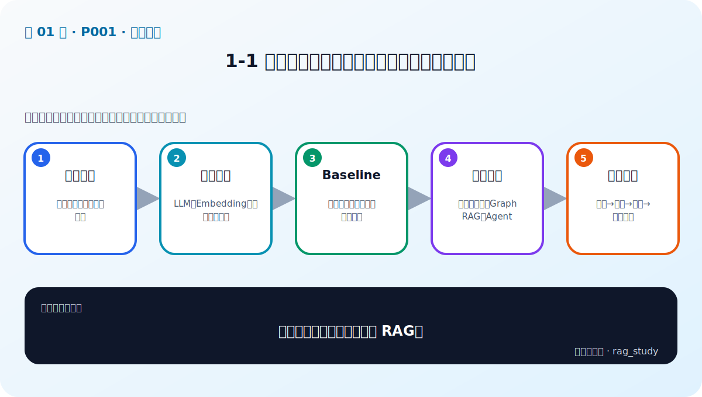
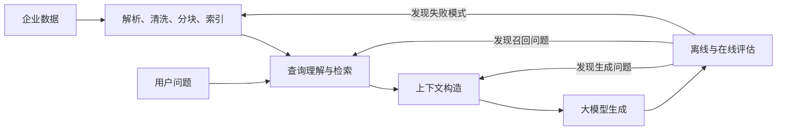

# 第 1 章：课程导学——把 RAG 当成可迭代系统

> 对应视频 P1：[1-1 全面了解课程](https://www.bilibili.com/video/BV1fLoKBREGv?p=1)

## 这章解决什么问题

学 RAG 最容易掉进两个坑：只会调用框架，或者只背算法名。本课程的主线不是
“做出一个能回答的 Demo”，而是建立一套能定位问题、度量质量、继续优化的
企业知识系统。

## 音频讲解中的课程定位

- 大模型是“脑”，Agent 是“手”，知识库是外部可维护的“记忆”；RAG 是把
  问题、企业知识和大模型接起来的关键机制。
- 企业需求正从通用聊天转向垂直场景。真正的竞争力不是模型名单，而是
  `场景 → 痛点 → 数据 → AI 能力 → 评估` 的闭环。
- 开源 RAG 软件只能给出起点。回答不好时，必须能区分是文档质量、分块、
  Embedding、索引、查询、召回、重排、提示词还是模型本身的问题。
- RAG 是典型的概率型 AI 项目：先做 baseline，再建立评测集，最后用实验数据
  选择优化手段。

## 两个贯穿课程的项目

1. **企业员工制度问答助手**：PDF/表格解析、分块、向量库、baseline、
   Ragas 评估、查询增强、融合检索、重排与 Self-RAG。
2. **金融智库**：知识三元组、图数据库、Graph RAG、多跳关系查询与路由。

最终再用 Agent 做多知识库路由，用 Gradio 统一演示。

## 推荐学习法

1. 每章先跑通最小闭环，不在第一天堆齐所有框架。
2. 每加入一种优化，固定评测集并保存“改前/改后”结果。
3. 记录失败问题，而不只记录平均分；失败样本决定下一次迭代。
4. 学框架时始终能回答：输入是什么、输出是什么、状态存在哪里、如何替换。

## 自测

为什么“Demo 能回答”不等于 RAG 已完成？

因为单个问题无法证明召回覆盖、答案忠实度、时效性和稳定性。还需要有代表性的
评测集、可观测的中间结果以及对失败模式的定向迭代。

