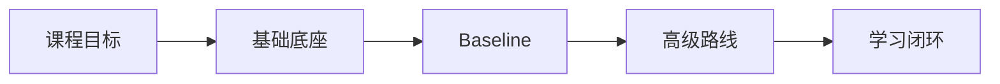

# P1：1-1 全面了解课程，让你少走弯路，必看！！！

> 笔记编号 1/89 · 对应原视频 P1 · 时长 10:54 · [打开这一节](https://www.bilibili.com/video/BV1fLoKBREGv?p=1)

← 已是第一节 · [返回第 1 章专题](./README.md) · [P2: 2-1 本章简介 →](../02-rag-foundations/p002-RAG-基础-本章导学.md)

## 这节到底讲什么

**核心问题：怎样用一条路线学完企业级 RAG？**

这一节是整门课程的地图，不要求你立刻掌握某个算法。老师先说明课程终点：不是只会调用一个 RAG 框架，而是能完成企业制度问答和金融知识库项目。为此，课程先补齐 LLM、Embedding、向量数据库和文档处理，再搭建 Baseline，随后学习评估、高级检索、Graph RAG 与 Agent。你现在只需记住这条先后路线。

## 辅助流程图

## 正文讲解（按视频顺序）

> 下面是依据音轨和画面整理的通顺版本，不是逐字稿。技术术语已经校正，
> 老师的原始讲法保留在后面的 ASR 页面。

### 1. 课程目标

课程最终希望你具备完整的企业 RAG 开发能力，而不是只会复制一个向量检索示例。学完后，你应能说明业务需求、设计知识处理流程、搭建问答系统，并用评测结果继续改进。

### 2. 基础底座

开始做项目之前，需要先认识四个基础部件：LLM 负责理解和生成，Embedding 把文本变成可比较的向量，向量数据库负责快速召回，文档处理负责把原始资料变成可检索的知识块。

### 3. Baseline

掌握部件后，先做一个最小可用的制度问答系统：离线读取制度、切块、向量化并建索引；在线接收问题、召回证据，再让模型依据证据回答。这就是后续所有优化都要比较的 Baseline。

### 4. 高级路线

Baseline 能运行不代表效果稳定。后续课程会先建立评测集定位失败，再学习查询增强、混合召回、融合和重排；关系型问题使用 Graph RAG，需要选择多个知识库或工具时再引入 Agent。

### 5. 学习闭环

每学一节都按照同一闭环进行：先听原声理解动机，再用笔记整理概念，接着运行代码确认输入输出，最后用固定指标判断是否真的学会或改进。不要把“视频看完了”误当成“已经会做了”。

### 为什么现在值得学习 RAG

大模型的推理能力、速度和价格持续改善，企业需求也从通用聊天转向具体业务场景。企业真正缺少的不是另一个会聊天的模型，而是能把内部数据、业务流程与模型能力连接起来的应用。RAG 是企业知识库和 Agent 的重要基础，因此产品、后端、算法、架构和项目管理岗位都可能需要理解它。

### 用人类学习理解 RAG

可以把大语言模型看作大脑，把 Agent 看作能够操作工具的手，把 RAG 看作随时查阅的外部资料。人不可能把所有知识永久记在脑中，模型也受训练语料和参数容量限制。RAG 不改变模型权重，而是在当前问题的上下文中提供所需知识，并允许知识库持续更新。

### 课程要解决的三个学习难点

RAG 涉及面广，初学者容易被零散名词淹没；许多资料只讲原理，不展示完整代码；真实企业数据和用户问题又很复杂，系统精度难以稳定提升。因此课程采用“体系地图 + 两个项目 + 多种优化工具 + 评估迭代”的方式，让你能够根据失败类型选择方法，而不是盲目堆组件。

### 适合人群与前置知识

课程主要使用 Python。已有 Python 基础会更顺畅，没有也可以边学边用。它适合准备进入 AI 应用开发的开发者，也适合需要与 RAG 团队协作的产品、后端、架构和项目角色。学习时既要理解底层逻辑，也必须亲手运行代码；只看视频无法形成真实的开发能力。

## 用一个例子串起来

把学习过程当作造一辆车：先认识发动机等部件，再组装出能跑的原型，最后通过测试发现问题并升级。课程也是先学组件，再做 Baseline，最后评估和增强。

## 完整原声逐段记录

已用本地语音识别核查；技术词与口误以专题笔记的校正版为准。

[查看本节按时间戳保留的本地 ASR 转写](./transcripts/p001-全面了解课程-让你少走弯路-必看-ASR.md)。原始转写会保留
同音字和断句误差，正文用校正后的术语，方便同时核对“老师说了什么”和“概念是什么”。

## 读完记住这五句话

- **课程目标：** 从原理走到两个企业项目
- **基础底座：** LLM、Embedding、向量库、文档
- **Baseline：** 制度问答打通离线与在线链路
- **高级路线：** 评估、增强、Graph RAG、Agent
- **学习闭环：** 原声→笔记→代码→指标复盘

## 最小可运行代码

[打开本节最相关的纯 Python 练习](../../rag_from_scratch/README.md)。练习包不依赖 LangChain，
目的是先看清输入、输出和算法边界，再替换成课程中的框架/API。

## 最容易踩的坑

一开始就钻进某个框架 API，容易看见代码却不知道整条 RAG 链路。先记住课程地图，再逐章补细节。

## 自测

1. 为什么课程先做 Baseline，再学习高级增强？
2. LLM、Embedding、向量数据库和文档处理在 RAG 中分别负责什么？
3. 看完视频与真正具备 RAG 开发能力之间，还缺哪些实践步骤？

## 学完检查

- [ ] 我能不看视频解释本节核心概念
- [ ] 我能指出它在 RAG 数据流中的位置
- [ ] 我知道它最适合与最不适合的场景
- [ ] 我读过完整 ASR 并核对了技术术语
- [ ] 我完成了专题 README 中对应的自测或实验
