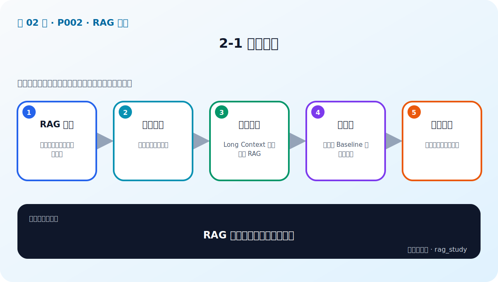
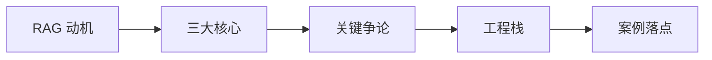

# P2：2-1 本章简介

> 笔记编号 2/89 · 对应原视频 P2 · 时长 00:59 · [打开这一节](https://www.bilibili.com/video/BV1fLoKBREGv?p=2)

[← P1: 1-1 全面了解课程，让你少走弯路，必看！！！](../01-course-guide/p001-全面了解课程-让你少走弯路-必看.md) · [返回第 2 章专题](./README.md) · [P3: 2-2 满足企业精准需求：RAG如何填补大语言模型短板 →](../02-rag-foundations/p003-满足企业精准需求-RAG如何填补大语言模型短板.md)

## 这节到底讲什么

**核心问题：RAG 基础章会回答哪些问题？**

这一节是 RAG 基础章的导览。它先解释企业为什么不能只依赖通用大模型，再把 RAG 拆成检索、增强和生成三部分；之后讨论 Long Context 的边界、完整工程技术栈，以及课程中的制度问答和金融智库两个案例。

## 辅助流程图

## 正文讲解（按视频顺序）

> 下面是依据音轨和画面整理的通顺版本，不是逐字稿。技术术语已经校正，
> 老师的原始讲法保留在后面的 ASR 页面。

### 1. RAG 动机

企业使用通用大模型时，最常见的矛盾是：模型语言能力很强，却不知道企业内部制度、客户资料和最新业务变化。RAG 的作用是在回答发生之前，临时取回与问题有关的企业知识，让模型在有依据的条件下生成。

### 2. 三大核心

RAG 可以拆成知识库、检索和生成三部分。知识库保存可更新的外部事实；检索器从中找到少量相关证据；大语言模型读取问题与证据后组织答案。后续所有高级方法都在改进这三部分或它们之间的连接。

### 3. 关键争论

本章还会回答一个常见问题：模型已经支持很长的上下文，为什么不把全部文档一次塞进去？答案涉及重复 Token 成本、延迟、私有数据暴露、长文本中的信息定位能力，以及知识更新和引用管理。

### 4. 工程栈

一个可演示的 RAG 只需要切块、向量检索和生成；企业可用系统还需要文档质量、元数据、混合召回、重排、评估、权限、增量更新、监控和高可用。课程后续会沿这条工程链逐层展开。

### 5. 案例落点

课程用两个项目承载知识：制度问答练习文本型 RAG 的完整链路，金融智库练习知识图谱和多跳关系查询。最后再用 Router 判断问题属于哪个知识域，并通过 Gradio 提供统一界面。

### 关于这一集的转写质量

P2 的音轨识别发生严重异常，原始 ASR 大量重复无意义单词，无法可靠恢复逐句内容。本页依据课程目录、P3–P7 的实际讲解和章级知识结构重建学习路线。它是章节导学的校正版，不是对损坏 ASR 的逐字修复。

## 用一个例子串起来

假设要做“员工差旅问答”。P3 先解释为什么通用模型不知道公司标准；P4 把系统拆成知识库、检索和生成；P5 决定不能每次把所有制度全文发给模型；P6 列出解析、分块、召回、重排和评估等工程问题；P7 再说明它如何与金融智库共同组成企业员工助手。

## 完整原声逐段记录

已用本地语音识别核查；技术词与口误以专题笔记的校正版为准。

[查看本节按时间戳保留的本地 ASR 转写](./transcripts/p002-RAG-基础-本章导学-ASR.md)。原始转写会保留
同音字和断句误差，正文用校正后的术语，方便同时核对“老师说了什么”和“概念是什么”。

## 读完记住这五句话

- **RAG 动机：** 补足企业知识与可信性短板
- **三大核心：** 检索、增强、生成
- **关键争论：** Long Context 是否替代 RAG
- **工程栈：** 从合格 Baseline 到优秀系统
- **案例落点：** 制度问答与金融智库

## 最小可运行代码

[打开本节最相关的纯 Python 练习](../../rag_from_scratch/pipeline.py)。练习包不依赖 LangChain，
目的是先看清输入、输出和算法边界，再替换成课程中的框架/API。

## 最容易踩的坑

不要在导学阶段背框架和产品名。先画出知识库、检索、生成和评估的位置，后续每学一个工具再把它放回这张图。

## 自测

1. RAG 基础章准备解决哪五类问题？
2. 制度问答和金融智库分别适合训练什么能力？
3. 为什么 P2 不能声称已经完成逐字校正？

## 学完检查

- [ ] 我能不看视频解释本节核心概念
- [ ] 我能指出它在 RAG 数据流中的位置
- [ ] 我知道它最适合与最不适合的场景
- [ ] 我读过完整 ASR 并核对了技术术语
- [ ] 我完成了专题 README 中对应的自测或实验
