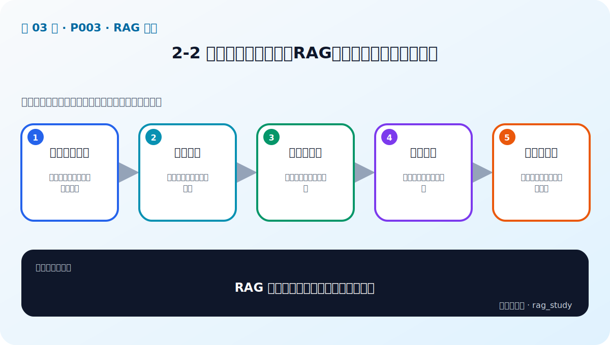

# P3：2-2 满足企业精准需求：RAG如何填补大语言模型短板

> 笔记编号 3/89 · 对应原视频 P3 · 时长 03:39 · [打开这一节](https://www.bilibili.com/video/BV1fLoKBREGv?p=3)

[← P2: 2-1 本章简介](../02-rag-foundations/p002-RAG-基础-本章导学.md) · [返回第 2 章专题](./README.md) · [P4: 2-3 解锁RAG三大核心 →](../02-rag-foundations/p004-解锁RAG三大核心.md)

## 这节到底讲什么

**核心问题：RAG 如何填补通用大模型的企业短板？**

这节直接回答“RAG 如何填补通用大模型的企业短板？”。老师的结论可以整理成五点：第一，通用模型短板：知识滞后、私域缺失、易幻觉；第二，用户问题：先明确企业真实信息需求；第三，外部知识库：保留可更新的权威事实；第四，检索增强：把相关证据放进上下文；第五，可核查回答：引用来源并控制无证据作答。下面逐项解释每一点的含义和作用。

## 辅助流程图

## 正文讲解（按视频顺序）

> 下面是依据音轨和画面整理的通顺版本，不是逐字稿。技术术语已经校正，
> 老师的原始讲法保留在后面的 ASR 页面。

### 1. 通用模型短板

通用大模型擅长写作、总结、编程等开放任务，但能力受训练语料限制。它可能没有见过企业私有资料，也不知道训练截止时间之后发生的变化；在缺少事实依据时，仍可能生成语气肯定但内容错误的答案。

### 2. 用户问题

企业问题通常不是“写一个故事”，而是“某员工有几天年假”“这笔费用能否报销”。这类问题有明确答案，错误回答会影响业务，因此要求内容准确、及时、可解释，并能追溯到具体制度或数据来源。

### 3. 外部知识库

RAG 把企业制度、产品资料、数据库记录等放在模型参数之外的知识库中。资料变化时更新文档和索引即可，不需要重新训练整个大模型。知识库还可以保存版本、权限、页码和发布时间，为治理与审计提供基础。

### 4. 检索增强

回答前，系统先根据用户问题检索相关片段，再把这些片段作为上下文与问题一起交给模型。模型因此获得当前任务所需的临时知识。检索质量决定了模型能看到什么，也是 RAG 能否回答正确的第一道门槛。

### 5. 可核查回答

生成提示词应要求模型只依据证据回答、标出来源，并在资料不足时拒答。RAG 能降低幻觉概率，但不能保证绝对正确：如果检索到旧制度或错误片段，模型仍可能生成错误答案，所以必须配套评估和人工抽检。

## 用一个例子串起来

员工问“上海出差住宿每晚最多报多少”。通用模型可能给出行业常见数字，但公司制度可能规定了完全不同的标准。RAG 应检索当前有效的差旅制度，返回包含城市和金额的条款，并在答案中标出文件与页码；如果没有对应条款，就明确说明资料不足。

## 完整原声逐段记录

已用本地语音识别核查；技术词与口误以专题笔记的校正版为准。

[查看本节按时间戳保留的本地 ASR 转写](./transcripts/p003-满足企业精准需求-RAG如何填补大语言模型短板-ASR.md)。原始转写会保留
同音字和断句误差，正文用校正后的术语，方便同时核对“老师说了什么”和“概念是什么”。

## 读完记住这五句话

- **通用模型短板：** 知识滞后、私域缺失、易幻觉
- **用户问题：** 先明确企业真实信息需求
- **外部知识库：** 保留可更新的权威事实
- **检索增强：** 把相关证据放进上下文
- **可核查回答：** 引用来源并控制无证据作答

## 最小可运行代码

[打开本节最相关的纯 Python 练习](../../rag_from_scratch/pipeline.py)。练习包不依赖 LangChain，
目的是先看清输入、输出和算法边界，再替换成课程中的框架/API。

## 最容易踩的坑

RAG 只能利用知识库中存在并被召回的资料。资料缺失、过期或召回错误时，增加提示词并不能修复事实来源。

## 自测

1. 通用大模型的哪三个短板与企业要求直接冲突？
2. 知识库更新与重新训练模型有什么区别？
3. 检索到错误制度时，RAG 为什么仍可能产生错误答案？

## 学完检查

- [ ] 我能不看视频解释本节核心概念
- [ ] 我能指出它在 RAG 数据流中的位置
- [ ] 我知道它最适合与最不适合的场景
- [ ] 我读过完整 ASR 并核对了技术术语
- [ ] 我完成了专题 README 中对应的自测或实验
