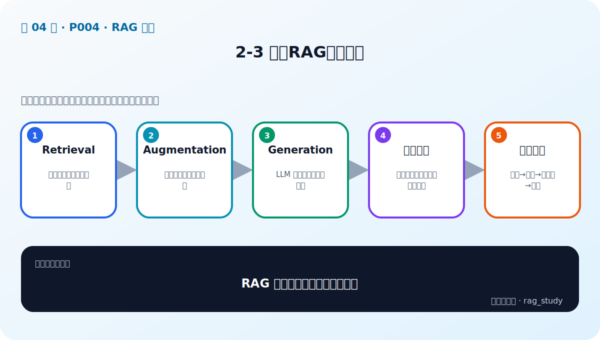

# P4：2-3 解锁RAG三大核心

> 笔记编号 4/89 · 对应原视频 P4 · 时长 01:33 · [打开这一节](https://www.bilibili.com/video/BV1fLoKBREGv?p=4)

[← P3: 2-2 满足企业精准需求：RAG如何填补大语言模型短板](../02-rag-foundations/p003-满足企业精准需求-RAG如何填补大语言模型短板.md) · [返回第 2 章专题](./README.md) · [P5: 2-4 深入思考 long context加持的大模型企业还需要RAG →](../02-rag-foundations/p005-深入思考-long-context加持的大模型企业还需要RAG.md)

## 这节到底讲什么

**核心问题：RAG 的三大核心怎样首尾相接？**

这节直接回答“RAG 的三大核心怎样首尾相接？”。老师的结论可以整理成五点：第一，Retrieval：从知识库召回相关片段；第二，Augmentation：筛选、组织证据与问题；第三，Generation：LLM 严格依据上下文回答；第四，离线链路：解析、分块、向量化、建索引；第五，在线链路：查询→召回→提示词→答案。下面逐项解释每一点的含义和作用。

## 辅助流程图

## 正文讲解（按视频顺序）

> 下面是依据音轨和画面整理的通顺版本，不是逐字稿。技术术语已经校正，
> 老师的原始讲法保留在后面的 ASR 页面。

### 1. Retrieval

Retrieval 是“找证据”。系统把用户问题转换成适合检索的表示，在企业知识库中取回最相关的若干文档块。检索既可以使用 BM25 关键词匹配，也可以使用 Embedding 向量相似度，实际项目常把两者结合。

### 2. Augmentation

Augmentation 不是再次训练模型，而是把检索结果整理成更有用的上下文。这里包括去重、重排、补充相邻段落、控制长度、附带来源，以及在提示词中写清回答和拒答规则。

### 3. Generation

Generation 是让大语言模型读取“问题 + 增强后的上下文”并组织答案。模型负责语言理解与表达，不应凭空创造企业事实。输出通常还要包含引用、置信提示或“资料不足”的说明。

### 4. 离线链路

知识进入系统发生在离线阶段：加载原始文件，解析并清洗内容，切成文档块，生成 Embedding，最后把向量、原文和元数据写入索引。文档更新后也要通过这条链路完成增量更新或重建。

### 5. 在线链路

用户提问发生在在线阶段：理解问题、检索候选、筛选和组织上下文、调用模型、返回答案与来源。调试 RAG 时必须把每个中间结果保留下来，否则答案错误时无法判断问题出在检索还是生成。

## 用一个例子串起来

问题“年假要提前几天申请”进入在线链路后，检索器找到“年假申请需提前三天提交”的制度块；增强步骤补上文件名、页码和拒答要求；生成模型据此回答“三天”，并附来源。若检索器没有找到该块，生成模型不应自行猜测。

## 完整原声逐段记录

已用本地语音识别核查；技术词与口误以专题笔记的校正版为准。

[查看本节按时间戳保留的本地 ASR 转写](./transcripts/p004-解锁RAG三大核心-ASR.md)。原始转写会保留
同音字和断句误差，正文用校正后的术语，方便同时核对“老师说了什么”和“概念是什么”。

## 读完记住这五句话

- **Retrieval：** 从知识库召回相关片段
- **Augmentation：** 筛选、组织证据与问题
- **Generation：** LLM 严格依据上下文回答
- **离线链路：** 解析、分块、向量化、建索引
- **在线链路：** 查询→召回→提示词→答案

## 最小可运行代码

[打开本节最相关的纯 Python 练习](../../rag_from_scratch/pipeline.py)。练习包不依赖 LangChain，
目的是先看清输入、输出和算法边界，再替换成课程中的框架/API。

## 最容易踩的坑

不要把三大核心误写成“向量库、Embedding、LLM”。向量库和 Embedding 是检索实现，概念层仍是知识、检索增强和生成。

## 自测

1. 用自己的话解释 Retrieval、Augmentation 和 Generation。
2. 离线建库和在线问答各包含哪些步骤？
3. 答案错误时，为什么必须查看检索中间结果？

## 学完检查

- [ ] 我能不看视频解释本节核心概念
- [ ] 我能指出它在 RAG 数据流中的位置
- [ ] 我知道它最适合与最不适合的场景
- [ ] 我读过完整 ASR 并核对了技术术语
- [ ] 我完成了专题 README 中对应的自测或实验
