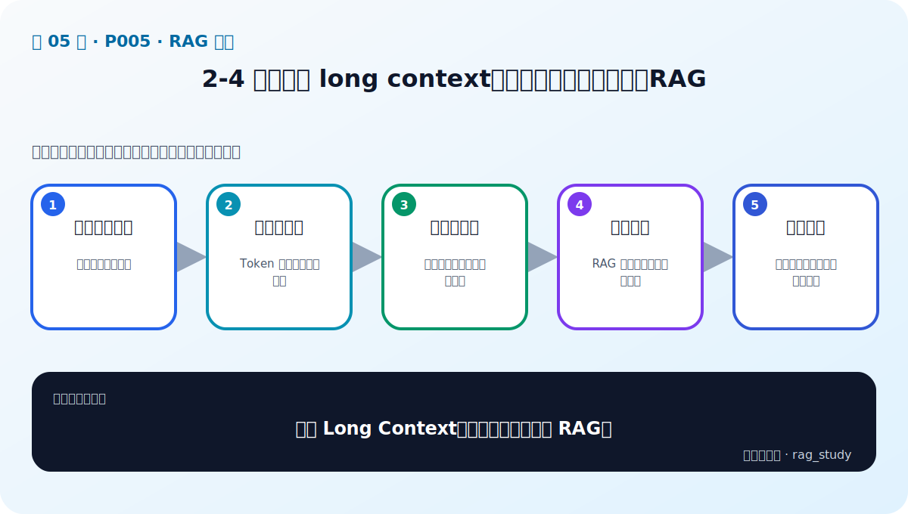

# P5：2-4 深入思考 long context加持的大模型企业还需要RAG

> 笔记编号 5/89 · 对应原视频 P5 · 时长 06:27 · [打开这一节](https://www.bilibili.com/video/BV1fLoKBREGv?p=5)

[← P4: 2-3 解锁RAG三大核心](../02-rag-foundations/p004-解锁RAG三大核心.md) · [返回第 2 章专题](./README.md) · [P6: 2-5 RAG技术栈：从【合格】到【优秀】的跨越 →](../02-rag-foundations/p006-RAG技术栈-从-合格-到-优秀-的跨越.md)

## 这节到底讲什么

**核心问题：有了 Long Context，企业为什么仍需要 RAG？**

这节直接回答“有了 Long Context，企业为什么仍需要 RAG？”。老师的结论可以整理成五点：第一，长上下文优势：一次容纳更多原文；第二，成本与延迟：Token 越多推理越贵越慢；第三，注意力稀释：关键信息可能被长文本淹没；第四，知识治理：RAG 支持更新、权限与引用；第五，组合策略：先检索缩小范围再用长上下文。下面逐项解释每一点的含义和作用。

## 辅助流程图

## 正文讲解（按视频顺序）

> 下面是依据音轨和画面整理的通顺版本，不是逐字稿。技术术语已经校正，
> 老师的原始讲法保留在后面的 ASR 页面。

### 1. 长上下文优势

长上下文允许模型一次读取更多文档，在资料少、调用频率低或必须通读全文的场景中很有价值。它也能让 RAG 返回较大的父文档或更多相邻段落，减少过度切块造成的信息缺失。

### 2. 成本与延迟

上下文窗口很大，不代表每次都应该填满。输入越长，占用计算和显存的时间越多，首字延迟和总费用通常越高；调用收费 API 时，每个问题都重复发送几百份文档尤其浪费。

### 3. 注意力稀释

模型在超长文本中并不能稳定找到所有关键信息。课程引用“干草堆里找针”类实验：当关键点数量增加、上下文变长或信息位于不利位置时，模型的检索与推理准确率会下降。能装下不等于能可靠使用。

### 4. 知识治理

把完整企业资料发送给外部模型会扩大数据暴露范围。RAG 可以先在受控环境中检索，只发送回答所需的片段，并保留来源、版本和权限信息。它仍需安全审计，但比每次上传全库更容易治理。

### 5. 组合策略

Long Context 与 RAG 不是二选一。更稳健的方案是先用检索器缩小范围，再利用较长上下文放入多个候选、父文档或完整章节。这样既保留长上下文的理解能力，又控制成本、噪声和数据暴露。

### 如何理解“干草堆里找针”

实验会把一个或多个关键事实放在很长的无关文本中，再询问模型这些事实。如果关键点只有一个且上下文较短，模型通常表现较好；随着关键点和文本长度增加，遗漏会变多，表现还可能受信息位置影响。这个实验提醒我们：上下文容量描述的是“最多能输入多少”，不是“所有信息都能同样可靠使用”。

### 什么时候可以直接使用长上下文

资料数量少、调用频率低、允许较高成本，而且任务必须整体阅读全文时，直接输入较长文档可能更简单。资料规模大、问题频繁、需要权限与引用、知识经常更新或延迟敏感时，应优先使用 RAG。实际系统通常根据问题类型动态决定放入多少检索结果。

## 用一个例子串起来

公司有 500 份制度，每个员工每天都可能提问。如果每次把 500 份全文发送给外部 API，Token、延迟和数据暴露都会很高。更合理的做法是在公司侧先检索出 3–10 个相关片段，再根据问题复杂度放入相邻段落或完整章节。

## 完整原声逐段记录

已用本地语音识别核查；技术词与口误以专题笔记的校正版为准。

[查看本节按时间戳保留的本地 ASR 转写](./transcripts/p005-深入思考-long-context加持的大模型企业还需要RAG-ASR.md)。原始转写会保留
同音字和断句误差，正文用校正后的术语，方便同时核对“老师说了什么”和“概念是什么”。

## 读完记住这五句话

- **长上下文优势：** 一次容纳更多原文
- **成本与延迟：** Token 越多推理越贵越慢
- **注意力稀释：** 关键信息可能被长文本淹没
- **知识治理：** RAG 支持更新、权限与引用
- **组合策略：** 先检索缩小范围再用长上下文

## 最小可运行代码

[打开本节最相关的纯 Python 练习](../../rag_from_scratch/pipeline.py)。练习包不依赖 LangChain，
目的是先看清输入、输出和算法边界，再替换成课程中的框架/API。

## 最容易踩的坑

Long Context 的标称长度只是容量上限。选型时还要实测有效检索能力、延迟、价格、数据边界和引用需求。

## 自测

1. “上下文能装下全部资料”为什么不等于“应该每次装入全部资料”？
2. 干草堆找针实验说明了长上下文的什么限制？
3. 设计一个 Long Context 与 RAG 组合使用的方案。

## 学完检查

- [ ] 我能不看视频解释本节核心概念
- [ ] 我能指出它在 RAG 数据流中的位置
- [ ] 我知道它最适合与最不适合的场景
- [ ] 我读过完整 ASR 并核对了技术术语
- [ ] 我完成了专题 README 中对应的自测或实验
