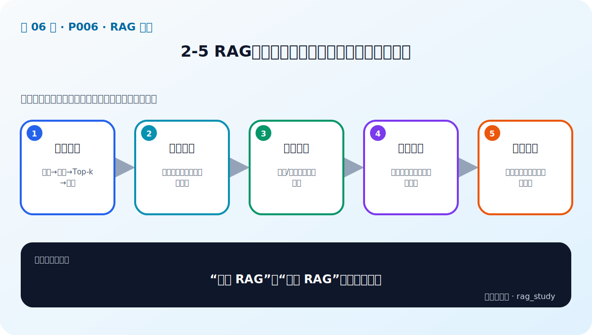

# P6：2-5 RAG技术栈：从【合格】到【优秀】的跨越

> 笔记编号 6/89 · 对应原视频 P6 · 时长 02:43 · [打开这一节](https://www.bilibili.com/video/BV1fLoKBREGv?p=6)

[← P5: 2-4 深入思考 long context加持的大模型企业还需要RAG](../02-rag-foundations/p005-深入思考-long-context加持的大模型企业还需要RAG.md) · [返回第 2 章专题](./README.md) · [P7: 2-6 本课程案例分析与说明 →](../02-rag-foundations/p007-本课程案例分析与说明.md)

## 这节到底讲什么

**核心问题：“优秀 RAG”比“能跑 RAG”多了哪些层？**

这节直接回答““优秀 RAG”比“能跑 RAG”多了哪些层？”。老师的结论可以整理成五点：第一，合格链路：切块→向量→Top-k→生成；第二，数据质量：解析、清洗、元数据与分块；第三，检索质量：稀疏/稠密、融合、重排；第四，系统质量：评估集、可观测、反馈迭代；第五，企业能力：权限、高可用、成本与规范。下面逐项解释每一点的含义和作用。

## 辅助流程图

## 正文讲解（按视频顺序）

> 下面是依据音轨和画面整理的通顺版本，不是逐字稿。技术术语已经校正，
> 老师的原始讲法保留在后面的 ASR 页面。

### 1. 合格链路

最小 RAG 链路是：读取资料、分块、生成向量、写入索引；用户提问后取 Top-k 文档，把它们放入提示词并调用模型。它能验证系统是否跑通，但还不能保证对复杂企业数据和真实用户问题稳定有效。

### 2. 数据质量

企业资料可能来自 PDF、Excel、PPT、数据库和扫描件，既有结构化数据，也有非结构化文本。系统需要正确解析、清洗、分块并建立索引；任何乱码、漏表或错误边界都会直接限制后续检索效果。

### 3. 检索质量

用户问题可能很短、含糊、多意图或与文档措辞不同。除了基础向量检索，还可能需要查询改写、BM25、稠密检索、多索引、融合和重排。具体使用哪些方法，必须由失败样本和评测结果决定。

### 4. 系统质量

候选过多时要筛选与排序，生成前要控制上下文和提示词，模型输出后还要评估检索相关性、答案忠实性和业务正确性。没有固定评测集，就无法知道一次改动到底让系统变好还是变坏。

### 5. 企业能力

企业落地还要处理权限过滤、数据隔离、索引更新、日志、成本、监控和高可用。不是每个项目都要使用最复杂的方案；简单技术能达到要求时，额外组件只会增加延迟和维护负担。

## 用一个例子串起来

制度问答总把旧版报销标准排在第一。不要立刻换更大的模型：先检查旧文件是否仍在索引、版本元数据是否正确、过滤是否生效，再看混合召回和重排。修复后用包含新旧制度冲突的问题集重新评估，才能确认问题真正解决。

## 完整原声逐段记录

已用本地语音识别核查；技术词与口误以专题笔记的校正版为准。

[查看本节按时间戳保留的本地 ASR 转写](./transcripts/p006-RAG技术栈-从-合格-到-优秀-的跨越-ASR.md)。原始转写会保留
同音字和断句误差，正文用校正后的术语，方便同时核对“老师说了什么”和“概念是什么”。

## 读完记住这五句话

- **合格链路：** 切块→向量→Top-k→生成
- **数据质量：** 解析、清洗、元数据与分块
- **检索质量：** 稀疏/稠密、融合、重排
- **系统质量：** 评估集、可观测、反馈迭代
- **企业能力：** 权限、高可用、成本与规范

## 最小可运行代码

[打开本节最相关的纯 Python 练习](../../rag_from_scratch/pipeline.py)。练习包不依赖 LangChain，
目的是先看清输入、输出和算法边界，再替换成课程中的框架/API。

## 最容易踩的坑

不要为了“技术先进”把所有增强方法默认串联。每增加一层都会增加延迟、费用、故障点和调试成本。

## 自测

1. 一个能运行的 RAG 与企业可用 RAG 相差哪些能力？
2. 用户问题含糊时，可以在哪些检索环节优化？
3. 为什么新增技术必须在固定评测集上验证？

## 学完检查

- [ ] 我能不看视频解释本节核心概念
- [ ] 我能指出它在 RAG 数据流中的位置
- [ ] 我知道它最适合与最不适合的场景
- [ ] 我读过完整 ASR 并核对了技术术语
- [ ] 我完成了专题 README 中对应的自测或实验
