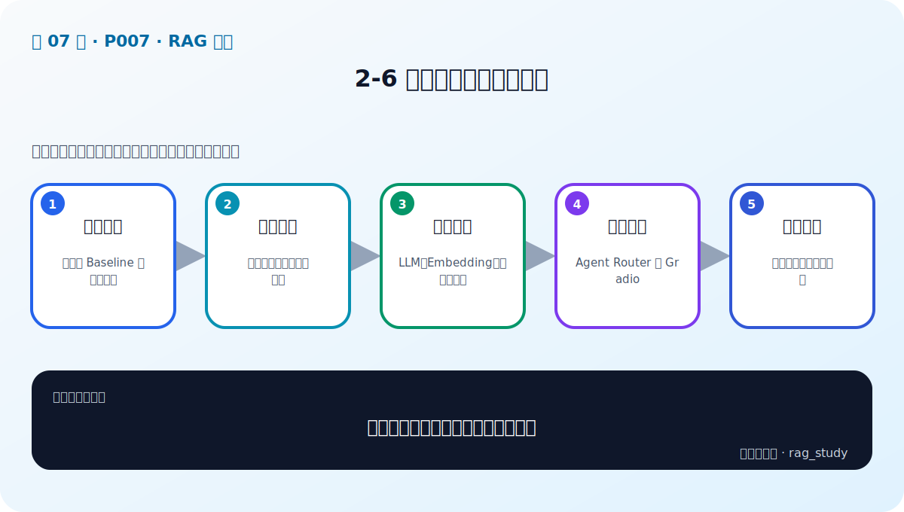
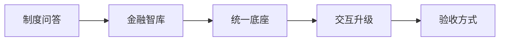

# P7：2-6 本课程案例分析与说明

> 笔记编号 7/89 · 对应原视频 P7 · 时长 02:25 · [打开这一节](https://www.bilibili.com/video/BV1fLoKBREGv?p=7)

[← P6: 2-5 RAG技术栈：从【合格】到【优秀】的跨越](../02-rag-foundations/p006-RAG技术栈-从-合格-到-优秀-的跨越.md) · [返回第 2 章专题](./README.md) · [P8: 3-1 本章简介 →](../03-llm-foundations/p008-大模型基础与选型-本章导学.md)

## 这节到底讲什么

**核心问题：课程的两个案例分别训练什么能力？**

这节直接回答“课程的两个案例分别训练什么能力？”。老师的结论可以整理成五点：第一，制度问答：文档型 Baseline 与高级检索；第二，金融智库：三元组、知识图谱与多跳；第三，统一底座：LLM、Embedding、向量数据库；第四，交互升级：Agent Router 与 Gradio；第五，验收方式：评测而非只看演示答案。下面逐项解释每一点的含义和作用。

## 辅助流程图

## 正文讲解（按视频顺序）

> 下面是依据音轨和画面整理的通顺版本，不是逐字稿。技术术语已经校正，
> 老师的原始讲法保留在后面的 ASR 页面。

### 1. 制度问答

第一个项目是企业制度问答。资料主要是考勤、薪酬或差旅报销等 PDF、Excel 文档。项目会走完整的文本 RAG 流程，并用它练习文档处理、向量检索、评估和高级检索增强。

### 2. 金融智库

第二个项目是金融智库。它把公司、人物、行业、投资等事实表示成实体与关系，存入图数据库。这个项目用于学习知识图谱、图查询和 Graph RAG，尤其适合需要关系路径或多跳证据的问题。

### 3. 统一底座

课程以 Python 3.9 为主要环境，使用 LangChain、LlamaIndex、PyTorch、Transformers 等框架操作模型；文本向量可存入 Chroma，图数据使用 Neo4j，代码主要通过 Jupyter Notebook 演示。具体版本应以项目锁定配置为准。

### 4. 交互升级

两个后端最终会被包装成统一工具。入口先做意图识别：制度问题交给文本 RAG，金融关系问题交给 Graph RAG。Gradio 提供演示界面，FastAPI可以作为服务接口；界面不应直接承担索引和模型逻辑。

### 5. 验收方式

两个项目都不能只以“页面能回答”为验收。制度问答要检查召回条款、引用与拒答；金融智库要检查实体对齐、关系路径和来源。还要记录延迟、错误类型和版本，才能持续迭代。

### 整体请求路线

用户从前端输入问题后，系统先做意图识别。制度类问题进入向量 RAG：从制度文档中召回片段并生成答案；金融类问题进入 Graph RAG：识别实体并查询关系路径。两个模块返回统一的答案、来源和路由信息，前端只负责展示。这种分层使每个知识库可以独立开发、测试和替换。

## 用一个例子串起来

用户问“迟到如何处理”时，Router 应调用制度向量库；问“A 公司投资了哪些新能源企业”时，应调用金融图数据库。两个模块都返回答案和来源，但前者的证据是文档片段，后者的证据是实体关系路径。

## 完整原声逐段记录

已用本地语音识别核查；技术词与口误以专题笔记的校正版为准。

[查看本节按时间戳保留的本地 ASR 转写](./transcripts/p007-本课程案例分析与说明-ASR.md)。原始转写会保留
同音字和断句误差，正文用校正后的术语，方便同时核对“老师说了什么”和“概念是什么”。

## 读完记住这五句话

- **制度问答：** 文档型 Baseline 与高级检索
- **金融智库：** 三元组、知识图谱与多跳
- **统一底座：** LLM、Embedding、向量数据库
- **交互升级：** Agent Router 与 Gradio
- **验收方式：** 评测而非只看演示答案

## 最小可运行代码

[打开本节最相关的纯 Python 练习](../../rag_from_scratch/pipeline.py)。练习包不依赖 LangChain，
目的是先看清输入、输出和算法边界，再替换成课程中的框架/API。

## 最容易踩的坑

演示框架不是系统架构。LangChain、Gradio 或 Chroma 都可以替换，真正需要稳定的是模块输入输出、数据版本和评测方法。

## 自测

1. 制度问答和金融智库的数据结构、检索方式分别是什么？
2. Router 根据什么决定调用哪个知识库？
3. 为什么 Gradio 页面不应直接包含模型加载和索引逻辑？

## 学完检查

- [ ] 我能不看视频解释本节核心概念
- [ ] 我能指出它在 RAG 数据流中的位置
- [ ] 我知道它最适合与最不适合的场景
- [ ] 我读过完整 ASR 并核对了技术术语
- [ ] 我完成了专题 README 中对应的自测或实验
