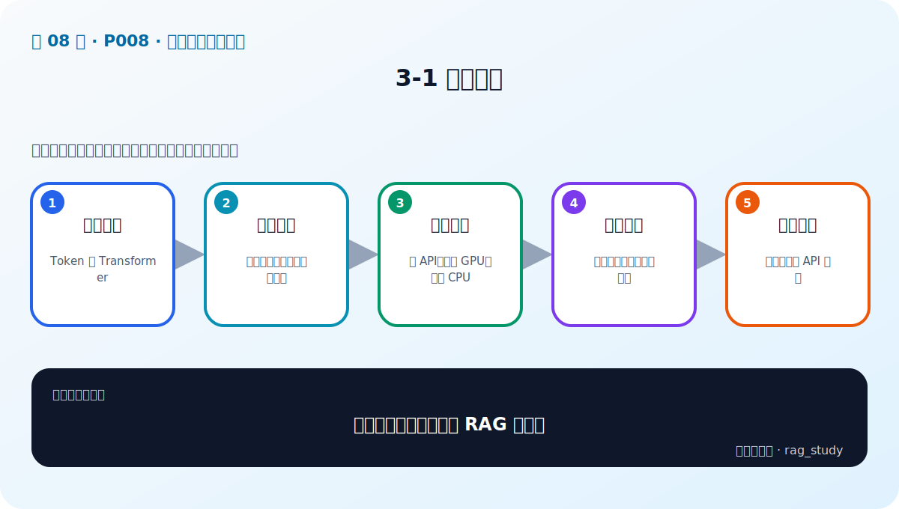
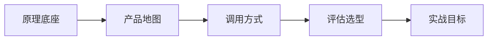

# P8：3-1 本章简介

> 笔记编号 8/89 · 对应原视频 P8 · 时长 01:41 · [打开这一节](https://www.bilibili.com/video/BV1fLoKBREGv?p=8)

[← P7: 2-6 本课程案例分析与说明](../02-rag-foundations/p007-本课程案例分析与说明.md) · [返回第 3 章专题](./README.md) · [P9: 3-2 大模型入门：核心要点和技术演变（Token、Transformer、GPT） →](../03-llm-foundations/p009-大模型入门-核心要点和技术演变-Token-Transformer-GPT.md)

## 这节到底讲什么

**核心问题：大模型基础章如何服务 RAG 选型？**

这节直接回答“大模型基础章如何服务 RAG 选型？”。老师的结论可以整理成五点：第一，原理底座：Token 与 Transformer；第二，产品地图：国内外主流模型与能力差异；第三，调用方式：云 API、本地 GPU、本地 CPU；第四，评估选型：质量、成本、延迟、合规；第五，实战目标：跑通本地与 API 推理。下面逐项解释每一点的含义和作用。

## 辅助流程图

## 正文讲解（按视频顺序）

> 下面是依据音轨和画面整理的通顺版本，不是逐字稿。技术术语已经校正，
> 老师的原始讲法保留在后面的 ASR 页面。

### 1. 原理底座

这一章只学习 RAG 开发真正需要的大模型基础：文本怎样变成 Token，Transformer 怎样利用上下文，以及模型为什么逐 Token 生成。目标不是从零训练 LLM，而是看懂它的输入、输出、速度和能力边界。

### 2. 产品地图

模型可以按闭源 API、开放权重和本地服务理解。不同产品在中文、推理、代码、长上下文、结构化输出和工具调用上各有差异，而且迭代很快。记住产品名不如记住比较维度。

### 3. 调用方式

课程会比较三条调用路线：直接使用厂商 API、通过托管推理服务调用、在本地 CPU 或 GPU 加载模型。三者的代码形式不同，但都应被封装成统一的消息输入和文本输出接口。

### 4. 评估选型

模型选型必须同时看任务质量、首字延迟、总耗时、吞吐、Token 费用、部署资源和数据合规。通用榜单只能帮助筛候选，最终结论要来自自己的 RAG 问题、证据和答案数据集。

### 5. 实战目标

章末实战会分别跑通 API 与本地模型，并比较 CPU、GPU 等设备。你需要学会加载 Tokenizer 和权重、设置生成参数、记录资源与耗时，以及处理鉴权、超时和模型输出。

## 用一个例子串起来

准备为制度问答选择生成模型时，先理解 Token 与自回归决定的上下文和延迟，再列出 API、本地 CPU 和 GPU 三条路线，最后用同一组制度问题比较答案质量、引用、拒答、耗时和费用。这就是本章从原理走向实战的路线。

## 完整原声逐段记录

已用本地语音识别核查；技术词与口误以专题笔记的校正版为准。

[查看本节按时间戳保留的本地 ASR 转写](./transcripts/p008-大模型基础与选型-本章导学-ASR.md)。原始转写会保留
同音字和断句误差，正文用校正后的术语，方便同时核对“老师说了什么”和“概念是什么”。

## 读完记住这五句话

- **原理底座：** Token 与 Transformer
- **产品地图：** 国内外主流模型与能力差异
- **调用方式：** 云 API、本地 GPU、本地 CPU
- **评估选型：** 质量、成本、延迟、合规
- **实战目标：** 跑通本地与 API 推理

## 最小可运行代码

[打开本节最相关的纯 Python 练习](../../rag_from_scratch/llm_clients.py)。练习包不依赖 LangChain，
目的是先看清输入、输出和算法边界，再替换成课程中的框架/API。

## 最容易踩的坑

不要试图在一章里学会训练大模型。这里的目标是掌握 RAG 调用、选型和评测所需的最小原理。

## 自测

1. 不看图回答：大模型基础章如何服务 RAG 选型？
2. 用上面的例子，指出本节五个知识点分别出现在哪里。
3. 如果没有“评估选型”，会出现什么具体问题？

## 学完检查

- [ ] 我能不看视频解释本节核心概念
- [ ] 我能指出它在 RAG 数据流中的位置
- [ ] 我知道它最适合与最不适合的场景
- [ ] 我读过完整 ASR 并核对了技术术语
- [ ] 我完成了专题 README 中对应的自测或实验
