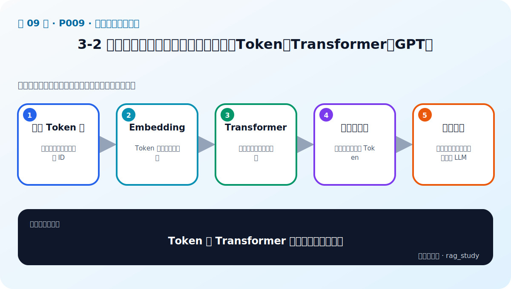
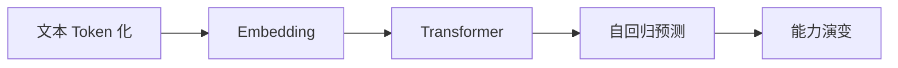

# P9：3-2 大模型入门：核心要点和技术演变（Token、Transformer、GPT）

> 笔记编号 9/89 · 对应原视频 P9 · 时长 20:58 · [打开这一节](https://www.bilibili.com/video/BV1fLoKBREGv?p=9)

[← P8: 3-1 本章简介](../03-llm-foundations/p008-大模型基础与选型-本章导学.md) · [返回第 3 章专题](./README.md) · [P10: 3-3 国内外大模型产品必知必会 →](../03-llm-foundations/p010-国内外大模型产品必知必会.md)

## 这节到底讲什么

**核心问题：Token 和 Transformer 如何变成一次生成？**

这节直接回答“Token 和 Transformer 如何变成一次生成？”。老师的结论可以整理成五点：第一，文本 Token 化：字符串转成模型可处理 ID；第二，Embedding：Token 映射为连续向量；第三，Transformer：注意力聚合上下文关系；第四，自回归预测：逐个预测下一个 Token；第五，能力演变：规模、数据、对齐共同塑造 LLM。下面逐项解释每一点的含义和作用。

## 辅助流程图

## 正文讲解（按视频顺序）

> 下面是依据音轨和画面整理的通顺版本，不是逐字稿。技术术语已经校正，
> 老师的原始讲法保留在后面的 ASR 页面。

### 1. 文本 Token 化

大模型不直接读取字符串。Tokenizer 按词、子词或字符片段把文本切成 Token，再映射为整数 ID。不同模型的 Tokenizer 不同，同一句话会得到不同长度；上下文限制和 API 计费通常也以 Token 数量为单位。

### 2. Embedding

进入模型后，每个 Token ID 会被查表转换成连续向量，并叠加位置信息。这里的 Token Embedding 是模型内部表示，不要与 RAG 检索使用的句向量 Embedding 混淆：前者服务生成，后者服务整段文本相似检索。

### 3. Transformer

Transformer 通过自注意力计算当前 Token 与上下文中其他 Token 的关系，再经过前馈网络逐层变换表示。多头注意力允许模型从语法、指代、主题等不同角度聚合信息，残差连接和归一化帮助深层网络稳定训练。

### 4. 自回归预测

生成时，模型根据已有 Token 计算下一个 Token 的概率分布，按贪心或采样策略选出一个，再把它追加回输入继续预测。因此生成 100 个 Token 需要大约 100 个串行解码步骤，流式输出只是更早展示结果。

### 5. 能力演变

现代大模型通常经历大规模预训练、指令微调和偏好对齐。模型规模、数据质量、训练方法和推理策略共同影响能力；参数更多不保证每个业务任务都更好，所以仍要用目标任务评测。

## 用一个例子串起来

输入“年假怎么申请”后，Tokenizer 先产生一串 ID，Transformer 读取这些 Token 的关系，模型预测下一个 Token 可能是“年”。选出后再继续预测“假”、“需”等内容，直到生成结束标记或达到长度限制。

## 完整原声逐段记录

已用本地语音识别核查；技术词与口误以专题笔记的校正版为准。

[查看本节按时间戳保留的本地 ASR 转写](./transcripts/p009-大模型入门-核心要点和技术演变-Token-Transformer-GPT-ASR.md)。原始转写会保留
同音字和断句误差，正文用校正后的术语，方便同时核对“老师说了什么”和“概念是什么”。

## 读完记住这五句话

- **文本 Token 化：** 字符串转成模型可处理 ID
- **Embedding：** Token 映射为连续向量
- **Transformer：** 注意力聚合上下文关系
- **自回归预测：** 逐个预测下一个 Token
- **能力演变：** 规模、数据、对齐共同塑造 LLM

## 最小可运行代码

[打开本节最相关的纯 Python 练习](../../rag_from_scratch/llm_clients.py)。练习包不依赖 LangChain，
目的是先看清输入、输出和算法边界，再替换成课程中的框架/API。

## 最容易踩的坑

不要混淆模型内部 Token Embedding 与检索用句向量 Embedding；它们的粒度、训练目标和用途不同。

## 自测

1. 不看图回答：Token 和 Transformer 如何变成一次生成？
2. 用上面的例子，指出本节五个知识点分别出现在哪里。
3. 如果没有“自回归预测”，会出现什么具体问题？

## 学完检查

- [ ] 我能不看视频解释本节核心概念
- [ ] 我能指出它在 RAG 数据流中的位置
- [ ] 我知道它最适合与最不适合的场景
- [ ] 我读过完整 ASR 并核对了技术术语
- [ ] 我完成了专题 README 中对应的自测或实验
