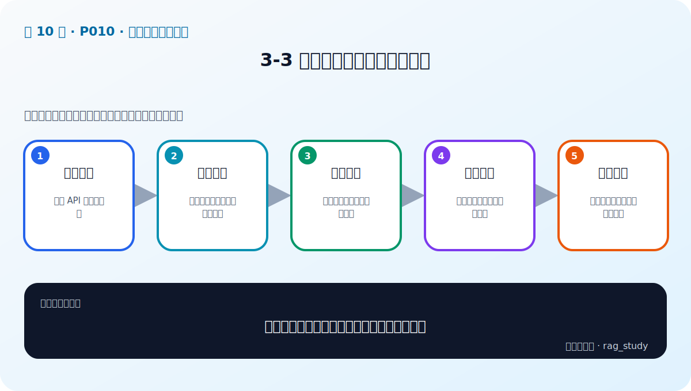
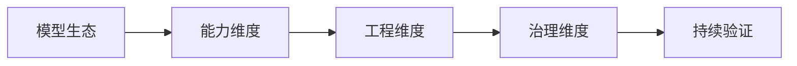

# P10：3-3 国内外大模型产品必知必会

> 笔记编号 10/89 · 对应原视频 P10 · 时长 03:45 · [打开这一节](https://www.bilibili.com/video/BV1fLoKBREGv?p=10)

[← P9: 3-2 大模型入门：核心要点和技术演变（Token、Transformer、GPT）](../03-llm-foundations/p009-大模型入门-核心要点和技术演变-Token-Transformer-GPT.md) · [返回第 3 章专题](./README.md) · [P11: 3-4 没有GPU如何调用大模型-大模型调用的三种方式 →](../03-llm-foundations/p011-没有GPU如何调用大模型-大模型调用的三种方式.md)

## 这节到底讲什么

**核心问题：比较大模型产品时应看什么，而非只背名字？**

这节直接回答“比较大模型产品时应看什么，而非只背名字？”。老师的结论可以整理成五点：第一，模型生态：闭源 API 与开源权重；第二，能力维度：中文、推理、代码、长上下文；第三，工程维度：价格、吞吐、延迟、稳定性；第四，治理维度：数据合规、私有化与可控性；第五，持续验证：产品迭代快，结论需实测更新。下面逐项解释每一点的含义和作用。

## 辅助流程图

## 正文讲解（按视频顺序）

> 下面是依据音轨和画面整理的通顺版本，不是逐字稿。技术术语已经校正，
> 老师的原始讲法保留在后面的 ASR 页面。

### 1. 模型生态

闭源模型通过 API 提供能力，通常维护简单、更新快，但权重不可控并存在供应商依赖；开放权重模型可以本地部署、量化和微调，但需要算力、推理框架和运维。两类模型都可能适合 RAG。

### 2. 能力维度

比较模型时要拆开中文理解、事实抽取、复杂推理、代码、长上下文、结构化输出和 Tool Calling。一个擅长创意写作的模型，不一定能稳定依据多段证据回答制度问题。

### 3. 工程维度

除了答案质量，还要测输入和输出价格、首 Token 延迟、总吞吐、并发限制、上下文长度、稳定性和版本升级策略。生产系统还需要超时、重试、降级和供应商故障切换。

### 4. 治理维度

企业需要判断数据是否离开内网、服务商是否保存请求、模型许可证是否允许商用，以及输出能否审计。敏感文档不能因为 API 调用方便就跳过安全和合规评审。

### 5. 持续验证

模型产品和版本变化很快，课程中的名单只能帮助建立地图。项目应固定测试集和模型版本，定期重新跑质量、成本和延迟；升级模型前做回归测试，避免新版本在关键场景退化。

## 用一个例子串起来

某闭源 API 在中文推理上最好，但公司规定制度全文不能离开内网；某开放模型可私有部署，质量稍低却满足数据边界。最终方案可能用本地模型处理敏感问答，用强 API 处理脱敏后的复杂任务，而不是只选一个榜单冠军。

## 完整原声逐段记录

已用本地语音识别核查；技术词与口误以专题笔记的校正版为准。

[查看本节按时间戳保留的本地 ASR 转写](./transcripts/p010-国内外大模型产品必知必会-ASR.md)。原始转写会保留
同音字和断句误差，正文用校正后的术语，方便同时核对“老师说了什么”和“概念是什么”。

## 读完记住这五句话

- **模型生态：** 闭源 API 与开源权重
- **能力维度：** 中文、推理、代码、长上下文
- **工程维度：** 价格、吞吐、延迟、稳定性
- **治理维度：** 数据合规、私有化与可控性
- **持续验证：** 产品迭代快，结论需实测更新

## 最小可运行代码

[打开本节最相关的纯 Python 练习](../../rag_from_scratch/llm_clients.py)。练习包不依赖 LangChain，
目的是先看清输入、输出和算法边界，再替换成课程中的框架/API。

## 最容易踩的坑

具体产品能力和价格会变化，笔记中的产品名单只能当生态示例，不能当长期有效的采购建议。

## 自测

1. 不看图回答：比较大模型产品时应看什么，而非只背名字？
2. 用上面的例子，指出本节五个知识点分别出现在哪里。
3. 如果没有“治理维度”，会出现什么具体问题？

## 学完检查

- [ ] 我能不看视频解释本节核心概念
- [ ] 我能指出它在 RAG 数据流中的位置
- [ ] 我知道它最适合与最不适合的场景
- [ ] 我读过完整 ASR 并核对了技术术语
- [ ] 我完成了专题 README 中对应的自测或实验
