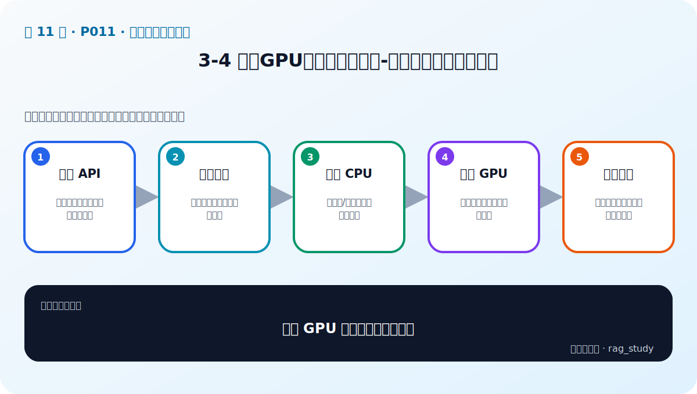

# P11：3-4 没有GPU如何调用大模型-大模型调用的三种方式

> 笔记编号 11/89 · 对应原视频 P11 · 时长 09:33 · [打开这一节](https://www.bilibili.com/video/BV1fLoKBREGv?p=11)

[← P10: 3-3 国内外大模型产品必知必会](../03-llm-foundations/p010-国内外大模型产品必知必会.md) · [返回第 3 章专题](./README.md) · [P12: 3-5 火眼金星：如何分辨大模型的好坏 →](../03-llm-foundations/p012-火眼金星-如何分辨大模型的好坏.md)

## 这节到底讲什么

**核心问题：没有 GPU 时怎样调用大模型？**

这节直接回答“没有 GPU 时怎样调用大模型？”。老师的结论可以整理成五点：第一，云端 API：零部署但受价格与数据边界约束；第二，托管推理：调用云厂商或模型平台端点；第三，本地 CPU：小模型/量化可跑但速度有限；第四，本地 GPU：吞吐更高但需要显存与运维；第五，选路原则：按隐私、预算、延迟和并发决定。下面逐项解释每一点的含义和作用。

## 辅助流程图

## 正文讲解（按视频顺序）

> 下面是依据音轨和画面整理的通顺版本，不是逐字稿。技术术语已经校正，
> 老师的原始讲法保留在后面的 ASR 页面。

### 1. 云端 API

直接调用模型厂商 API 不需要购买 GPU，通常只需准备密钥、模型名和消息列表。优点是开箱即用、模型能力强；缺点是按量付费、受网络和限流影响，还要评估私有数据能否发送给第三方。

### 2. 托管推理

云平台或模型社区也会提供托管推理端点。它允许选择开放权重模型而不自己维护 GPU，并可能支持专属实例和弹性扩缩容。代价是平台配置、冷启动、配额和不同端点协议。

### 3. 本地 CPU

CPU 可以运行较小模型或量化模型，适合开发验证、离线低频任务和没有 GPU 的环境。内存必须容纳模型权重和 KV Cache，生成速度通常较慢；模型“能加载”不代表延迟能满足线上要求。

### 4. 本地 GPU

GPU 擅长 Transformer 中的大规模矩阵运算，通常能显著提高预填充和生成吞吐。部署时要关注显存、数据类型、量化、批处理、并发和上下文长度；显存不足可能在加载或长请求时 OOM。

### 5. 选路原则

没有绝对最好的调用方式。快速验证可先用 API；严格隐私或稳定大流量可能需要本地/专属部署；低频内部工具可能 CPU 也够。决策要同时满足质量、数据边界、延迟、并发、预算和团队运维能力。

## 用一个例子串起来

开发阶段先用 API 验证制度问答是否可行；需要离线演示时，用量化小模型在 CPU 运行；上线后若请求稳定且数据敏感，再部署 GPU 推理服务。三种后端通过同一个 `chat(messages)` 接口接入 RAG。

## 完整原声逐段记录

已用本地语音识别核查；技术词与口误以专题笔记的校正版为准。

[查看本节按时间戳保留的本地 ASR 转写](./transcripts/p011-没有GPU如何调用大模型-大模型调用的三种方式-ASR.md)。原始转写会保留
同音字和断句误差，正文用校正后的术语，方便同时核对“老师说了什么”和“概念是什么”。

## 读完记住这五句话

- **云端 API：** 零部署但受价格与数据边界约束
- **托管推理：** 调用云厂商或模型平台端点
- **本地 CPU：** 小模型/量化可跑但速度有限
- **本地 GPU：** 吞吐更高但需要显存与运维
- **选路原则：** 按隐私、预算、延迟和并发决定

## 最小可运行代码

[打开本节最相关的纯 Python 练习](../../rag_from_scratch/llm_clients.py)。练习包不依赖 LangChain，
目的是先看清输入、输出和算法边界，再替换成课程中的框架/API。

## 最容易踩的坑

CPU 或 GPU 能成功生成一句话，不等于能够承受生产并发和长上下文；必须做目标负载测试。

## 自测

1. 不看图回答：没有 GPU 时怎样调用大模型？
2. 用上面的例子，指出本节五个知识点分别出现在哪里。
3. 如果没有“本地 GPU”，会出现什么具体问题？

## 学完检查

- [ ] 我能不看视频解释本节核心概念
- [ ] 我能指出它在 RAG 数据流中的位置
- [ ] 我知道它最适合与最不适合的场景
- [ ] 我读过完整 ASR 并核对了技术术语
- [ ] 我完成了专题 README 中对应的自测或实验
