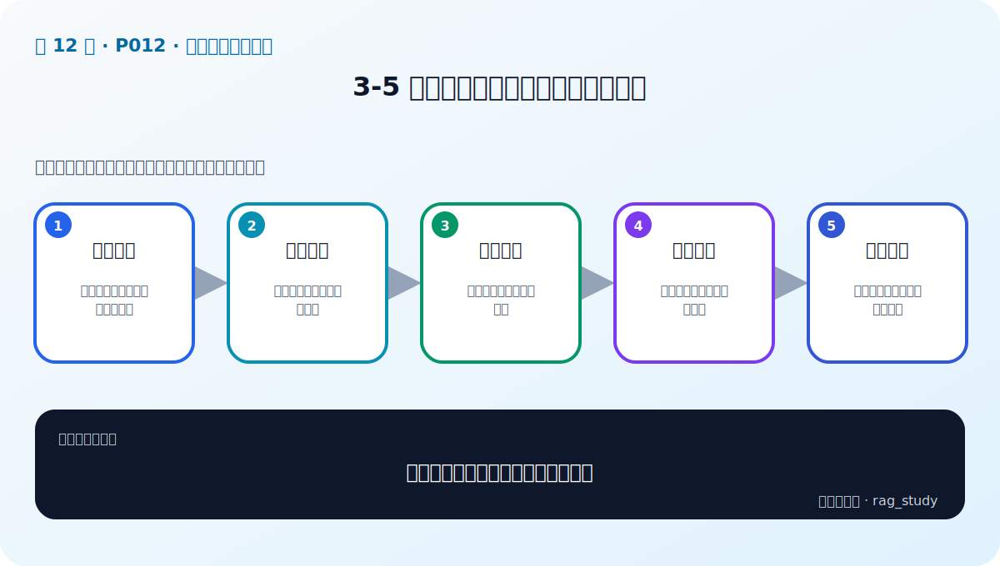
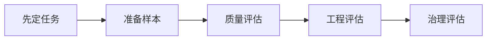

# P12：3-5 火眼金星：如何分辨大模型的好坏

> 笔记编号 12/89 · 对应原视频 P12 · 时长 05:58 · [打开这一节](https://www.bilibili.com/video/BV1fLoKBREGv?p=12)

[← P11: 3-4 没有GPU如何调用大模型-大模型调用的三种方式](../03-llm-foundations/p011-没有GPU如何调用大模型-大模型调用的三种方式.md) · [返回第 3 章专题](./README.md) · [P13: 3-6 RAG应用：挑选大模型的四大步骤 →](../03-llm-foundations/p013-RAG应用-挑选大模型的四大步骤.md)

## 这节到底讲什么

**核心问题：怎样分辨一个大模型是否适合业务？**

这节直接回答“怎样分辨一个大模型是否适合业务？”。老师的结论可以整理成五点：第一，先定任务：抽取、问答、推理、代码各不同；第二，准备样本：覆盖正常、困难与拒答场景；第三，质量评估：正确性、忠实性与稳定性；第四，工程评估：时延、吞吐、成本与上下文；第五，治理评估：安全、隐私、可部署与可追踪。下面逐项解释每一点的含义和作用。

## 辅助流程图

## 正文讲解（按视频顺序）

> 下面是依据音轨和画面整理的通顺版本，不是逐字稿。技术术语已经校正，
> 老师的原始讲法保留在后面的 ASR 页面。

### 1. 先定任务

“哪个模型最好”必须先补充任务。RAG 可能要求模型做问题改写、证据抽取、答案生成、引用、拒答或工具选择，每项能力不同。先定义输入、预期输出和不能接受的错误，评测才有意义。

### 2. 准备样本

测试集要来自真实业务，包含常见问题、困难问题、多文档问题、歧义问题、资料外问题和对抗性问题。每条样本尽量保存标准答案、相关证据和错误类型，不能只临时问几个顺手的问题。

### 3. 质量评估

质量至少包括答案正确性、对证据的忠实性、问题相关性、指令遵循、结构化输出成功率和拒答准确性。自动 LLM 评审可以提高效率，但必须用人工抽样校准，避免评审模型的偏好替代业务标准。

### 4. 工程评估

同一模型还要记录首 Token 延迟、总延迟、输入输出 Token、吞吐、错误率和费用。测试时固定提示词、temperature、最大输出长度和并发条件，否则结果不可公平比较。

### 5. 治理评估

最后检查部署方式、数据保存策略、许可证、内容安全、可审计性和供应商风险。一个质量略高但无法满足数据合规的模型，不是企业场景中的可用候选。

## 用一个例子串起来

比较两个模型时准备 100 条问题：60 条正常制度问答、20 条多文档问题、10 条资料外拒答、10 条结构化 JSON 输出。固定检索证据和提示词，再比较正确率、忠实性、JSON 通过率、P95 延迟和单次费用。

## 完整原声逐段记录

已用本地语音识别核查；技术词与口误以专题笔记的校正版为准。

[查看本节按时间戳保留的本地 ASR 转写](./transcripts/p012-火眼金星-如何分辨大模型的好坏-ASR.md)。原始转写会保留
同音字和断句误差，正文用校正后的术语，方便同时核对“老师说了什么”和“概念是什么”。

## 读完记住这五句话

- **先定任务：** 抽取、问答、推理、代码各不同
- **准备样本：** 覆盖正常、困难与拒答场景
- **质量评估：** 正确性、忠实性与稳定性
- **工程评估：** 时延、吞吐、成本与上下文
- **治理评估：** 安全、隐私、可部署与可追踪

## 最小可运行代码

[打开本节最相关的纯 Python 练习](../../rag_from_scratch/llm_clients.py)。练习包不依赖 LangChain，
目的是先看清输入、输出和算法边界，再替换成课程中的框架/API。

## 最容易踩的坑

不要让待比较模型各自生成检索证据，否则无法区分差异来自检索还是生成模型。

## 自测

1. 不看图回答：怎样分辨一个大模型是否适合业务？
2. 用上面的例子，指出本节五个知识点分别出现在哪里。
3. 如果没有“工程评估”，会出现什么具体问题？

## 学完检查

- [ ] 我能不看视频解释本节核心概念
- [ ] 我能指出它在 RAG 数据流中的位置
- [ ] 我知道它最适合与最不适合的场景
- [ ] 我读过完整 ASR 并核对了技术术语
- [ ] 我完成了专题 README 中对应的自测或实验
