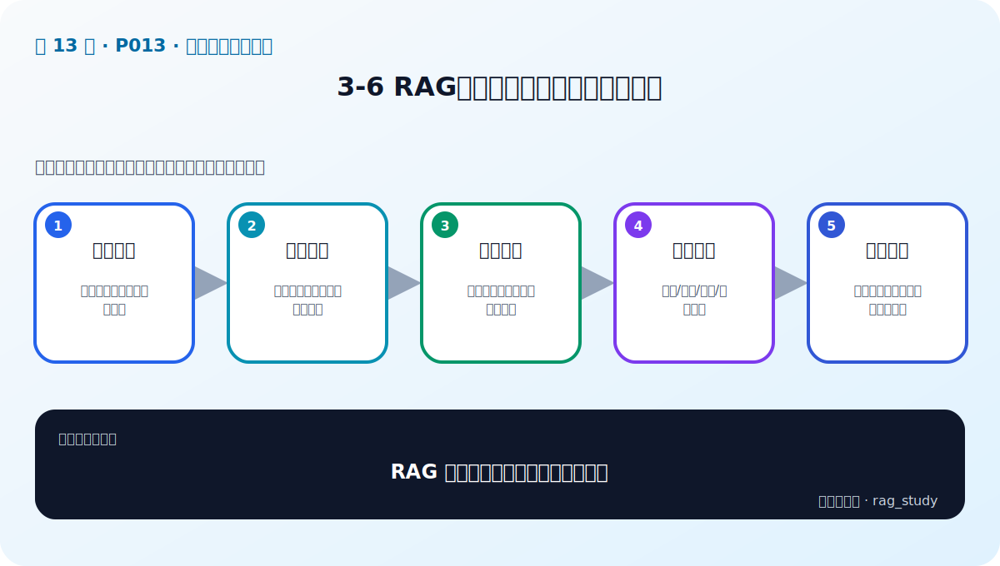
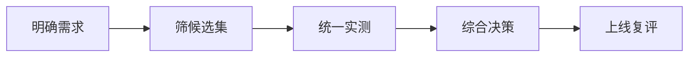

# P13：3-6 RAG应用：挑选大模型的四大步骤

> 笔记编号 13/89 · 对应原视频 P13 · 时长 02:18 · [打开这一节](https://www.bilibili.com/video/BV1fLoKBREGv?p=13)

[← P12: 3-5 火眼金星：如何分辨大模型的好坏](../03-llm-foundations/p012-火眼金星-如何分辨大模型的好坏.md) · [返回第 3 章专题](./README.md) · [P14: 3-7 总结和展望：不同项目角色需要对AI大模型了解程度的差异性分析 →](../03-llm-foundations/p014-总结和展望-不同项目角色需要对AI大模型了解程度的差异性分析.md)

## 这节到底讲什么

**核心问题：RAG 应用挑选大模型的四步是什么？**

这节直接回答“RAG 应用挑选大模型的四步是什么？”。老师的结论可以整理成五点：第一，明确需求：业务任务、质量底线与约束；第二，筛候选集：能力、上下文、语言和许可证；第三，统一实测：固定数据、提示词与解码参数；第四，综合决策：质量/成本/时延/合规权衡；第五，上线复评：用真实流量与失败样本持续验证。下面逐项解释每一点的含义和作用。

## 辅助流程图

## 正文讲解（按视频顺序）

> 下面是依据音轨和画面整理的通顺版本，不是逐字稿。技术术语已经校正，
> 老师的原始讲法保留在后面的 ASR 页面。

### 1. 明确需求

第一步把业务目标转换成可测约束：问题类型、答案质量门槛、最大延迟、预计并发、月度预算、上下文长度和数据安全等级。没有这些条件，选型会退化成比较宣传参数。

### 2. 筛候选集

第二步根据语言能力、任务能力、调用或部署方式、许可证和资源先排除明显不合适的模型。候选数量不必很多，但要包含一个能力较强的模型作为业务上限基线。

### 3. 统一实测

第三步在相同问题、证据、System Prompt、生成参数和运行环境下测试。保存每次的模型版本、完整输入、原始输出、Token 与耗时，确保结果能够复现和复盘。

### 4. 综合决策

第四步在达到质量门槛的模型中比较成本、延迟、并发和治理。可以先用强模型证明方案可行，再尝试更小模型、量化或缓存降本；不能用低成本掩盖质量不达标。

### 5. 上线复评

离线评测通过后，还要用灰度流量观察真实用户问题、P95 延迟、错误率和失败分布。新问题回流到评测集；模型、提示词或检索链变化时重新跑回归，而不是一次选型永久不变。

## 用一个例子串起来

项目要求正确率达到既定门槛、P95 小于两秒、数据不出境且月成本受限。先用强模型测出质量上限，再筛选可私有部署候选；统一实测后，选择满足质量门槛且总成本最低的方案，并通过灰度流量复评。

## 完整原声逐段记录

已用本地语音识别核查；技术词与口误以专题笔记的校正版为准。

[查看本节按时间戳保留的本地 ASR 转写](./transcripts/p013-RAG应用-挑选大模型的四大步骤-ASR.md)。原始转写会保留
同音字和断句误差，正文用校正后的术语，方便同时核对“老师说了什么”和“概念是什么”。

## 读完记住这五句话

- **明确需求：** 业务任务、质量底线与约束
- **筛候选集：** 能力、上下文、语言和许可证
- **统一实测：** 固定数据、提示词与解码参数
- **综合决策：** 质量/成本/时延/合规权衡
- **上线复评：** 用真实流量与失败样本持续验证

## 最小可运行代码

[打开本节最相关的纯 Python 练习](../../rag_from_scratch/llm_clients.py)。练习包不依赖 LangChain，
目的是先看清输入、输出和算法边界，再替换成课程中的框架/API。

## 最容易踩的坑

一开始就选最便宜的小模型，失败时会分不清是方案错误还是模型能力不足。先确定质量上限再降本。

## 自测

1. 不看图回答：RAG 应用挑选大模型的四步是什么？
2. 用上面的例子，指出本节五个知识点分别出现在哪里。
3. 如果没有“综合决策”，会出现什么具体问题？

## 学完检查

- [ ] 我能不看视频解释本节核心概念
- [ ] 我能指出它在 RAG 数据流中的位置
- [ ] 我知道它最适合与最不适合的场景
- [ ] 我读过完整 ASR 并核对了技术术语
- [ ] 我完成了专题 README 中对应的自测或实验
