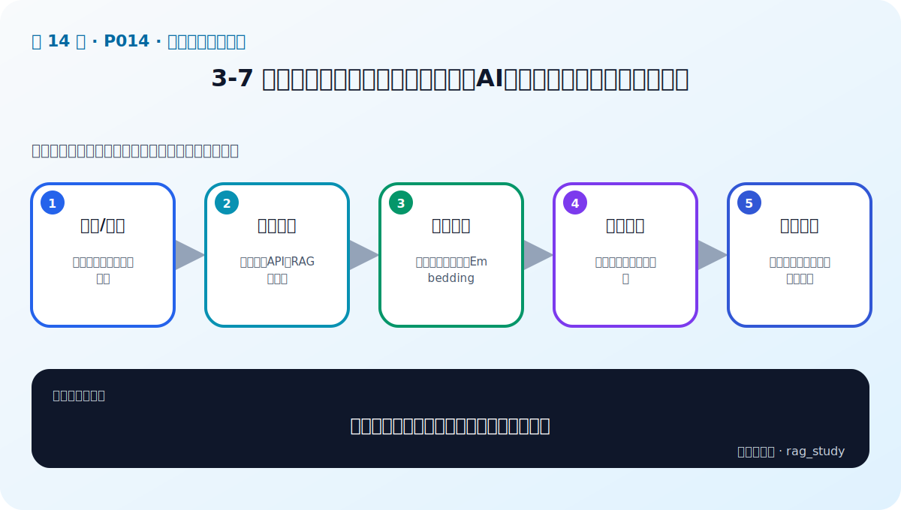

# P14：3-7 总结和展望：不同项目角色需要对AI大模型了解程度的差异性分析

> 笔记编号 14/89 · 对应原视频 P14 · 时长 09:02 · [打开这一节](https://www.bilibili.com/video/BV1fLoKBREGv?p=14)

[← P13: 3-6 RAG应用：挑选大模型的四大步骤](../03-llm-foundations/p013-RAG应用-挑选大模型的四大步骤.md) · [返回第 3 章专题](./README.md) · [P15: 3-11 实战：使用大语言模型（本地和API、GPU和CPU）-1 →](../03-llm-foundations/p015-实战-使用大语言模型-本地和API-GPU和CPU-1.md)

## 这节到底讲什么

**核心问题：不同项目角色需要把大模型学到什么深度？**

这节直接回答“不同项目角色需要把大模型学到什么深度？”。老师的结论可以整理成五点：第一，产品/业务：边界、成本、风险与验收；第二，应用开发：提示词、API、RAG 与评测；第三，算法工程：推理部署、微调、Embedding；第四，研究岗位：架构、训练与前沿方法；第五，共同要求：能用指标和案例沟通系统效果。下面逐项解释每一点的含义和作用。

## 辅助流程图

## 正文讲解（按视频顺序）

> 下面是依据音轨和画面整理的通顺版本，不是逐字稿。技术术语已经校正，
> 老师的原始讲法保留在后面的 ASR 页面。

### 1. 产品/业务

产品和业务角色不必推导 Transformer，但要理解模型能做什么、何时会幻觉、数据从哪里来、调用成本和风险怎样估算，以及用什么指标验收。否则需求容易写成无法测量的“回答更智能”。

### 2. 应用开发

AI 应用开发需要熟悉消息/API、本地服务、提示词、结构化输出、上下文管理、RAG 和 Tool Calling，还要能记录中间结果、处理超时重试并编写评测。重点是把不确定模型嵌入可靠软件系统。

### 3. 算法工程

算法工程通常进一步掌握 Tokenizer、Transformer、Embedding、量化、推理部署、微调和评测方法。除了调模型，还要理解数据构造、难负例、显存与吞吐等工程约束。

### 4. 研究岗位

研究岗位需要深入模型结构、训练目标、优化算法、数据规模规律和前沿论文，并能设计对照实验验证方法。课程主要面向应用落地，只提供进入这些主题所需的基础地图。

### 5. 共同要求

所有角色都应能说清业务问题、系统数据流、能力边界和评测证据。术语深度可以不同，但不能只凭主观体验判断模型，也不能把模型输出当成确定性软件结果。

## 用一个例子串起来

面对同一个制度助手，产品经理定义用户、风险和验收；应用开发实现 RAG、API 与日志；算法工程优化模型、Embedding 和推理；研究人员探索新方法。每个人深度不同，但都要能用数据说明系统是否有效。

## 完整原声逐段记录

已用本地语音识别核查；技术词与口误以专题笔记的校正版为准。

[查看本节按时间戳保留的本地 ASR 转写](./transcripts/p014-总结和展望-不同项目角色需要对AI大模型了解程度的差异性分析-ASR.md)。原始转写会保留
同音字和断句误差，正文用校正后的术语，方便同时核对“老师说了什么”和“概念是什么”。

## 读完记住这五句话

- **产品/业务：** 边界、成本、风险与验收
- **应用开发：** 提示词、API、RAG 与评测
- **算法工程：** 推理部署、微调、Embedding
- **研究岗位：** 架构、训练与前沿方法
- **共同要求：** 能用指标和案例沟通系统效果

## 最小可运行代码

[打开本节最相关的纯 Python 练习](../../rag_from_scratch/llm_clients.py)。练习包不依赖 LangChain，
目的是先看清输入、输出和算法边界，再替换成课程中的框架/API。

## 最容易踩的坑

角色分工不是知识壁垒。产品不能完全不懂模型边界，算法也不能不懂业务指标和上线约束。

## 自测

1. 不看图回答：不同项目角色需要把大模型学到什么深度？
2. 用上面的例子，指出本节五个知识点分别出现在哪里。
3. 如果没有“研究岗位”，会出现什么具体问题？

## 学完检查

- [ ] 我能不看视频解释本节核心概念
- [ ] 我能指出它在 RAG 数据流中的位置
- [ ] 我知道它最适合与最不适合的场景
- [ ] 我读过完整 ASR 并核对了技术术语
- [ ] 我完成了专题 README 中对应的自测或实验
