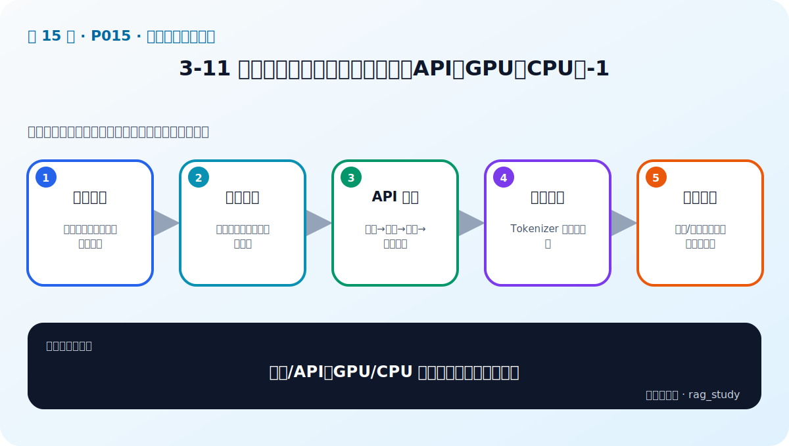
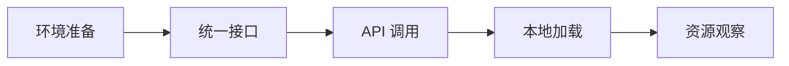

# P15：3-11 实战：使用大语言模型（本地和API、GPU和CPU）-1

> 笔记编号 15/89 · 对应原视频 P15 · 时长 17:39 · [打开这一节](https://www.bilibili.com/video/BV1fLoKBREGv?p=15)

[← P14: 3-7 总结和展望：不同项目角色需要对AI大模型了解程度的差异性分析](../03-llm-foundations/p014-总结和展望-不同项目角色需要对AI大模型了解程度的差异性分析.md) · [返回第 3 章专题](./README.md) · [P16: 3-12 实战：使用大语言模型（本地和API、GPU和CPU）-2 →](../03-llm-foundations/p016-实战-使用大语言模型-本地和API-GPU和CPU-2.md)

## 这节到底讲什么

**核心问题：本地/API、GPU/CPU 推理实战第一步做什么？**

这节直接回答“本地/API、GPU/CPU 推理实战第一步做什么？”。老师的结论可以整理成五点：第一，环境准备：依赖、密钥、设备与模型路径；第二，统一接口：固定消息、参数和返回结构；第三，API 调用：鉴权→请求→解析→异常处理；第四，本地加载：Tokenizer 与权重匹配；第五，资源观察：显存/内存、首字延迟与总耗时。下面逐项解释每一点的含义和作用。



## 辅助流程图



## 正文讲解（按视频顺序）

> 下面是依据音轨和画面整理的通顺版本，不是逐字稿。技术术语已经校正，
> 老师的原始讲法保留在后面的 ASR 页面。

### 1. 环境准备

先确认 Python 与依赖版本、模型文件或 API 密钥、可用设备和网络。密钥放在环境变量中，不写进 Notebook；本地模型提前估算权重与 KV Cache所需内存/显存，避免加载到一半才 OOM。

### 2. 统一接口

无论后端是 API 还是本地模型，上层都应使用统一结构，例如输入 system/user 消息与生成参数，输出文本、Token 用量、耗时和错误。这样 RAG pipeline 才能替换模型而不重写业务逻辑。

### 3. API 调用

API 路线包含读取密钥、创建客户端、指定模型、发送消息和解析响应。生产代码还要设置连接/读取超时、限流重试、请求 ID 和日志脱敏，并区分可重试的网络错误与不可重试的参数错误。

### 4. 本地加载

Transformers 路线通常先加载与权重匹配的 Tokenizer，再按设备和数据类型加载模型，切换到推理模式，编码输入并调用 generate。聊天模型还要使用其 chat template，否则提示格式错误会显著影响输出。

### 5. 资源观察

每次实验记录模型版本、输入长度、输出长度、首 Token 与总耗时、CPU内存或 GPU 显存。只有同时观察质量和资源，才能判断本地 GPU、CPU 或 API 哪条路线适合项目。


## 用一个例子串起来

同一个 `messages=[system,user]` 请求分别发给云 API 和本地模型。API 返回文本与 Token 用量；本地端用 Tokenizer 编码、`generate` 解码。两边都记录模型版本、生成参数、耗时和错误，才能进行下一集的公平比较。

## 完整原声逐段记录

已用本地语音识别核查；技术词与口误以专题笔记的校正版为准。

[查看本节按时间戳保留的本地 ASR 转写](./transcripts/p015-实战-使用大语言模型-本地和API-GPU和CPU-1-ASR.md)。原始转写会保留
同音字和断句误差，正文用校正后的术语，方便同时核对“老师说了什么”和“概念是什么”。

## 读完记住这五句话

- **环境准备：** 依赖、密钥、设备与模型路径
- **统一接口：** 固定消息、参数和返回结构
- **API 调用：** 鉴权→请求→解析→异常处理
- **本地加载：** Tokenizer 与权重匹配
- **资源观察：** 显存/内存、首字延迟与总耗时

## 最小可运行代码

[打开本节最相关的纯 Python 练习](../../rag_from_scratch/llm_clients.py)。练习包不依赖 LangChain，
目的是先看清输入、输出和算法边界，再替换成课程中的框架/API。

下面的客户端同时适用于云端或开启 OpenAI-compatible 接口的本地服务：

```python
import os
from rag_from_scratch.llm_clients import OpenAICompatibleClient

client = OpenAICompatibleClient(
    base_url=os.environ["MODEL_BASE_URL"],
    model=os.environ["MODEL_NAME"],
    api_key=os.environ.get("MODEL_API_KEY", ""),
)
response = client.chat([
    {"role": "system", "content": "只依据给定资料回答。"},
    {"role": "user", "content": "年假怎么申请？"},
])
print(response.text)
print(response.latency_seconds)
```

本地服务通常把 `MODEL_BASE_URL` 指向本机地址；云服务指向厂商端点。密钥不写进
代码，调用失败时保存错误类型但不要记录敏感正文。

## 最容易踩的坑

不要把 API Key、私有路径或完整敏感提示词写进 Notebook 和日志；演示代码也应使用环境变量。

## 自测

1. 不看图回答：本地/API、GPU/CPU 推理实战第一步做什么？
2. 用上面的例子，指出本节五个知识点分别出现在哪里。
3. 如果没有“本地加载”，会出现什么具体问题？

## 学完检查

- [ ] 我能不看视频解释本节核心概念
- [ ] 我能指出它在 RAG 数据流中的位置
- [ ] 我知道它最适合与最不适合的场景
- [ ] 我读过完整 ASR 并核对了技术术语
- [ ] 我完成了专题 README 中对应的自测或实验
