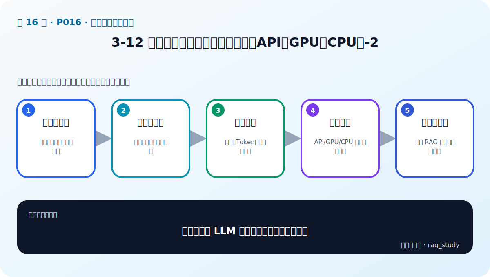
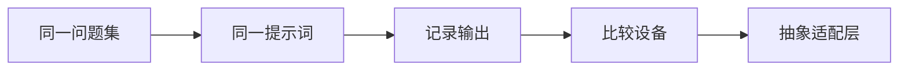

# P16：3-12 实战：使用大语言模型（本地和API、GPU和CPU）-2

> 笔记编号 16/89 · 对应原视频 P16 · 时长 18:43 · [打开这一节](https://www.bilibili.com/video/BV1fLoKBREGv?p=16)

[← P15: 3-11 实战：使用大语言模型（本地和API、GPU和CPU）-1](../03-llm-foundations/p015-实战-使用大语言模型-本地和API-GPU和CPU-1.md) · [返回第 3 章专题](./README.md) · [P17: 4-1 本章介绍 →](../04-embeddings/p017-Embedding-本章导学.md)

## 这节到底讲什么

**核心问题：怎样把多种 LLM 调用方式做成可比较实验？**

这节直接回答“怎样把多种 LLM 调用方式做成可比较实验？”。老师的结论可以整理成五点：第一，同一问题集：避免因输入不同误判模型；第二，同一提示词：控制系统指令和上下文；第三，记录输出：答案、Token、耗时与错误；第四，比较设备：API/GPU/CPU 的质量和成本；第五，抽象适配层：上层 RAG 不绑定单一模型。下面逐项解释每一点的含义和作用。



## 辅助流程图



## 正文讲解（按视频顺序）

> 下面是依据音轨和画面整理的通顺版本，不是逐字稿。技术术语已经校正，
> 老师的原始讲法保留在后面的 ASR 页面。

### 1. 同一问题集

比较调用方式时，先固定一组包含简单问答、证据阅读、拒答和结构化输出的问题。不同后端必须接收完全相同的问题和证据，否则结果差异无法归因于模型或设备。

### 2. 同一提示词

System Prompt、上下文格式、temperature、top_p 和最大输出长度都要一致。聊天模型使用各自官方 chat template，但语义指令应等价；不能给某个模型更详细的提示再声称它更好。

### 3. 记录输出

不要只打印最终文本。保存原始响应、异常、输入/输出 Token、首字延迟、总耗时和资源峰值；结构化输出要做 JSON 或 Schema 校验，拒答要检查是否真的因为资料不足。

### 4. 比较设备

API、GPU 和 CPU 的主要差别常体现在部署责任、延迟、吞吐和成本，而不是代码能否运行。GPU 更适合高并发矩阵计算，CPU 适合低频或小模型，API适合快速验证；实际结论来自目标负载测试。

### 5. 抽象适配层

把每种后端封装成相同的 generate/chat 协议，RAG 上层只依赖协议。适配层负责消息格式、重试、Token 统计和错误转换；业务层负责检索、提示和答案校验。这个边界能降低供应商和框架锁定。


## 用一个例子串起来

让 API、GPU 和 CPU 回答同一组“依据证据回答并输出 JSON”的问题。若 API最准确、GPU 延迟最低、CPU 成本最低但很慢，就根据线上并发和质量门槛选择，而不是笼统地说某种设备更好。

## 完整原声逐段记录

已用本地语音识别核查；技术词与口误以专题笔记的校正版为准。

[查看本节按时间戳保留的本地 ASR 转写](./transcripts/p016-实战-使用大语言模型-本地和API-GPU和CPU-2-ASR.md)。原始转写会保留
同音字和断句误差，正文用校正后的术语，方便同时核对“老师说了什么”和“概念是什么”。

## 读完记住这五句话

- **同一问题集：** 避免因输入不同误判模型
- **同一提示词：** 控制系统指令和上下文
- **记录输出：** 答案、Token、耗时与错误
- **比较设备：** API/GPU/CPU 的质量和成本
- **抽象适配层：** 上层 RAG 不绑定单一模型

## 最小可运行代码

[打开本节最相关的纯 Python 练习](../../rag_from_scratch/llm_clients.py)。练习包不依赖 LangChain，
目的是先看清输入、输出和算法边界，再替换成课程中的框架/API。

先用无需网络的模拟客户端练习公平比较和结果记录：

```python
from rag_from_scratch.llm_clients import MockChatClient, benchmark

client = MockChatClient(lambda messages: "资料不足，无法回答。")
cases = [(
    "outside-knowledge",
    [{"role": "user", "content": "资料中没有的问题"}],
)]
print(benchmark(client, cases))
```

预期结果包含 `case_id`、`ok`、`text`、`model` 和 `latency_seconds`。换成 API、
GPU 或 CPU 后仍使用同一批 `cases`，再补充 Token、显存和业务质量指标。

## 最容易踩的坑

比较设备时不能只看一次总耗时。预热、输入长度、输出长度、并发和批处理条件必须一致。

## 自测

1. 不看图回答：怎样把多种 LLM 调用方式做成可比较实验？
2. 用上面的例子，指出本节五个知识点分别出现在哪里。
3. 如果没有“比较设备”，会出现什么具体问题？

## 学完检查

- [ ] 我能不看视频解释本节核心概念
- [ ] 我能指出它在 RAG 数据流中的位置
- [ ] 我知道它最适合与最不适合的场景
- [ ] 我读过完整 ASR 并核对了技术术语
- [ ] 我完成了专题 README 中对应的自测或实验
