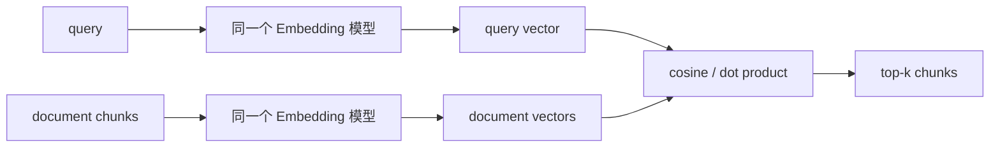

# 第 4 章：Embedding——检索质量的语义入口

> 对应视频 P17–P23：[打开本章第一节](https://www.bilibili.com/video/BV1fLoKBREGv?p=17)

## Embedding 在 RAG 中做什么

Embedding 把查询和文档映射为固定维度向量。若训练目标让“语义相关”的文本向量
靠近，向量数据库就能用距离找出字面不同但含义相近的片段。它决定候选集的上限：
相关文档没有进入 top-k，后面的重排和大模型通常无法补救。



## 模型怎样“炼成”

句向量模型通常以成对或成组三元数据训练：

- 正样本 `(query, relevant_document)` 要拉近；
- 负样本 `(query, irrelevant_document)` 要推远；
- hard negative 与主题相似但不能回答，最能训练细粒度判断；
- Encoder 输出 token 表示，再经 CLS/mean pooling 得到句向量；
- 对比学习损失让一个 batch 内正例相对其他候选得分更高。

Embedding 相似表示“训练分布中的相关性”，不等于事实正确、逻辑蕴含或业务可用。

## 距离与归一化

余弦相似度只比较方向：

```text
cos(q, d) = (q · d) / (||q|| ||d||)
```

若向量已经做 L2 归一化，余弦排序与点积排序一致。索引构建和查询必须使用同一
模型、同一版本、同一归一化和同一 query/document 指令格式；换模型后旧向量要
重建，不能混在一个集合中。

## 中文 Embedding 选择维度

课程介绍主流中文/多语模型与排行榜，但选型不应只看榜单总分。至少比较：

- 业务语言、领域术语、短查询和长文档覆盖；
- 最大输入长度、向量维度、吞吐、显存/内存；
- 是否要求 `query:` / `passage:` 或中文检索指令；
- 模型许可证、离线部署、批处理和 API 成本；
- 在自有评测集上的 Recall@k、MRR 与 hard-negative 表现。

通用榜单（如 C-MTEB 类评测）适合筛候选，不是最终验收。制度、医学、代码或商品
检索的相关性定义都可能不同。

## 实战对比方式

1. 固定同一批 chunks、查询和相关文档标注。
2. 为每个模型分别建索引，禁止复用其他模型的向量。
3. 同时记录召回质量、编码吞吐、索引大小和查询延迟。
4. 检查失败样本属于数字/专名、否定、长文本、领域词还是多跳问题。
5. 再决定是否加 BM25、领域微调或 Reranker。

## 最容易踩的坑

- 用字符切坏表格或标题，再责怪 Embedding。
- 忘记模型要求的 query/document 前缀。
- 只看最高相似度，不设置无相关结果时的拒答策略。
- 模型升级后只向新文档写新向量，导致向量空间混杂。
- 把向量维度更高直接等同于效果更好。

## 动手练习

[HashingEmbedder](../../rag_from_scratch/dense.py) 只模拟接口。先观察它为何只能
匹配共享 token，再换真实语义模型：保持 `embed(text) -> vector` 协议不变，
其余 `VectorIndex` 与评估代码无需改动。

