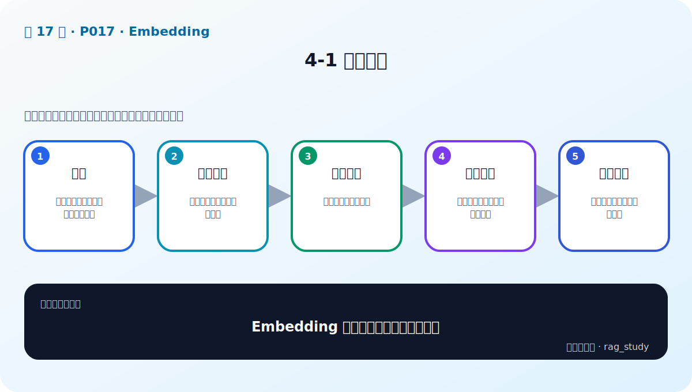

# P17：4-1 本章介绍

> 笔记编号 17/89 · 对应原视频 P17 · 时长 00:42 · [打开这一节](https://www.bilibili.com/video/BV1fLoKBREGv?p=17)

[← P16: 3-12 实战：使用大语言模型（本地和API、GPU和CPU）-2](../03-llm-foundations/p016-实战-使用大语言模型-本地和API-GPU和CPU-2.md) · [返回第 4 章专题](./README.md) · [P18: 4-2 embedding模型的重要性 →](../04-embeddings/p018-embedding模型的重要性.md)

## 这节到底讲什么

**核心问题：Embedding 章要建立怎样的完整认识？**

这节直接回答“Embedding 章要建立怎样的完整认识？”。老师的结论可以整理成五点：第一，作用：把查询与文档映射到同一向量空间；第二，训练原理：相似样本拉近、负样本推远；第三，模型选择：排行榜只是候选入口；第四，实战比较：加载、编码、归一化、相似度；第五，系统影响：召回上限决定后续生成上限。下面逐项解释每一点的含义和作用。

## 辅助流程图

## 正文讲解（按视频顺序）

> 下面是依据音轨和画面整理的通顺版本，不是逐字稿。技术术语已经校正，
> 老师的原始讲法保留在后面的 ASR 页面。

### 1. 作用

Embedding 把查询和文档映射到同一个固定维度向量空间。向量越接近，表示模型认为两段文本越相关。RAG 利用这种表示找到字面不同但语义相近的文档，它直接决定候选证据的质量上限。

### 2. 训练原理

句向量模型通常用对比学习训练：相关的 query-document 正样本要靠近，无关或容易混淆的负样本要远离。难负例与正确文档主题相近却不能回答，对学习细粒度相关性尤其重要。

### 3. 模型选择

选择模型要同时看语言、领域、最大输入长度、向量维度、推理速度、许可证和输入格式。公开排行榜适合筛候选，但只有企业自己的问题与相关文档标注才能给出最终结论。

### 4. 实战比较

章末会加载多个 Embedding 模型，对查询与文档编码，进行归一化并计算余弦或点积。公平比较必须固定文本、前缀、截断、池化和距离函数，并分别重建索引。

### 5. 系统影响

相关文档没有进入召回候选，后面的 Reranker 和 LLM 通常无法补救。因此调试回答错误时，应先查看 Recall@k 和失败查询，再决定更换模型、改分块、增加 BM25 或做领域微调。

## 用一个例子串起来

文档写“员工可申请调休”，用户问“加班能不能补休”。Embedding 把两种表达映射到相近位置，使正确条款进入候选；如果它没有进入 Top-k，生成模型就看不到证据。

## 完整原声逐段记录

已用本地语音识别核查；技术词与口误以专题笔记的校正版为准。

[查看本节按时间戳保留的本地 ASR 转写](./transcripts/p017-Embedding-本章导学-ASR.md)。原始转写会保留
同音字和断句误差，正文用校正后的术语，方便同时核对“老师说了什么”和“概念是什么”。

## 读完记住这五句话

- **作用：** 把查询与文档映射到同一向量空间
- **训练原理：** 相似样本拉近、负样本推远
- **模型选择：** 排行榜只是候选入口
- **实战比较：** 加载、编码、归一化、相似度
- **系统影响：** 召回上限决定后续生成上限

## 最小可运行代码

[打开本节最相关的纯 Python 练习](../../rag_from_scratch/dense.py)。练习包不依赖 LangChain，
目的是先看清输入、输出和算法边界，再替换成课程中的框架/API。

## 最容易踩的坑

Embedding 决定语义召回，但不能修复坏文档、错误权限和过期内容；检索质量是整条数据链共同结果。

## 自测

1. 不看图回答：Embedding 章要建立怎样的完整认识？
2. 用上面的例子，指出本节五个知识点分别出现在哪里。
3. 如果没有“实战比较”，会出现什么具体问题？

## 学完检查

- [ ] 我能不看视频解释本节核心概念
- [ ] 我能指出它在 RAG 数据流中的位置
- [ ] 我知道它最适合与最不适合的场景
- [ ] 我读过完整 ASR 并核对了技术术语
- [ ] 我完成了专题 README 中对应的自测或实验
