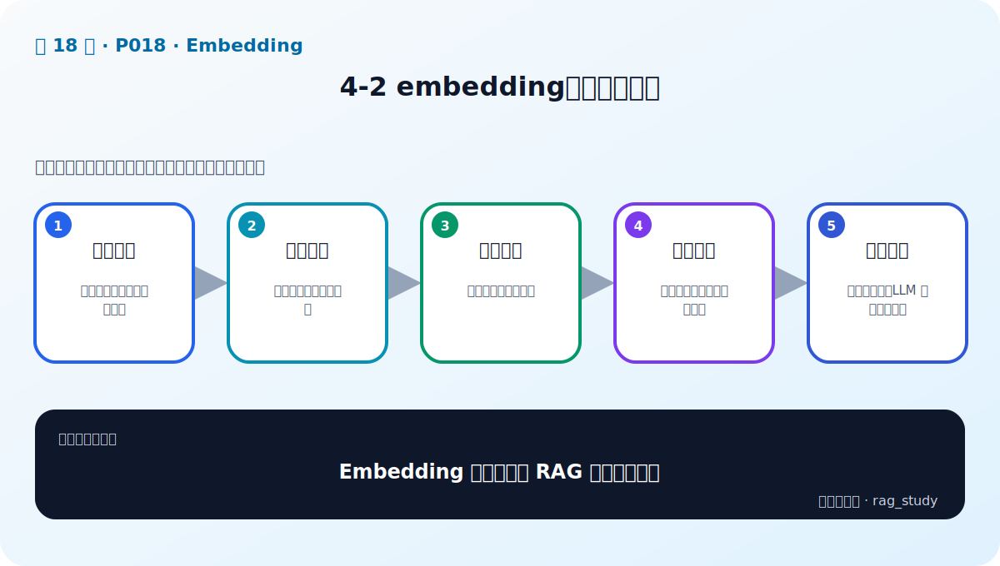

# P18：4-2 embedding模型的重要性

> 笔记编号 18/89 · 对应原视频 P18 · 时长 02:36 · [打开这一节](https://www.bilibili.com/video/BV1fLoKBREGv?p=18)

[← P17: 4-1 本章介绍](../04-embeddings/p017-Embedding-本章导学.md) · [返回第 4 章专题](./README.md) · [P19: 4-3 embedding是怎么炼成的？ →](../04-embeddings/p019-embedding是怎么炼成的.md)

## 这节到底讲什么

**核心问题：Embedding 为什么决定 RAG 的召回上限？**

这节直接回答“Embedding 为什么决定 RAG 的召回上限？”。老师的结论可以整理成五点：第一，语义桥梁：把不同表达映射到相近位置；第二，查询编码：用户意图变为检索向量；第三，文档编码：知识块离线形成向量；第四，相似召回：距离近不等于事实必然正确；第五，错误传递：证据没召回，LLM 再强也难回答。下面逐项解释每一点的含义和作用。

## 辅助流程图

## 正文讲解（按视频顺序）

> 下面是依据音轨和画面整理的通顺版本，不是逐字稿。技术术语已经校正，
> 老师的原始讲法保留在后面的 ASR 页面。

### 1. 语义桥梁

关键词检索要求文字有较多重合，Embedding 则学习语义表示。例如“补休”和“调休”字面不同，但在合适的中文检索模型中可以靠近。它因此成为用户自然语言与企业文档措辞之间的桥梁。

### 2. 查询编码

在线检索时，用户问题先经过 Embedding 模型得到查询向量。有些模型要求添加 query 前缀或检索指令；遗漏这些格式可能降低效果。查询过短、歧义或包含多意图时，向量本身也会不稳定。

### 3. 文档编码

离线阶段用同一模型编码每个文档块，并把向量与原文、ID、来源、页码和版本一起保存。换模型、版本、池化或归一化方式后，旧向量不能直接混用，通常需要重建索引。

### 4. 相似召回

向量库按余弦、内积或欧氏距离取得最近邻。分数只表示当前表示空间中的相似程度，不代表文档事实正确，也不等于一定能回答问题；还要检查内容、权限、时效和证据充分性。

### 5. 错误传递

如果正确证据没有进入 Top-k，生成模型只能在错误或不完整上下文上作答。这类问题应先优化检索召回，而不是反复修改生成提示词。RAG 的整体上限首先受候选集覆盖率限制。

## 用一个例子串起来

查询“差旅住宿标准”和文档“出差酒店费用上限”字面重合不多，但语义相关。查询与文档使用同一模型和规范编码后，向量距离应比“员工食堂菜单”更近。

## 完整原声逐段记录

已用本地语音识别核查；技术词与口误以专题笔记的校正版为准。

[查看本节按时间戳保留的本地 ASR 转写](./transcripts/p018-embedding模型的重要性-ASR.md)。原始转写会保留
同音字和断句误差，正文用校正后的术语，方便同时核对“老师说了什么”和“概念是什么”。

## 读完记住这五句话

- **语义桥梁：** 把不同表达映射到相近位置
- **查询编码：** 用户意图变为检索向量
- **文档编码：** 知识块离线形成向量
- **相似召回：** 距离近不等于事实必然正确
- **错误传递：** 证据没召回，LLM 再强也难回答

## 最小可运行代码

[打开本节最相关的纯 Python 练习](../../rag_from_scratch/dense.py)。练习包不依赖 LangChain，
目的是先看清输入、输出和算法边界，再替换成课程中的框架/API。

## 最容易踩的坑

相似度高不等于事实蕴含。否定句、数字和条件很容易语义接近却答案相反，必须用难负例测试。

## 自测

1. 不看图回答：Embedding 为什么决定 RAG 的召回上限？
2. 用上面的例子，指出本节五个知识点分别出现在哪里。
3. 如果没有“相似召回”，会出现什么具体问题？

## 学完检查

- [ ] 我能不看视频解释本节核心概念
- [ ] 我能指出它在 RAG 数据流中的位置
- [ ] 我知道它最适合与最不适合的场景
- [ ] 我读过完整 ASR 并核对了技术术语
- [ ] 我完成了专题 README 中对应的自测或实验
