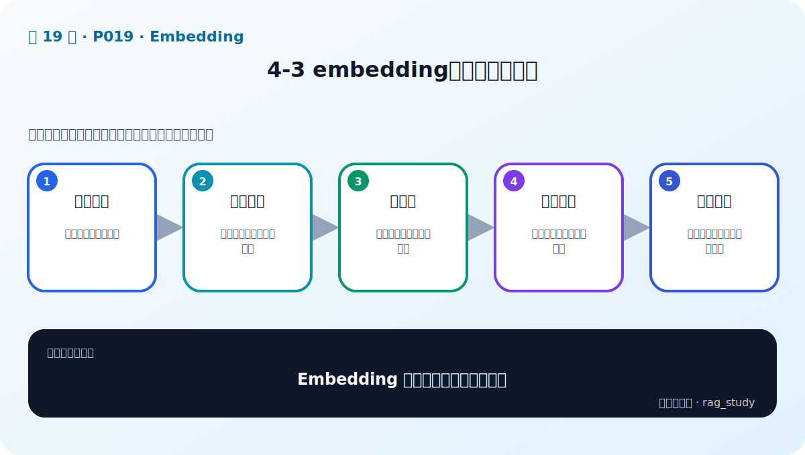
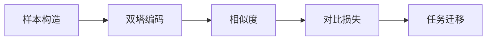

# P19：4-3 embedding是怎么炼成的？

> 笔记编号 19/89 · 对应原视频 P19 · 时长 05:08 · [打开这一节](https://www.bilibili.com/video/BV1fLoKBREGv?p=19)

[← P18: 4-2 embedding模型的重要性](../04-embeddings/p018-embedding模型的重要性.md) · [返回第 4 章专题](./README.md) · [P20: 4-4 主流中文embedding模型 →](../04-embeddings/p020-主流中文embedding模型.md)

## 这节到底讲什么

**核心问题：Embedding 模型是怎样训练出来的？**

这节直接回答“Embedding 模型是怎样训练出来的？”。老师的结论可以整理成五点：第一，样本构造：正对、负例与难负例；第二，双塔编码：查询和文档分别生成向量；第三，相似度：点积或余弦计算匹配程度；第四，对比损失：拉近正样本、推远负样本；第五，任务迁移：通用预训练后可做领域微调。下面逐项解释每一点的含义和作用。

## 辅助流程图

## 正文讲解（按视频顺序）

> 下面是依据音轨和画面整理的通顺版本，不是逐字稿。技术术语已经校正，
> 老师的原始讲法保留在后面的 ASR 页面。

### 1. 样本构造

训练数据可以是句子对或 query-document 对。正样本表示真正相关，负样本表示无关；从当前模型高分误召回中挑出的 hard negatives 最有价值。错误标签会直接扭曲向量空间。

### 2. 双塔编码

检索模型常使用双塔结构：查询和文档分别经过相同或相关的 Encoder 得到向量。文档向量可以提前离线计算，查询到来时只编码一次，因此适合大规模快速召回。

### 3. 相似度

模型用点积、余弦等函数计算 query 与候选的匹配得分。若向量已做 L2 归一化，点积和余弦的排序一致；是否归一化必须与训练方式和向量库距离配置保持一致。

### 4. 对比损失

对比学习会提高正样本得分、降低负样本得分。一个 batch 中其他文档可作为 in-batch negatives，从而提高训练效率；但存在假负例时，会把实际相关内容错误推远。

### 5. 任务迁移

通用模型在公开语料上学习广泛语义，进入医学、法律或企业缩写场景后可能不够准确。先用业务评测确认问题，再用领域正负样本微调；微调前后都要在独立测试集比较 Recall@k 与 MRR。

## 用一个例子串起来

对查询“上海住宿上限”，正确条款是正样本；“北京住宿上限”主题很像却回答错误，是有价值的难负例；“年假申请”是普通负例。训练要让模型学会城市条件，而不只是看到“住宿上限”就判为相关。

## 完整原声逐段记录

已用本地语音识别核查；技术词与口误以专题笔记的校正版为准。

[查看本节按时间戳保留的本地 ASR 转写](./transcripts/p019-embedding是怎么炼成的-ASR.md)。原始转写会保留
同音字和断句误差，正文用校正后的术语，方便同时核对“老师说了什么”和“概念是什么”。

## 读完记住这五句话

- **样本构造：** 正对、负例与难负例
- **双塔编码：** 查询和文档分别生成向量
- **相似度：** 点积或余弦计算匹配程度
- **对比损失：** 拉近正样本、推远负样本
- **任务迁移：** 通用预训练后可做领域微调

## 最小可运行代码

[打开本节最相关的纯 Python 练习](../../rag_from_scratch/dense.py)。练习包不依赖 LangChain，
目的是先看清输入、输出和算法边界，再替换成课程中的框架/API。

## 最容易踩的坑

训练数据中若存在假负例，模型会被迫把实际相关文档推远；负样本采集后要抽样审核。

## 自测

1. 不看图回答：Embedding 模型是怎样训练出来的？
2. 用上面的例子，指出本节五个知识点分别出现在哪里。
3. 如果没有“对比损失”，会出现什么具体问题？

## 学完检查

- [ ] 我能不看视频解释本节核心概念
- [ ] 我能指出它在 RAG 数据流中的位置
- [ ] 我知道它最适合与最不适合的场景
- [ ] 我读过完整 ASR 并核对了技术术语
- [ ] 我完成了专题 README 中对应的自测或实验
