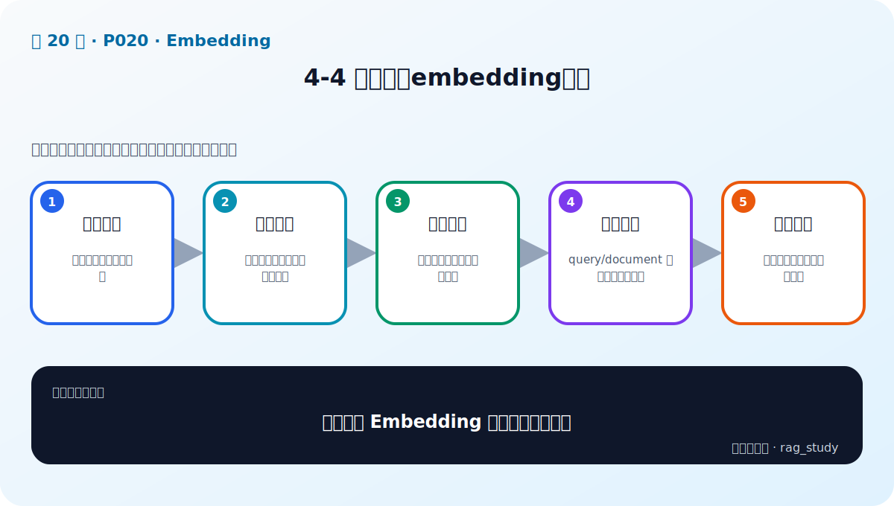

# P20：4-4 主流中文embedding模型

> 笔记编号 20/89 · 对应原视频 P20 · 时长 06:21 · [打开这一节](https://www.bilibili.com/video/BV1fLoKBREGv?p=20)

[← P19: 4-3 embedding是怎么炼成的？](../04-embeddings/p019-embedding是怎么炼成的.md) · [返回第 4 章专题](./README.md) · [P21: 4-5 embedding模型排行榜靠谱不靠谱，如何选择 →](../04-embeddings/p021-embedding模型排行榜靠谱不靠谱-如何选择.md)

## 这节到底讲什么

**核心问题：主流中文 Embedding 模型应如何认识？**

这节直接回答“主流中文 Embedding 模型应如何认识？”。老师的结论可以整理成五点：第一，中文适配：分词、语料与语义覆盖；第二，模型家族：通用、多语、指令化与长文本；第三，向量维度：容量、存储与检索成本权衡；第四，输入规范：query/document 前缀需按模型说明；第五，候选原则：先按许可证与部署条件过滤。下面逐项解释每一点的含义和作用。

## 辅助流程图

## 正文讲解（按视频顺序）

> 下面是依据音轨和画面整理的通顺版本，不是逐字稿。技术术语已经校正，
> 老师的原始讲法保留在后面的 ASR 页面。

### 1. 中文适配

中文模型的差异不仅是能否输入汉字，还包括训练语料、简繁体、专业词、短查询、长文档和中英混合能力。选择时要用真实中文问题测试，而不是只看模型名称中是否写着 Chinese。

### 2. 模型家族

候选通常包含中文专用、多语、指令式检索和长文本 Embedding 模型。有些模型直接编码文本，有些要求区分 query 与 passage，还有些通过指令描述检索任务；必须遵循模型卡用法。

### 3. 向量维度

维度越高，单个向量的存储、传输、索引内存和计算成本越高，但效果不一定单调提升。部分模型支持裁剪维度；实际应比较目标维度下的召回、速度和存储，而不是默认选最大。

### 4. 输入规范

模型可能要求 `query:`、`passage:` 或自然语言检索指令，最大长度与截断策略也不同。索引和查询两端必须遵守同一版本规范；文档被静默截断可能丢失后半部分关键信息。

### 5. 候选原则

先按商用许可证、离线部署、语言、输入长度和硬件过滤，再选择少量候选做业务评测。模型产品变化很快，课程列举的具体名称只作为当时的生态示例，不能代替当前项目验证。

## 用一个例子串起来

一个模型中文榜单高，但最大输入很短，会截断长制度；另一个模型向量更小、支持检索指令并可商用。项目应分别建索引，在真实长短问题上比较召回和资源，再决定，而不是只看榜单排名。

## 完整原声逐段记录

已用本地语音识别核查；技术词与口误以专题笔记的校正版为准。

[查看本节按时间戳保留的本地 ASR 转写](./transcripts/p020-主流中文embedding模型-ASR.md)。原始转写会保留
同音字和断句误差，正文用校正后的术语，方便同时核对“老师说了什么”和“概念是什么”。

## 读完记住这五句话

- **中文适配：** 分词、语料与语义覆盖
- **模型家族：** 通用、多语、指令化与长文本
- **向量维度：** 容量、存储与检索成本权衡
- **输入规范：** query/document 前缀需按模型说明
- **候选原则：** 先按许可证与部署条件过滤

## 最小可运行代码

[打开本节最相关的纯 Python 练习](../../rag_from_scratch/dense.py)。练习包不依赖 LangChain，
目的是先看清输入、输出和算法边界，再替换成课程中的框架/API。

## 最容易踩的坑

模型要求的 query/document 前缀、检索指令和最大长度不能凭经验省略，应以对应版本模型卡为准。

## 自测

1. 不看图回答：主流中文 Embedding 模型应如何认识？
2. 用上面的例子，指出本节五个知识点分别出现在哪里。
3. 如果没有“输入规范”，会出现什么具体问题？

## 学完检查

- [ ] 我能不看视频解释本节核心概念
- [ ] 我能指出它在 RAG 数据流中的位置
- [ ] 我知道它最适合与最不适合的场景
- [ ] 我读过完整 ASR 并核对了技术术语
- [ ] 我完成了专题 README 中对应的自测或实验
