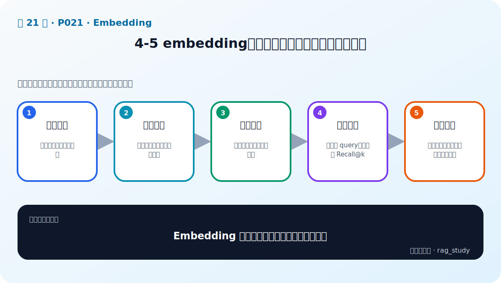

# P21：4-5 embedding模型排行榜靠谱不靠谱，如何选择

> 笔记编号 21/89 · 对应原视频 P21 · 时长 04:11 · [打开这一节](https://www.bilibili.com/video/BV1fLoKBREGv?p=21)

[← P20: 4-4 主流中文embedding模型](../04-embeddings/p020-主流中文embedding模型.md) · [返回第 4 章专题](./README.md) · [P22: 4-7 实战：embedding模型加载和使用对比 →](../04-embeddings/p022-实战-embedding模型加载和使用对比.md)

## 这节到底讲什么

**核心问题：Embedding 排行榜为什么不能直接替你选型？**

这节直接回答“Embedding 排行榜为什么不能直接替你选型？”。老师的结论可以整理成五点：第一，榜单价值：快速缩小通用候选范围；第二，数据偏差：公开集与企业语料分布不同；第三，指标局限：平均分掩盖具体任务短板；第四，业务评测：用真实 query、文档和 Recall@k；第五，工程约束：速度、显存、维度、许可同样重要。下面逐项解释每一点的含义和作用。

## 辅助流程图

## 正文讲解（按视频顺序）

> 下面是依据音轨和画面整理的通顺版本，不是逐字稿。技术术语已经校正，
> 老师的原始讲法保留在后面的 ASR 页面。

### 1. 榜单价值

MTEB、C-MTEB 等榜单在多个公开任务上给出统一分数，适合了解模型大致能力并缩小候选范围。它们节省初筛时间，但测试任务、语言和数据分布不可能与每家企业完全一致。

### 2. 数据偏差

公开集可能以通用问答、百科或语义相似为主，而企业检索包含制度编号、产品型号、否定条件、表格和内部缩写。榜单高分模型可能在这些场景中系统性失败。

### 3. 指标局限

平均分会掩盖单项短板；相似度任务高分也不等于 Retrieval Recall@k 高。还要注意模型尺寸、输入长度、向量维度和是否使用额外指令，避免只比较一个总分。

### 4. 业务评测

建立真实 query、候选文档和相关文档 ID 的测试集，为每个模型分别编码并建索引，比较 Recall@k、MRR 和失败样本。数据应包含专名、数字、长文档、难负例和资料外问题。

### 5. 工程约束

达到召回门槛后，再比较编码吞吐、查询延迟、索引大小、显存/内存、许可证和维护成本。最终模型是质量与工程约束的平衡，不一定是榜单第一。

## 用一个例子串起来

排行榜第一的模型在公开语义任务很好，却把“不得报销”与“可以报销”召回到一起。企业测试集加入否定、金额和版本冲突后，它的 Recall@k 可能不如排名较低的模型，这正是业务评测不可省略的原因。

## 完整原声逐段记录

已用本地语音识别核查；技术词与口误以专题笔记的校正版为准。

[查看本节按时间戳保留的本地 ASR 转写](./transcripts/p021-embedding模型排行榜靠谱不靠谱-如何选择-ASR.md)。原始转写会保留
同音字和断句误差，正文用校正后的术语，方便同时核对“老师说了什么”和“概念是什么”。

## 读完记住这五句话

- **榜单价值：** 快速缩小通用候选范围
- **数据偏差：** 公开集与企业语料分布不同
- **指标局限：** 平均分掩盖具体任务短板
- **业务评测：** 用真实 query、文档和 Recall@k
- **工程约束：** 速度、显存、维度、许可同样重要

## 最小可运行代码

[打开本节最相关的纯 Python 练习](../../rag_from_scratch/dense.py)。练习包不依赖 LangChain，
目的是先看清输入、输出和算法边界，再替换成课程中的框架/API。

## 最容易踩的坑

不要把多个榜单的分数直接横向相加；任务、数据、指标和评测版本不同，数值未必可比。

## 自测

1. 不看图回答：Embedding 排行榜为什么不能直接替你选型？
2. 用上面的例子，指出本节五个知识点分别出现在哪里。
3. 如果没有“业务评测”，会出现什么具体问题？

## 学完检查

- [ ] 我能不看视频解释本节核心概念
- [ ] 我能指出它在 RAG 数据流中的位置
- [ ] 我知道它最适合与最不适合的场景
- [ ] 我读过完整 ASR 并核对了技术术语
- [ ] 我完成了专题 README 中对应的自测或实验
