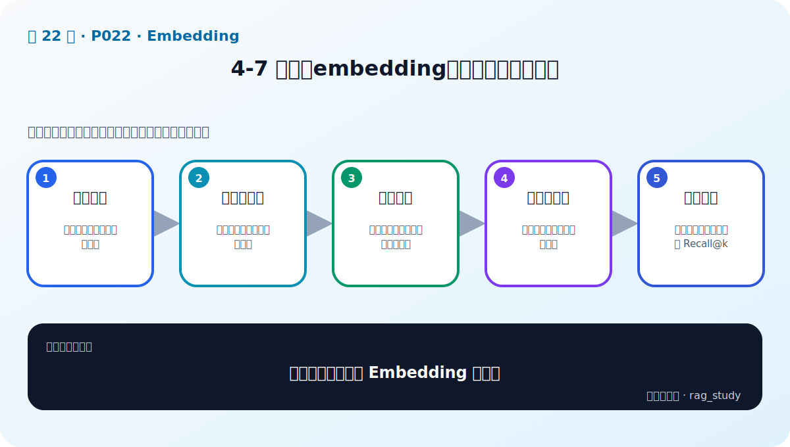

# P22：4-7 实战：embedding模型加载和使用对比

> 笔记编号 22/89 · 对应原视频 P22 · 时长 22:25 · [打开这一节](https://www.bilibili.com/video/BV1fLoKBREGv?p=22)

[← P21: 4-5 embedding模型排行榜靠谱不靠谱，如何选择](../04-embeddings/p021-embedding模型排行榜靠谱不靠谱-如何选择.md) · [返回第 4 章专题](./README.md) · [P23: 4-8 本章总结 →](../04-embeddings/p023-Embedding-本章总结.md)

## 这节到底讲什么

**核心问题：怎样公平比较两个 Embedding 模型？**

这节直接回答“怎样公平比较两个 Embedding 模型？”。老师的结论可以整理成五点：第一，加载模型：核对版本、设备与推理模式；第二，准备文本对：相似、无关、难负例都要有；第三，统一编码：前缀、截断、池化、归一化一致；第四，计算相似度：余弦或点积与索引配置一致；第五，业务对照：最终用固定检索集比较 Recall@k。下面逐项解释每一点的含义和作用。

## 辅助流程图

## 正文讲解（按视频顺序）

> 下面是依据音轨和画面整理的通顺版本，不是逐字稿。技术术语已经校正，
> 老师的原始讲法保留在后面的 ASR 页面。

### 1. 加载模型

实战先固定模型名称和版本，加载 Tokenizer/Embedding 权重并切换到推理模式。确认设备、数据类型和最大输入长度；远程代码选项和模型文件来源要经过安全审查。

### 2. 准备文本对

不要只用一对明显相似文本。至少准备同义表达、无关文本、同主题难负例、数字或专名问题和长文档。单纯观察几个余弦分数只能帮助理解接口，不能完成模型选型。

### 3. 统一编码

不同模型可能使用 CLS、mean pooling 或专用句向量接口。比较时遵循各自官方方法，同时固定 query/document 前缀、截断和归一化，并记录输出维度。

### 4. 计算相似度

余弦相似度是向量点积除以两边范数；已归一化向量可直接点积。手工计算几组分数用于检查方向是否合理，批量检索则应把向量写入各自独立索引，不能混合不同模型空间。

### 5. 业务对照

最终对每个查询取 Top-k，与标注的相关文档 ID 比较 Recall@k 和 MRR，同时记录编码速度、索引大小和查询延迟。只有在统一数据与指标上的结果，才能支持选型结论。

## 用一个例子串起来

为两个模型各自建立索引，输入“加班如何补休”，查看 Top-5 是否包含调休条款；再记录 1000 个文档块的编码时间、向量维度和索引大小。不能拿模型 A 的查询向量去搜索模型 B 的文档向量。

## 完整原声逐段记录

已用本地语音识别核查；技术词与口误以专题笔记的校正版为准。

[查看本节按时间戳保留的本地 ASR 转写](./transcripts/p022-实战-embedding模型加载和使用对比-ASR.md)。原始转写会保留
同音字和断句误差，正文用校正后的术语，方便同时核对“老师说了什么”和“概念是什么”。

## 读完记住这五句话

- **加载模型：** 核对版本、设备与推理模式
- **准备文本对：** 相似、无关、难负例都要有
- **统一编码：** 前缀、截断、池化、归一化一致
- **计算相似度：** 余弦或点积与索引配置一致
- **业务对照：** 最终用固定检索集比较 Recall@k

## 最小可运行代码

[打开本节最相关的纯 Python 练习](../../rag_from_scratch/dense.py)。练习包不依赖 LangChain，
目的是先看清输入、输出和算法边界，再替换成课程中的框架/API。

练习包中的 `HashingEmbedder` 只用于演示接口，并不是真正语义模型。替换
真实模型时保持 `embed(text) -> list[float]` 协议不变；每个候选模型分别建立
`VectorIndex`，再用 `evaluation.py` 的 Recall@k/MRR 比较，禁止复用旧向量。

## 最容易踩的坑

切换 Embedding 模型后必须重建文档向量；只更新查询端会让两个向量空间失配。

## 自测

1. 不看图回答：怎样公平比较两个 Embedding 模型？
2. 用上面的例子，指出本节五个知识点分别出现在哪里。
3. 如果没有“计算相似度”，会出现什么具体问题？

## 学完检查

- [ ] 我能不看视频解释本节核心概念
- [ ] 我能指出它在 RAG 数据流中的位置
- [ ] 我知道它最适合与最不适合的场景
- [ ] 我读过完整 ASR 并核对了技术术语
- [ ] 我完成了专题 README 中对应的自测或实验
