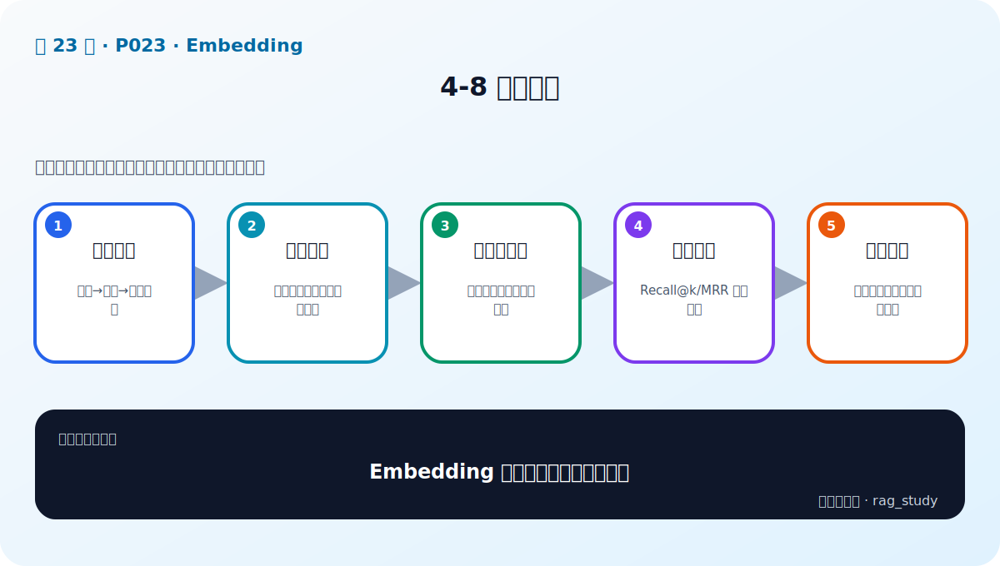
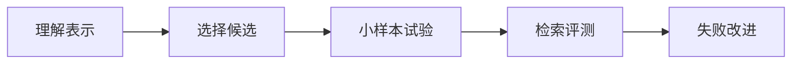

# P23：4-8 本章总结

> 笔记编号 23/89 · 对应原视频 P23 · 时长 01:20 · [打开这一节](https://www.bilibili.com/video/BV1fLoKBREGv?p=23)

[← P22: 4-7 实战：embedding模型加载和使用对比](../04-embeddings/p022-实战-embedding模型加载和使用对比.md) · [返回第 4 章专题](./README.md) · [P24: 5-1 本章介绍 →](../05-vector-databases/p024-向量数据库-本章导学.md)

## 这节到底讲什么

**核心问题：Embedding 章应带走哪条工程闭环？**

这节直接回答“Embedding 章应带走哪条工程闭环？”。老师的结论可以整理成五点：第一，理解表示：文本→向量→语义距离；第二，选择候选：榜单、语言、许可证与资源；第三，小样本试验：先验证相似度与输入规范；第四，检索评测：Recall@k/MRR 定量比较；第五，失败改进：数据、难负例、模型或微调。下面逐项解释每一点的含义和作用。

## 辅助流程图

## 正文讲解（按视频顺序）

> 下面是依据音轨和画面整理的通顺版本，不是逐字稿。技术术语已经校正，
> 老师的原始讲法保留在后面的 ASR 页面。

### 1. 理解表示

Embedding 的核心不是“把文字变成一串数字”，而是学习一个能表达任务相关性的空间。相关文本应靠近、无关文本应远离，但这种关系由训练数据和目标定义，不等于客观真理。

### 2. 选择候选

先使用语言、领域、输入长度、许可证和部署资源筛选候选，再参考公开榜单。不要一开始下载很多模型；少量有代表性的候选更容易进行严格对照。

### 3. 小样本试验

先用少量文本检查前缀、池化、归一化、维度和相似度是否符合预期，能快速发现接口错误。但小样本结果不能代替系统检索评测。

### 4. 检索评测

为每个模型分别建立索引，在固定业务问题上计算 Recall@k、MRR，并查看失败类型。相关文档是否进入候选集，比某一对文本的绝对相似分数更重要。

### 5. 失败改进

若失败来自文档切坏，先改解析和分块；来自编号和专名，可增加 BM25；候选多但顺序差，可加 Reranker；领域语义始终不匹配，才考虑更换或微调 Embedding。

## 用一个例子串起来

如果编号问题召回差，先加 BM25；如果同义表达召回差，比较 Embedding；如果正确文档已在 Top-20 但不在 Top-5，尝试 Reranker。按失败类型选择方法，比无目的更换模型更有效。

## 完整原声逐段记录

已用本地语音识别核查；技术词与口误以专题笔记的校正版为准。

[查看本节按时间戳保留的本地 ASR 转写](./transcripts/p023-Embedding-本章总结-ASR.md)。原始转写会保留
同音字和断句误差，正文用校正后的术语，方便同时核对“老师说了什么”和“概念是什么”。

## 读完记住这五句话

- **理解表示：** 文本→向量→语义距离
- **选择候选：** 榜单、语言、许可证与资源
- **小样本试验：** 先验证相似度与输入规范
- **检索评测：** Recall@k/MRR 定量比较
- **失败改进：** 数据、难负例、模型或微调

## 最小可运行代码

[打开本节最相关的纯 Python 练习](../../rag_from_scratch/dense.py)。练习包不依赖 LangChain，
目的是先看清输入、输出和算法边界，再替换成课程中的框架/API。

## 最容易踩的坑

章节总结不是停止评测。模型、数据或切块任何一项变化，都要重新跑同一业务检索集。

## 自测

1. 不看图回答：Embedding 章应带走哪条工程闭环？
2. 用上面的例子，指出本节五个知识点分别出现在哪里。
3. 如果没有“检索评测”，会出现什么具体问题？

## 学完检查

- [ ] 我能不看视频解释本节核心概念
- [ ] 我能指出它在 RAG 数据流中的位置
- [ ] 我知道它最适合与最不适合的场景
- [ ] 我读过完整 ASR 并核对了技术术语
- [ ] 我完成了专题 README 中对应的自测或实验
