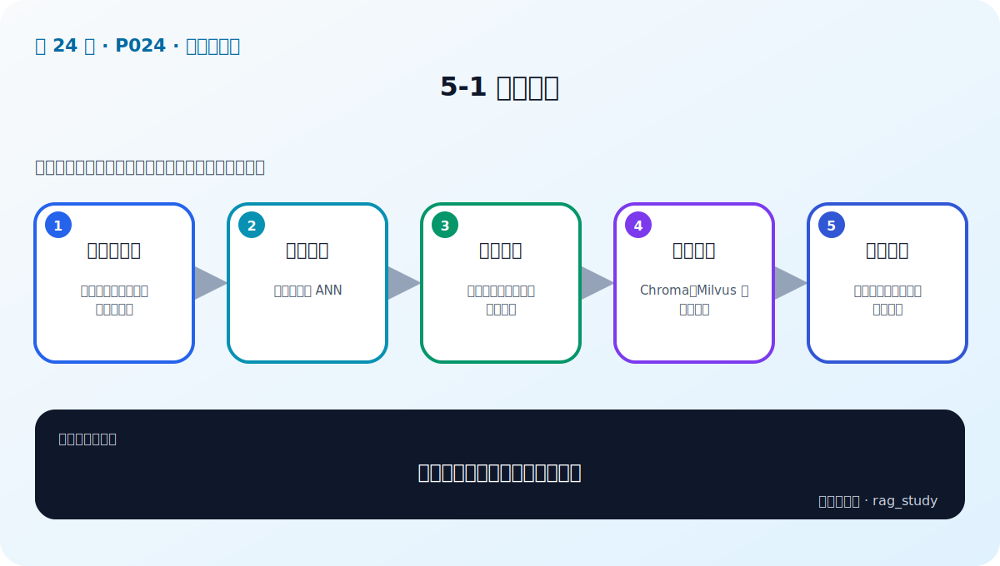

# 第 5 章：向量数据库——从距离计算到企业级索引

> 对应视频 P24–P31：[打开本章第一节](https://www.bilibili.com/video/BV1fLoKBREGv?p=24)



## 向量库不只是“存一个 list”

向量数据库同时管理：

- 高维向量及其距离度量；
- chunk 文本、source、page、version、permission 等 payload；
- collection/schema、批量写入、删除和增量更新；
- 精确或近似最近邻索引；
- metadata filter、持久化、备份、扩缩容和监控。

Chroma 适合本地学习和小型原型；Milvus 等分布式系统面向更大规模、并发和高可用。
选型要从数据量、QPS、过滤复杂度、运维能力和恢复目标出发，不只比查询速度。

## 相似性搜索

- **Cosine**：关注方向，常配合归一化 Embedding。
- **Inner Product**：点积；归一化后与 cosine 排序等价。
- **Euclidean/L2**：几何距离；对向量尺度敏感。

模型训练使用哪种相似度，索引就应尽量保持一致。不同距离的分数不可直接套同一
阈值。

## 精确检索与 ANN

Flat/Brute-force 比较 query 与所有向量，结果精确但计算量随数据线性增长。
Approximate Nearest Neighbor 用少量召回损失换速度和内存。

### HNSW

Hierarchical Navigable Small World 把向量组织为多层图：高层稀疏、负责远距离
跳转；底层稠密、负责局部精搜。构建时的 `M`、`efConstruction` 影响索引质量和
体积，查询时的 `efSearch` 控制延迟—召回权衡。

### IVF 与量化

IVF 先把向量分到多个聚类桶，查询只探测最相关的若干桶；`nprobe` 越大召回通常
越好但越慢。PQ/SQ 等量化压缩向量以节省内存，也会引入近似误差。

## 企业级要求

- 高可用、备份恢复、容量和延迟监控；
- 多租户、鉴权、行级/文档级权限过滤；
- 写入幂等、增量更新、删除传播和索引版本；
- metadata filter 与向量搜索的执行顺序；
- 热点、分片、复制、一致性和故障降级；
- 可重建性：原文、切分配置、模型版本和索引配置可追溯。

知识库删除不只删源文件，还要删除 chunks、向量、缓存和派生摘要。

## 实战：Chroma 与 Milvus

课程分别演示轻量本地库与企业级服务的部署、collection 创建、写入、查询和
持久化。学习重点不是记 API，而是认清一致协议：

```text
documents + ids + embeddings + metadata
→ upsert
→ query_embedding + top_k + filter
→ ids + distances + documents + metadata
```

## 自测

<details>
<summary>为什么 HNSW 的 efSearch 不能盲目调到最大？</summary>

更大的候选搜索范围通常提高召回，但也增加距离计算、延迟和资源消耗。应在业务
评测集上画召回—延迟曲线，选择满足质量门槛的最小成本点。
</details>
