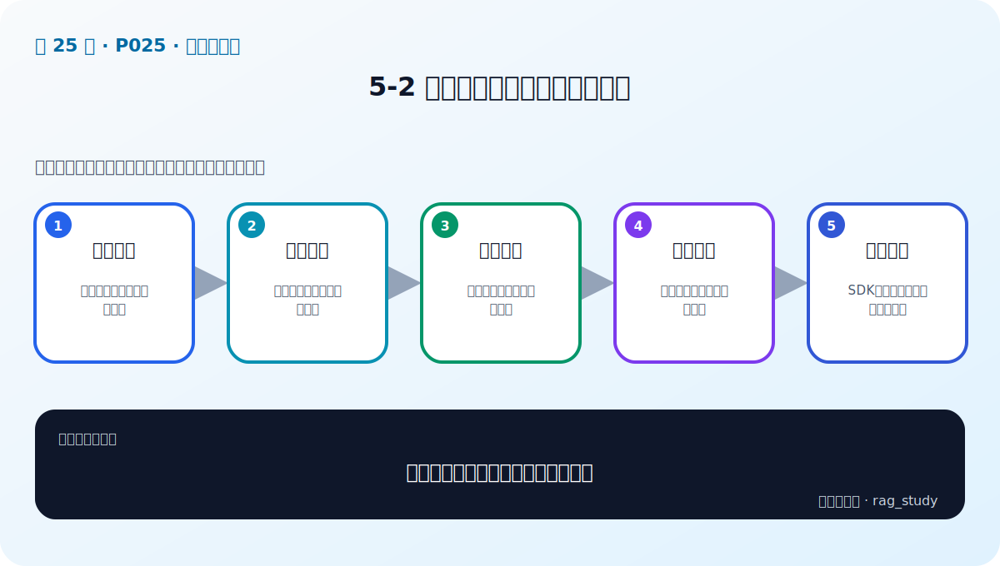
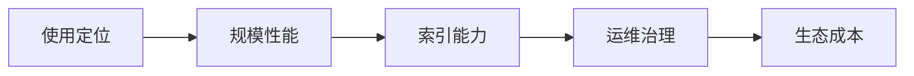

# P25：5-2 全方位对比：主流向量数据库

> 笔记编号 25/89 · 对应原视频 P25 · 时长 11:49 · [打开这一节](https://www.bilibili.com/video/BV1fLoKBREGv?p=25)

[← P24: 5-1 本章介绍](../05-vector-databases/p024-向量数据库-本章导学.md) · [返回第 5 章专题](./README.md) · [P26: 5-3 企业级向量数据库的要求 →](../05-vector-databases/p026-企业级向量数据库的要求.md)

## 这节到底讲什么

**核心问题：比较主流向量数据库应看哪些维度？**

这节直接回答“比较主流向量数据库应看哪些维度？”。老师的结论可以整理成五点：第一，使用定位：本地原型、服务化、云托管；第二，规模性能：数据量、并发、延迟与吞吐；第三，索引能力：算法、过滤、混合检索支持；第四，运维治理：备份、监控、权限、多租户；第五，生态成本：SDK、社区、许可证与团队经验。下面逐项解释每一点的含义和作用。

## 辅助流程图

## 正文讲解（按视频顺序）

> 下面是依据音轨和画面整理的通顺版本，不是逐字稿。技术术语已经校正，
> 老师的原始讲法保留在后面的 ASR 页面。

### 1. 使用定位

先区分嵌入式本地库、独立服务、分布式集群和云托管。个人原型重视安装简单，生产平台重视隔离、扩缩容和运维；不要只比较搜索 API 是否相似。

### 2. 规模性能

用预计向量数量、维度、写入速率、查询并发、Top-k 和过滤比例定义负载。厂商基准若数据、硬件和参数不同，不能直接代表你的 P95 延迟和 Recall。

### 3. 索引能力

检查支持的 ANN 类型、距离函数、索引在线构建、标量过滤、混合稀疏/稠密检索和多向量字段。功能存在还不够，还要确认对应版本的限制和参数。

### 4. 运维治理

生产系统需要备份恢复、副本、分片、监控、审计、权限和多租户。托管服务减少基础运维，但仍要处理费用、网络、数据边界和供应商锁定。

### 5. 生态成本

SDK 语言、框架集成、文档、社区、许可证和团队经验会影响长期成本。一个基准更快但故障难排、升级困难的产品，未必是总成本最低的选择。

## 用一个例子串起来

一百万个制度片段不能每次逐条计算相似度。向量数据库用 ANN 索引快速缩小候选范围，再返回原文、来源和页码供 RAG 使用。

## 完整原声逐段记录

已用本地语音识别核查；技术词与口误以专题笔记的校正版为准。

[查看本节按时间戳保留的本地 ASR 转写](./transcripts/p025-全方位对比-主流向量数据库-ASR.md)。原始转写会保留
同音字和断句误差，正文用校正后的术语，方便同时核对“老师说了什么”和“概念是什么”。

## 读完记住这五句话

- **使用定位：** 本地原型、服务化、云托管
- **规模性能：** 数据量、并发、延迟与吞吐
- **索引能力：** 算法、过滤、混合检索支持
- **运维治理：** 备份、监控、权限、多租户
- **生态成本：** SDK、社区、许可证与团队经验

## 最小可运行代码

[打开本节最相关的纯 Python 练习](../../rag_from_scratch/dense.py)。练习包不依赖 LangChain，
目的是先看清输入、输出和算法边界，再替换成课程中的框架/API。

## 最容易踩的坑

相似度最高只表示向量距离近，不表示内容一定正确。距离函数、索引参数和业务 Recall@k 必须一起验证。

## 自测

1. 不看图回答：比较主流向量数据库应看哪些维度？
2. 用上面的例子，指出本节五个知识点分别出现在哪里。
3. 如果没有“运维治理”，会出现什么具体问题？

## 学完检查

- [ ] 我能不看视频解释本节核心概念
- [ ] 我能指出它在 RAG 数据流中的位置
- [ ] 我知道它最适合与最不适合的场景
- [ ] 我读过完整 ASR 并核对了技术术语
- [ ] 我完成了专题 README 中对应的自测或实验
