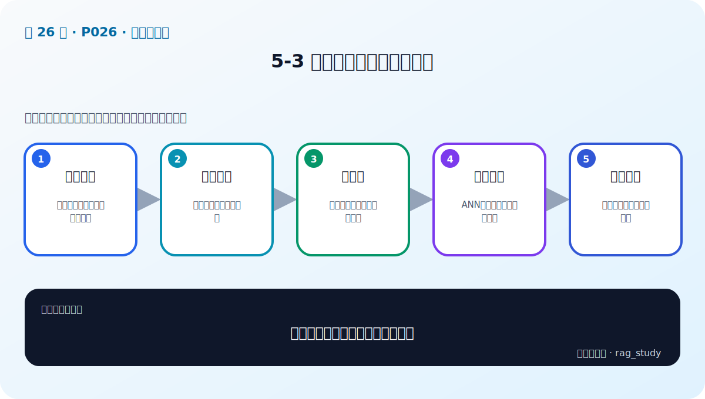

# P26：5-3 企业级向量数据库的要求

> 笔记编号 26/89 · 对应原视频 P26 · 时长 01:52 · [打开这一节](https://www.bilibili.com/video/BV1fLoKBREGv?p=26)

[← P25: 5-2 全方位对比：主流向量数据库](../05-vector-databases/p025-全方位对比-主流向量数据库.md) · [返回第 5 章专题](./README.md) · [P27: 5-4 向量数据库相似性搜索 →](../05-vector-databases/p027-向量数据库相似性搜索.md)

## 这节到底讲什么

**核心问题：企业级向量数据库必须满足什么？**

这节直接回答“企业级向量数据库必须满足什么？”。老师的结论可以整理成五点：第一，可靠存储：持久化、备份、恢复与一致性；第二，弹性扩展：分片、副本与水平扩容；第三，高性能：低延迟、高并发、批量写入；第四，检索能力：ANN、标量过滤与混合查询；第五，安全运维：鉴权、隔离、监控和审计。下面逐项解释每一点的含义和作用。

## 辅助流程图

## 正文讲解（按视频顺序）

> 下面是依据音轨和画面整理的通顺版本，不是逐字稿。技术术语已经校正，
> 老师的原始讲法保留在后面的 ASR 页面。

### 1. 可靠存储

向量必须与原文、ID 和元数据一致持久化，服务重启后不能丢失。备份不仅保存向量，还要保存集合 Schema、索引配置和业务数据版本，并定期演练恢复。

### 2. 弹性扩展

数据和流量增长后，需要通过分片分散容量与查询，通过副本提高读取吞吐和容灾。扩缩容过程中要关注数据迁移、再平衡和短时性能抖动。

### 3. 高性能

性能包含批量写入、索引构建、查询 P50/P95/P99、并发和过滤后的 Recall。只测空闲环境下单次查询会低估真实负载中的排队与资源竞争。

### 4. 检索能力

企业查询常同时包含向量相似度和部门、时间、版本、权限等标量条件。过滤发生在 ANN 前还是后会影响速度和召回，需要用真实选择率测试。

### 5. 安全运维

服务要有鉴权、租户隔离、传输加密、审计、资源配额和监控告警。数据库只负责一部分安全，应用仍需把用户权限转成不可绕过的查询过滤。

## 用一个例子串起来

一百万个制度片段不能每次逐条计算相似度。向量数据库用 ANN 索引快速缩小候选范围，再返回原文、来源和页码供 RAG 使用。

## 完整原声逐段记录

已用本地语音识别核查；技术词与口误以专题笔记的校正版为准。

[查看本节按时间戳保留的本地 ASR 转写](./transcripts/p026-企业级向量数据库的要求-ASR.md)。原始转写会保留
同音字和断句误差，正文用校正后的术语，方便同时核对“老师说了什么”和“概念是什么”。

## 读完记住这五句话

- **可靠存储：** 持久化、备份、恢复与一致性
- **弹性扩展：** 分片、副本与水平扩容
- **高性能：** 低延迟、高并发、批量写入
- **检索能力：** ANN、标量过滤与混合查询
- **安全运维：** 鉴权、隔离、监控和审计

## 最小可运行代码

[打开本节最相关的纯 Python 练习](../../rag_from_scratch/dense.py)。练习包不依赖 LangChain，
目的是先看清输入、输出和算法边界，再替换成课程中的框架/API。

## 最容易踩的坑

相似度最高只表示向量距离近，不表示内容一定正确。距离函数、索引参数和业务 Recall@k 必须一起验证。

## 自测

1. 不看图回答：企业级向量数据库必须满足什么？
2. 用上面的例子，指出本节五个知识点分别出现在哪里。
3. 如果没有“检索能力”，会出现什么具体问题？

## 学完检查

- [ ] 我能不看视频解释本节核心概念
- [ ] 我能指出它在 RAG 数据流中的位置
- [ ] 我知道它最适合与最不适合的场景
- [ ] 我读过完整 ASR 并核对了技术术语
- [ ] 我完成了专题 README 中对应的自测或实验
