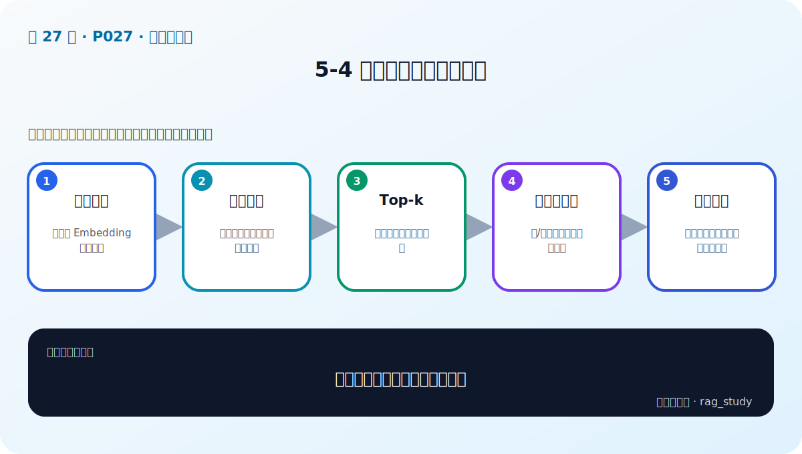

# P27：5-4 向量数据库相似性搜索

> 笔记编号 27/89 · 对应原视频 P27 · 时长 02:34 · [打开这一节](https://www.bilibili.com/video/BV1fLoKBREGv?p=27)

[← P26: 5-3 企业级向量数据库的要求](../05-vector-databases/p026-企业级向量数据库的要求.md) · [返回第 5 章专题](./README.md) · [P28: 5-5 性能为王：探索向量数据索引优化技术 →](../05-vector-databases/p028-性能为王-探索向量数据索引优化技术.md)

## 这节到底讲什么

**核心问题：向量相似性搜索到底比较什么？**

这节直接回答“向量相似性搜索到底比较什么？”。老师的结论可以整理成五点：第一，查询向量：由同一 Embedding 模型编码；第二，距离函数：余弦、内积、欧氏需匹配训练；第三，Top-k：返回最近邻候选与分数；第四，元数据过滤：先/后过滤影响效率与召回；第五，校准验证：相似分数不可直接当事实置信度。下面逐项解释每一点的含义和作用。

## 辅助流程图

## 正文讲解（按视频顺序）

> 下面是依据音轨和画面整理的通顺版本，不是逐字稿。技术术语已经校正，
> 老师的原始讲法保留在后面的 ASR 页面。

### 1. 查询向量

用户问题必须使用入库时相同的 Embedding 模型、版本、前缀和归一化方式编码。模型不一致时距离没有可比意义，即使维度相同也不能混用。

### 2. 距离函数

余弦比较方向，内积比较投影，欧氏比较距离。归一化向量的余弦排序与内积一致；数据库集合创建时选择的 metric 必须与编码和训练预期匹配。

### 3. Top-k

Top-k 越大，正确证据进入候选的机会通常越高，但查询、重排和 LLM 上下文成本也增加。召回阶段可取较大 candidate_k，再经 Reranker 截成较小 final_k。

### 4. 元数据过滤

部门、文件版本、时间和权限过滤能缩小合法候选。过滤条件过严会漏掉证据，过松会暴露无权内容；应记录过滤前后候选数，并测试空结果。

### 5. 校准验证

相似度阈值不能从网上照抄。不同模型和距离的分布不同，应在相关、难负例和无关问题上观察分数，再结合 Recall、Precision 和拒答策略确定。

## 用一个例子串起来

一百万个制度片段不能每次逐条计算相似度。向量数据库用 ANN 索引快速缩小候选范围，再返回原文、来源和页码供 RAG 使用。

## 完整原声逐段记录

已用本地语音识别核查；技术词与口误以专题笔记的校正版为准。

[查看本节按时间戳保留的本地 ASR 转写](./transcripts/p027-向量数据库相似性搜索-ASR.md)。原始转写会保留
同音字和断句误差，正文用校正后的术语，方便同时核对“老师说了什么”和“概念是什么”。

## 读完记住这五句话

- **查询向量：** 由同一 Embedding 模型编码
- **距离函数：** 余弦、内积、欧氏需匹配训练
- **Top-k：** 返回最近邻候选与分数
- **元数据过滤：** 先/后过滤影响效率与召回
- **校准验证：** 相似分数不可直接当事实置信度

## 最小可运行代码

[打开本节最相关的纯 Python 练习](../../rag_from_scratch/dense.py)。练习包不依赖 LangChain，
目的是先看清输入、输出和算法边界，再替换成课程中的框架/API。

## 最容易踩的坑

相似度最高只表示向量距离近，不表示内容一定正确。距离函数、索引参数和业务 Recall@k 必须一起验证。

## 自测

1. 不看图回答：向量相似性搜索到底比较什么？
2. 用上面的例子，指出本节五个知识点分别出现在哪里。
3. 如果没有“元数据过滤”，会出现什么具体问题？

## 学完检查

- [ ] 我能不看视频解释本节核心概念
- [ ] 我能指出它在 RAG 数据流中的位置
- [ ] 我知道它最适合与最不适合的场景
- [ ] 我读过完整 ASR 并核对了技术术语
- [ ] 我完成了专题 README 中对应的自测或实验
