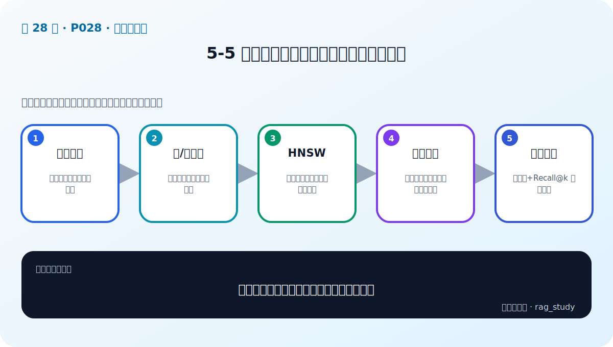

# P28：5-5 性能为王：探索向量数据索引优化技术

> 笔记编号 28/89 · 对应原视频 P28 · 时长 16:01 · [打开这一节](https://www.bilibili.com/video/BV1fLoKBREGv?p=28)

[← P27: 5-4 向量数据库相似性搜索](../05-vector-databases/p027-向量数据库相似性搜索.md) · [返回第 5 章专题](./README.md) · [P29: 5-6 实战：部署和使用企业级向量数据库（chroma和milvus）-1 →](../05-vector-databases/p029-实战-部署和使用企业级向量数据库-chroma和milvus-1.md)

## 这节到底讲什么

**核心问题：向量索引怎样在速度、召回和资源间取舍？**

这节直接回答“向量索引怎样在速度、召回和资源间取舍？”。老师的结论可以整理成五点：第一，暴力检索：精确但随数据量线性变慢；第二，树/量化类：压缩空间但可能损失精度；第三，HNSW：分层小世界图做近似邻居搜索；第四，关键参数：构建质量、查询深度、内存占用；第五，评测取舍：用延迟+Recall@k 联合调参。下面逐项解释每一点的含义和作用。

## 辅助流程图

## 正文讲解（按视频顺序）

> 下面是依据音轨和画面整理的通顺版本，不是逐字稿。技术术语已经校正，
> 老师的原始讲法保留在后面的 ASR 页面。

### 1. 暴力检索

Flat/暴力搜索把查询向量与所有文档向量比较，结果精确、实现简单，适合小规模或作为 Recall 基准。数据量增加后，计算量近似随向量数线性增长。

### 2. 树/量化类

IVF 先把空间分区，查询只扫描部分簇；PQ 等量化方法压缩向量以降低内存和距离计算成本。扫描簇太少或压缩太强会漏召回，需要用精确结果作对照。

### 3. HNSW

HNSW 把向量组织成分层近邻图：高层用于大步导航，逐层下降后在底层细搜。它通常查询快、Recall 高，但建图耗时且占用较多内存，不适合只凭默认参数。

### 4. 关键参数

`M` 控制每个节点连接数，影响内存和图质量；`efConstruction` 控制建索引搜索宽度；`efSearch` 控制查询探索范围。参数增大通常提高 Recall，也会增加构建、内存或查询成本。

### 5. 评测取舍

先用 Flat 得到真实最近邻，再在目标数据和硬件上扫描 ANN 参数，绘制 Recall@k—P95 延迟—内存曲线。选择达到业务 Recall 门槛的最低成本点，而不是追求单一指标最大。

## 用一个例子串起来

一百万个制度片段不能每次逐条计算相似度。向量数据库用 ANN 索引快速缩小候选范围，再返回原文、来源和页码供 RAG 使用。

## 完整原声逐段记录

已用本地语音识别核查；技术词与口误以专题笔记的校正版为准。

[查看本节按时间戳保留的本地 ASR 转写](./transcripts/p028-性能为王-探索向量数据索引优化技术-ASR.md)。原始转写会保留
同音字和断句误差，正文用校正后的术语，方便同时核对“老师说了什么”和“概念是什么”。

## 读完记住这五句话

- **暴力检索：** 精确但随数据量线性变慢
- **树/量化类：** 压缩空间但可能损失精度
- **HNSW：** 分层小世界图做近似邻居搜索
- **关键参数：** 构建质量、查询深度、内存占用
- **评测取舍：** 用延迟+Recall@k 联合调参

## 最小可运行代码

[打开本节最相关的纯 Python 练习](../../rag_from_scratch/dense.py)。练习包不依赖 LangChain，
目的是先看清输入、输出和算法边界，再替换成课程中的框架/API。

## 最容易踩的坑

相似度最高只表示向量距离近，不表示内容一定正确。距离函数、索引参数和业务 Recall@k 必须一起验证。

## 自测

1. 不看图回答：向量索引怎样在速度、召回和资源间取舍？
2. 用上面的例子，指出本节五个知识点分别出现在哪里。
3. 如果没有“关键参数”，会出现什么具体问题？

## 学完检查

- [ ] 我能不看视频解释本节核心概念
- [ ] 我能指出它在 RAG 数据流中的位置
- [ ] 我知道它最适合与最不适合的场景
- [ ] 我读过完整 ASR 并核对了技术术语
- [ ] 我完成了专题 README 中对应的自测或实验
