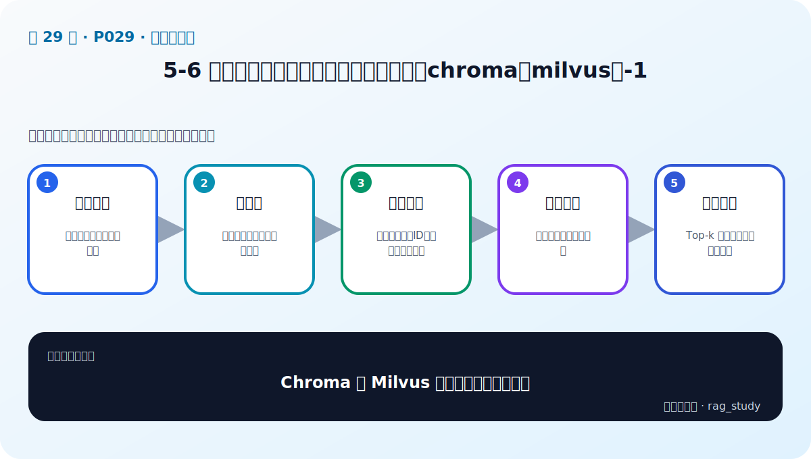

# P29：5-6 实战：部署和使用企业级向量数据库（chroma和milvus）-1

> 笔记编号 29/89 · 对应原视频 P29 · 时长 14:56 · [打开这一节](https://www.bilibili.com/video/BV1fLoKBREGv?p=29)

[← P28: 5-5 性能为王：探索向量数据索引优化技术](../05-vector-databases/p028-性能为王-探索向量数据索引优化技术.md) · [返回第 5 章专题](./README.md) · [P30: 5-7 实战：部署和使用企业级向量数据库（chroma和milvus）-2 →](../05-vector-databases/p030-实战-部署和使用企业级向量数据库-chroma和milvus-2.md)

## 这节到底讲什么

**核心问题：Chroma 与 Milvus 实战第一阶段做什么？**

这节直接回答“Chroma 与 Milvus 实战第一阶段做什么？”。老师的结论可以整理成五点：第一，环境部署：本地轻量与服务化数据库；第二，建集合：确定维度、距离函数与字段；第三，写入数据：向量、原文、ID、元数据成套保存；第四，创建索引：按规模与目标配置索引；第五，基础查询：Top-k 加过滤并核对返回内容。下面逐项解释每一点的含义和作用。

## 辅助流程图

## 正文讲解（按视频顺序）

> 下面是依据音轨和画面整理的通顺版本，不是逐字稿。技术术语已经校正，
> 老师的原始讲法保留在后面的 ASR 页面。

### 1. 环境部署

Chroma 可嵌入本地进程快速验证；Milvus 通常以服务方式运行，并依赖更完整的组件和资源。部署前固定版本、端口、持久化目录和健康检查，避免 Notebook重启后状态不明。

### 2. 建集合

创建集合时确定主键、向量维度、距离函数、正文和元数据字段。维度必须与Embedding 输出一致；主键要稳定，才能支持去重、更新和回到原文。

### 3. 写入数据

批量写入时同时保存 ID、向量、正文、来源、页码和版本。写入成功不代表立刻可查，某些系统需要等待 flush、索引构建或一致性条件。

### 4. 创建索引

小数据可以先用精确索引建立正确性基线，再按规模选择 HNSW、IVF 等 ANN。索引参数应配置化并记录到实验结果，不要散落在 Notebook 单元格。

### 5. 基础查询

查询端编码问题、应用合法元数据过滤、取得 Top-k，并打印文本、来源和分数进行人工核对。先验证返回内容正确，再接入 LLM，避免生成掩盖检索错误。

## 用一个例子串起来

一百万个制度片段不能每次逐条计算相似度。向量数据库用 ANN 索引快速缩小候选范围，再返回原文、来源和页码供 RAG 使用。

## 完整原声逐段记录

已用本地语音识别核查；技术词与口误以专题笔记的校正版为准。

[查看本节按时间戳保留的本地 ASR 转写](./transcripts/p029-实战-部署和使用企业级向量数据库-chroma和milvus-1-ASR.md)。原始转写会保留
同音字和断句误差，正文用校正后的术语，方便同时核对“老师说了什么”和“概念是什么”。

## 读完记住这五句话

- **环境部署：** 本地轻量与服务化数据库
- **建集合：** 确定维度、距离函数与字段
- **写入数据：** 向量、原文、ID、元数据成套保存
- **创建索引：** 按规模与目标配置索引
- **基础查询：** Top-k 加过滤并核对返回内容

## 最小可运行代码

[打开本节最相关的纯 Python 练习](../../rag_from_scratch/dense.py)。练习包不依赖 LangChain，
目的是先看清输入、输出和算法边界，再替换成课程中的框架/API。

## 最容易踩的坑

相似度最高只表示向量距离近，不表示内容一定正确。距离函数、索引参数和业务 Recall@k 必须一起验证。

## 自测

1. 不看图回答：Chroma 与 Milvus 实战第一阶段做什么？
2. 用上面的例子，指出本节五个知识点分别出现在哪里。
3. 如果没有“创建索引”，会出现什么具体问题？

## 学完检查

- [ ] 我能不看视频解释本节核心概念
- [ ] 我能指出它在 RAG 数据流中的位置
- [ ] 我知道它最适合与最不适合的场景
- [ ] 我读过完整 ASR 并核对了技术术语
- [ ] 我完成了专题 README 中对应的自测或实验
