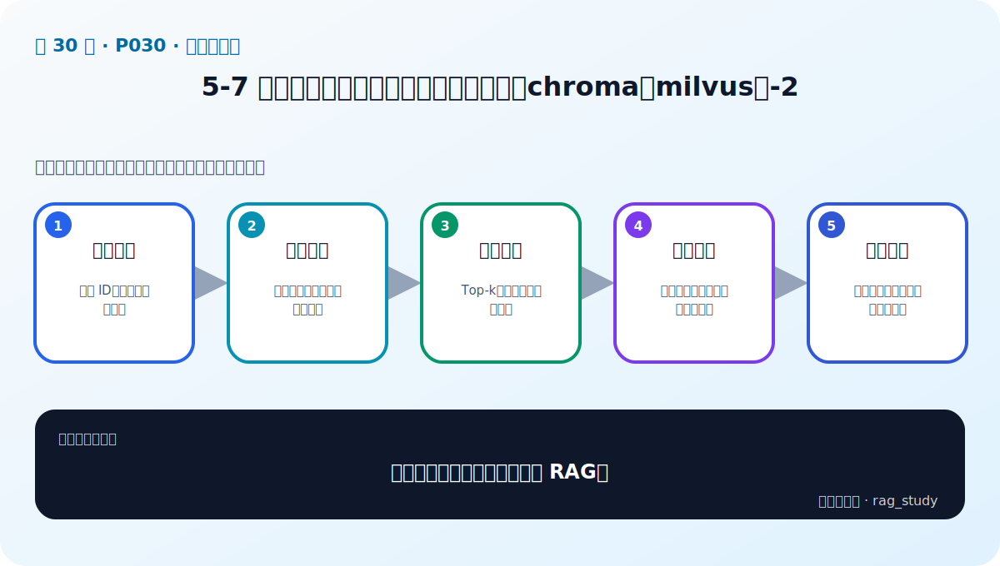

# P30：5-7 实战：部署和使用企业级向量数据库（chroma和milvus）-2

> 笔记编号 30/89 · 对应原视频 P30 · 时长 14:45 · [打开这一节](https://www.bilibili.com/video/BV1fLoKBREGv?p=30)

[← P29: 5-6 实战：部署和使用企业级向量数据库（chroma和milvus）-1](../05-vector-databases/p029-实战-部署和使用企业级向量数据库-chroma和milvus-1.md) · [返回第 5 章专题](./README.md) · [P31: 5-8 总结和展望：企业级应用的高可用性 →](../05-vector-databases/p031-总结和展望-企业级应用的高可用性.md)

## 这节到底讲什么

**核心问题：向量库实战第二阶段怎样接入 RAG？**

这节直接回答“向量库实战第二阶段怎样接入 RAG？”。老师的结论可以整理成五点：第一，批量入库：稳定 ID、去重与版本管理；第二，查询编码：必须复用入库时的模型和规范；第三，检索调用：Top-k、过滤、分数与超时；第四，结果封装：文档内容、来源、页码交给生成；第五，异常治理：连接、重试、空结果与索引更新。下面逐项解释每一点的含义和作用。

## 辅助流程图

## 正文讲解（按视频顺序）

> 下面是依据音轨和画面整理的通顺版本，不是逐字稿。技术术语已经校正，
> 老师的原始讲法保留在后面的 ASR 页面。

### 1. 批量入库

生产入库需要稳定 ID、批大小、重试、幂等和版本策略。重复运行不应产生多份相同文档；文档删除或更新时，也要同步处理旧向量和缓存。

### 2. 查询编码

把 Embedding 客户端封装成单一入口，锁定模型与输入规范。批量查询可提高吞吐，但在线单请求还要关注首响应时间和超时。

### 3. 检索调用

服务调用应设置连接池、超时和有限重试，并把 Top-k、过滤、索引参数与请求 ID 写入日志。空结果、连接错误和 Schema 不匹配要转成可诊断错误。

### 4. 结果封装

上层 RAG 不应依赖具体数据库返回对象。统一转换成 `Chunk(id, text, metadata, score)`，保留来源和页码；这样 Chroma 与 Milvus 可以替换。

### 5. 异常治理

索引服务故障时要决定降级、重试还是明确失败，不能让模型在无证据时继续编答案。监控连接、错误率、P95、空结果率和索引版本，并为重建准备流程。

## 用一个例子串起来

一百万个制度片段不能每次逐条计算相似度。向量数据库用 ANN 索引快速缩小候选范围，再返回原文、来源和页码供 RAG 使用。

## 完整原声逐段记录

已用本地语音识别核查；技术词与口误以专题笔记的校正版为准。

[查看本节按时间戳保留的本地 ASR 转写](./transcripts/p030-实战-部署和使用企业级向量数据库-chroma和milvus-2-ASR.md)。原始转写会保留
同音字和断句误差，正文用校正后的术语，方便同时核对“老师说了什么”和“概念是什么”。

## 读完记住这五句话

- **批量入库：** 稳定 ID、去重与版本管理
- **查询编码：** 必须复用入库时的模型和规范
- **检索调用：** Top-k、过滤、分数与超时
- **结果封装：** 文档内容、来源、页码交给生成
- **异常治理：** 连接、重试、空结果与索引更新

## 最小可运行代码

[打开本节最相关的纯 Python 练习](../../rag_from_scratch/dense.py)。练习包不依赖 LangChain，
目的是先看清输入、输出和算法边界，再替换成课程中的框架/API。

## 最容易踩的坑

相似度最高只表示向量距离近，不表示内容一定正确。距离函数、索引参数和业务 Recall@k 必须一起验证。

## 自测

1. 不看图回答：向量库实战第二阶段怎样接入 RAG？
2. 用上面的例子，指出本节五个知识点分别出现在哪里。
3. 如果没有“结果封装”，会出现什么具体问题？

## 学完检查

- [ ] 我能不看视频解释本节核心概念
- [ ] 我能指出它在 RAG 数据流中的位置
- [ ] 我知道它最适合与最不适合的场景
- [ ] 我读过完整 ASR 并核对了技术术语
- [ ] 我完成了专题 README 中对应的自测或实验
