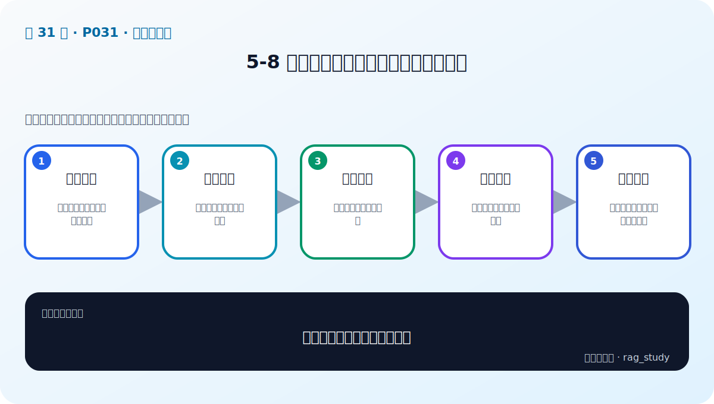

# P31：5-8 总结和展望：企业级应用的高可用性

> 笔记编号 31/89 · 对应原视频 P31 · 时长 02:40 · [打开这一节](https://www.bilibili.com/video/BV1fLoKBREGv?p=31)

[← P30: 5-7 实战：部署和使用企业级向量数据库（chroma和milvus）-2](../05-vector-databases/p030-实战-部署和使用企业级向量数据库-chroma和milvus-2.md) · [返回第 5 章专题](./README.md) · [P32: 6-1 本章介绍 →](../06-document-processing/p032-文档解析与分块-本章导学.md)

## 这节到底讲什么

**核心问题：企业向量库怎样做到高可用？**

这节直接回答“企业向量库怎样做到高可用？”。老师的结论可以整理成五点：第一，识别故障：节点、网络、磁盘和索引异常；第二，副本冗余：避免单点并支持故障转移；第三，分片扩展：容量与吞吐随节点增长；第四，备份恢复：定期快照并演练恢复时间；第五，可观测性：延迟、错误率、资源与召回漂移。下面逐项解释每一点的含义和作用。

## 辅助流程图

## 正文讲解（按视频顺序）

> 下面是依据音轨和画面整理的通顺版本，不是逐字稿。技术术语已经校正，
> 老师的原始讲法保留在后面的 ASR 页面。

### 1. 识别故障

向量库可能发生节点宕机、网络分区、磁盘耗尽、索引损坏、延迟突增和数据版本不一致。先定义可用性目标与故障模式，才能设计对应保护。

### 2. 副本冗余

副本让某个节点失败时仍可读取，也能分担查询，但会增加存储和写入同步成本。必须验证故障转移是否真的自动发生，以及切换期间读到的数据新鲜度。

### 3. 分片扩展

分片把向量分布到多个节点以扩展容量和吞吐。查询可能需要扇出到多个分片再合并 Top-k；分片键、热点和再平衡都会影响尾延迟。

### 4. 备份恢复

备份要覆盖原始文档、Embedding 版本、集合数据和索引配置。索引有时可从原始数据重建，但重建时间也属于恢复目标；恢复演练比“有备份文件”更重要。

### 5. 可观测性

持续监控写入、查询延迟、错误率、CPU/内存/磁盘、索引构建和副本状态。还要监控业务 Recall 与空结果率，因为服务健康并不代表检索质量没有漂移。

## 课后迁移示例（非视频原例）

> 来源说明：这是为了帮助理解而补充的迁移示例，不是老师在本节视频中逐字讲述的原例。

一百万个制度片段不能每次逐条计算相似度。向量数据库用 ANN 索引快速缩小候选范围，再返回原文、来源和页码供 RAG 使用。

## 完整原声逐段记录

已用本地语音识别核查；技术词与口误以专题笔记的校正版为准。

[查看本节按时间戳保留的本地 ASR 转写](./transcripts/p031-总结和展望-企业级应用的高可用性-ASR.md)。原始转写会保留
同音字和断句误差，正文用校正后的术语，方便同时核对“老师说了什么”和“概念是什么”。

## 读完记住这五句话

- **识别故障：** 节点、网络、磁盘和索引异常
- **副本冗余：** 避免单点并支持故障转移
- **分片扩展：** 容量与吞吐随节点增长
- **备份恢复：** 定期快照并演练恢复时间
- **可观测性：** 延迟、错误率、资源与召回漂移

## 最小可运行代码

[打开本节最相关的纯 Python 练习](../../rag_from_scratch/dense.py)。练习包不依赖 LangChain，
目的是先看清输入、输出和算法边界，再替换成课程中的框架/API。

## 最容易踩的坑

相似度最高只表示向量距离近，不表示内容一定正确。距离函数、索引参数和业务 Recall@k 必须一起验证。

## 自测

1. 不看图回答：企业向量库怎样做到高可用？
2. 用上面的例子，指出本节五个知识点分别出现在哪里。
3. 如果没有“备份恢复”，会出现什么具体问题？

## 学完检查

- [ ] 我能不看视频解释本节核心概念
- [ ] 我能指出它在 RAG 数据流中的位置
- [ ] 我知道它最适合与最不适合的场景
- [ ] 我读过完整 ASR 并核对了技术术语
- [ ] 我完成了专题 README 中对应的自测或实验
