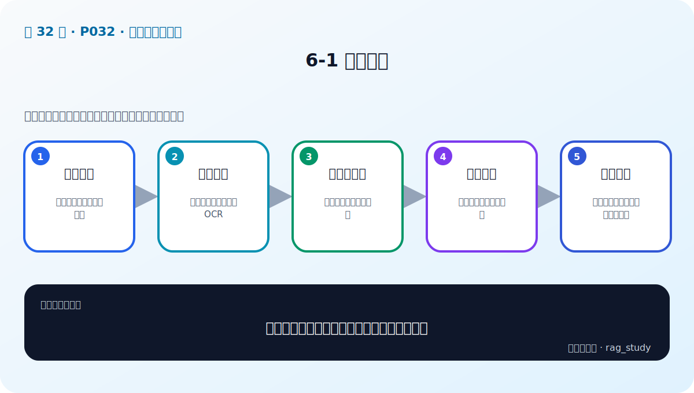

# 第 6 章：文档解析与分块——Garbage In, Garbage Out

> 对应视频 P32–P38：[打开本章第一节](https://www.bilibili.com/video/BV1fLoKBREGv?p=32)

## 为什么数据处理常比换模型重要

企业资料包括 PDF、Word、PPT、Excel、网页、数据库、扫描件和图片。解析器若把
表头、单位、脚注或章节关系丢掉，检索器面对的就已经不是原知识。生成模型无法
恢复从输入管道中永久丢失的信息。

## 解析不同内容

- **连续文本**：保留标题层级、段落、列表和页码。
- **表格**：保留表名、表头、行列关系和单位；不能只按阅读顺序拼成无结构文本。
- **复杂布局**：双栏、页眉页脚、侧栏、脚注要用版面坐标判断顺序。
- **扫描件**：OCR 后还需检查错字、数字、表格线和置信度。
- **图片/图表**：保存邻近标题与说明，必要时用视觉模型生成可检索描述。

## 分块的核心矛盾

小块语义集中、检索精准，但容易丢上下文；大块信息完整，却可能主题混杂、向量
稀释并浪费上下文。`chunk_size` 和 `chunk_overlap` 必须通过评测选择。

### 递归字符分块

按 `章节 → 段落 → 句子 → 标点 → 字符` 逐级尝试分隔，只有仍超长时才进入更细
层级。MarkdownTextSplitter 等格式专用分块器会优先尊重标题、代码块和列表。
练习实现见 [chunking.py](../../rag_from_scratch/chunking.py)。

### 语义分块

计算相邻句子的 Embedding 距离，在主题突变处切分。它更符合语义边界，但编码
成本更高、阈值不稳定，也可能把必须一起阅读的规则与例外拆开。

### 常见增强

- 父子块：小块召回、父块返回；
- 相邻窗口：命中后补前后段；
- 标题继承：每个 chunk 带完整 heading path；
- 表格按逻辑行切分，每块重复必要表头；
- 为 chunk 保存 source/page/version/permission/hash。

## 制度问答的数据管道

课程案例读取制度 PDF/表格，完成解析、切分和向量化。建议额外加入：

1. 文件 hash 与解析器版本，支持幂等增量更新；
2. 空页、乱码、重复页、超短块和超长块统计；
3. 从 chunk 反查原文页的可视化抽检；
4. 删除旧版本再写新版本，避免互相冲突；
5. 在写入索引前做权限标签，不在答案生成后补权限。

## 自测

为什么固定 500 字切分可能把制度问答做坏？

字符窗口不知道标题、条款、表格和“例外条件”的边界，可能把条件与结论拆开或把
无关主题混在一起。应先保留文档结构，再用长度约束兜底，并用真实问题评测。

