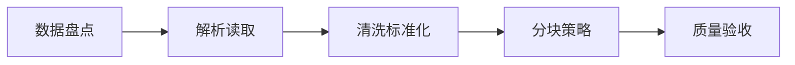

# P32：6-1 本章介绍

> 笔记编号 32/89 · 对应原视频 P32 · 时长 00:57 · [打开这一节](https://www.bilibili.com/video/BV1fLoKBREGv?p=32)

[← P31: 5-8 总结和展望：企业级应用的高可用性](../05-vector-databases/p031-总结和展望-企业级应用的高可用性.md) · [返回第 6 章专题](./README.md) · [P33: 6-2 复杂：企业数据复杂多样 →](../06-document-processing/p033-复杂-企业数据复杂多样.md)

## 这节到底讲什么

**核心问题：文档处理章如何把原始资料变成可检索知识？**

这节直接回答“文档处理章如何把原始资料变成可检索知识？”。老师的结论可以整理成五点：第一，数据盘点：格式、来源、质量与权限；第二，解析读取：文本、表格、版面与 OCR；第三，清洗标准化：去噪、去重、保留结构；第四，分块策略：递归、语义与重叠窗口；第五，质量验收：原文可追踪、块可读、信息不丢。下面逐项解释每一点的含义和作用。

## 辅助流程图

## 正文讲解（按视频顺序）

> 下面是依据音轨和画面整理的通顺版本，不是逐字稿。技术术语已经校正，
> 老师的原始讲法保留在后面的 ASR 页面。

### 1. 数据盘点

先统计资料来源、格式、数量、版本、更新频率、语言和权限。没有数据清单，就无法选择解析器、估算索引规模，也无法判断某个答案引用的是不是权威版本。

### 2. 解析读取

不同文件需要不同解析路线：普通文本提取段落，PDF 处理版面和阅读顺序，表格保留行列关系，扫描件使用 OCR。统一目标是得到内容与位置结构，而不只是得到一串字符。

### 3. 清洗标准化

清洗包括去除重复页眉页脚、修复异常空白、统一编码、去重和识别版本冲突。不能删除标题、单位、表头和例外条件等影响语义的结构。

### 4. 分块策略

分块要让每个块可独立检索又保留足够上下文。可先用递归规则保留自然边界，需要时增加 overlap、父子块或语义分块，并把标题和表格说明带入块中。

### 5. 质量验收

随机抽查解析文本、表格、块边界和元数据，统计漏页、乱码、重复与空块。再用真实问题测 Recall@k；只有程序成功运行，不能证明知识已经正确进入系统。

## 课后迁移示例（非视频原例）

> 来源说明：这是为了帮助理解而补充的迁移示例，不是老师在本节视频中逐字讲述的原例。

一份制度 PDF 可能同时有标题、正文、跨页表格和页眉。直接抽成一长串文本会破坏结构；正确做法是分别解析、清洗、分块，并保留页码和标题等元数据。

## 完整原声逐段记录

已用本地语音识别核查；技术词与口误以专题笔记的校正版为准。

[查看本节按时间戳保留的本地 ASR 转写](./transcripts/p032-文档解析与分块-本章导学-ASR.md)。原始转写会保留
同音字和断句误差，正文用校正后的术语，方便同时核对“老师说了什么”和“概念是什么”。

## 读完记住这五句话

- **数据盘点：** 格式、来源、质量与权限
- **解析读取：** 文本、表格、版面与 OCR
- **清洗标准化：** 去噪、去重、保留结构
- **分块策略：** 递归、语义与重叠窗口
- **质量验收：** 原文可追踪、块可读、信息不丢

## 最小可运行代码

[打开本节最相关的纯 Python 练习](../../rag_from_scratch/chunking.py)。练习包不依赖 LangChain，
目的是先看清输入、输出和算法边界，再替换成课程中的框架/API。

## 最容易踩的坑

不要只检查程序有没有报错。解析结果即使能输出，也可能丢表格、打乱阅读顺序或切断关键条件。

## 自测

1. 不看图回答：文档处理章如何把原始资料变成可检索知识？
2. 用上面的例子，指出本节五个知识点分别出现在哪里。
3. 如果没有“分块策略”，会出现什么具体问题？

## 学完检查

- [ ] 我能不看视频解释本节核心概念
- [ ] 我能指出它在 RAG 数据流中的位置
- [ ] 我知道它最适合与最不适合的场景
- [ ] 我读过完整 ASR 并核对了技术术语
- [ ] 我完成了专题 README 中对应的自测或实验
