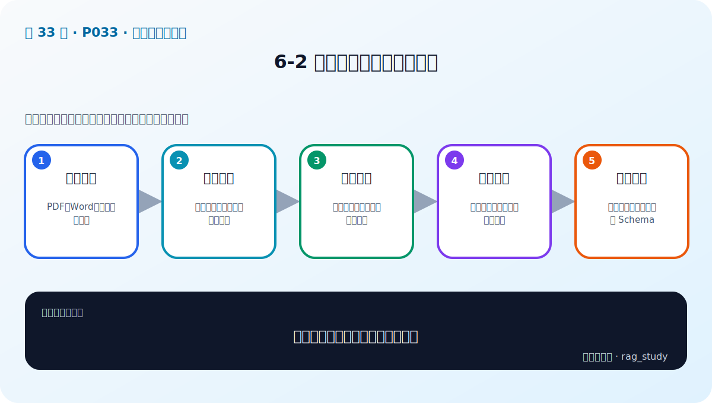

# P33：6-2 复杂：企业数据复杂多样

> 笔记编号 33/89 · 对应原视频 P33 · 时长 04:36 · [打开这一节](https://www.bilibili.com/video/BV1fLoKBREGv?p=33)

[← P32: 6-1 本章介绍](../06-document-processing/p032-文档解析与分块-本章导学.md) · [返回第 6 章专题](./README.md) · [P34: 6-3 原则：垃圾进垃圾出，注重文档质量 →](../06-document-processing/p034-原则-垃圾进垃圾出-注重文档质量.md)

## 这节到底讲什么

**核心问题：企业数据为什么比示例文本复杂？**

这节直接回答“企业数据为什么比示例文本复杂？”。老师的结论可以整理成五点：第一，格式多样：PDF、Word、表格、扫描件；第二，结构多样：标题、段落、页眉、跨页表格；第三，质量不齐：乱码、重复、缺失、版本冲突；第四，权限复杂：部门、角色、时效与敏感等级；第五，处理策略：按类型路由并统一输出 Schema。下面逐项解释每一点的含义和作用。

## 辅助流程图

## 正文讲解（按视频顺序）

> 下面是依据音轨和画面整理的通顺版本，不是逐字稿。技术术语已经校正，
> 老师的原始讲法保留在后面的 ASR 页面。

### 1. 格式多样

企业资料可能是 PDF、Word、PPT、Excel、网页、邮件、数据库和扫描图片。同一扩展名内部也可能完全不同，例如 PDF 既可能有文本层，也可能只是图片。

### 2. 结构多样

文档包含标题层级、多栏、页眉、脚注、跨页表格、图注和附件。错误阅读顺序会把不相邻内容拼在一起，打平表格会丢失字段与数值的对应关系。

### 3. 质量不齐

真实数据存在乱码、空页、重复、过期版本、扫描误识别和人为填写错误。RAG 会放大上游质量问题，所以数据治理必须在向量化之前完成并持续监控。

### 4. 权限复杂

不同部门、角色和时间可能只能看到部分资料。权限元数据要从源系统继承，并在检索时强制过滤；不能先召回敏感片段再希望提示词不泄露。

### 5. 处理策略

按文件类型和特征路由到专用解析器，再输出统一 Document Schema：正文、类型、标题、页码/区域、来源、版本和权限。统一下游接口不等于统一上游解析。

## 课后迁移示例（非视频原例）

> 来源说明：这是为了帮助理解而补充的迁移示例，不是老师在本节视频中逐字讲述的原例。

一份制度 PDF 可能同时有标题、正文、跨页表格和页眉。直接抽成一长串文本会破坏结构；正确做法是分别解析、清洗、分块，并保留页码和标题等元数据。

## 完整原声逐段记录

已用本地语音识别核查；技术词与口误以专题笔记的校正版为准。

[查看本节按时间戳保留的本地 ASR 转写](./transcripts/p033-复杂-企业数据复杂多样-ASR.md)。原始转写会保留
同音字和断句误差，正文用校正后的术语，方便同时核对“老师说了什么”和“概念是什么”。

## 读完记住这五句话

- **格式多样：** PDF、Word、表格、扫描件
- **结构多样：** 标题、段落、页眉、跨页表格
- **质量不齐：** 乱码、重复、缺失、版本冲突
- **权限复杂：** 部门、角色、时效与敏感等级
- **处理策略：** 按类型路由并统一输出 Schema

## 最小可运行代码

[打开本节最相关的纯 Python 练习](../../rag_from_scratch/chunking.py)。练习包不依赖 LangChain，
目的是先看清输入、输出和算法边界，再替换成课程中的框架/API。

## 最容易踩的坑

不要只检查程序有没有报错。解析结果即使能输出，也可能丢表格、打乱阅读顺序或切断关键条件。

## 自测

1. 不看图回答：企业数据为什么比示例文本复杂？
2. 用上面的例子，指出本节五个知识点分别出现在哪里。
3. 如果没有“权限复杂”，会出现什么具体问题？

## 学完检查

- [ ] 我能不看视频解释本节核心概念
- [ ] 我能指出它在 RAG 数据流中的位置
- [ ] 我知道它最适合与最不适合的场景
- [ ] 我读过完整 ASR 并核对了技术术语
- [ ] 我完成了专题 README 中对应的自测或实验
