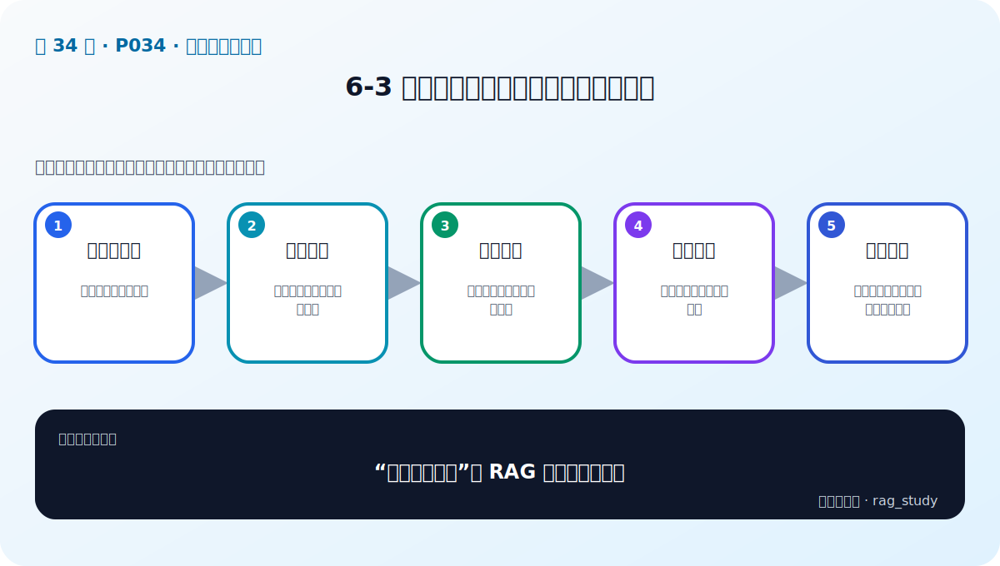

# P34：6-3 原则：垃圾进垃圾出，注重文档质量

> 笔记编号 34/89 · 对应原视频 P34 · 时长 03:59 · [打开这一节](https://www.bilibili.com/video/BV1fLoKBREGv?p=34)

[← P33: 6-2 复杂：企业数据复杂多样](../06-document-processing/p033-复杂-企业数据复杂多样.md) · [返回第 6 章专题](./README.md) · [P35: 6-4 挑战：RAG如何读取多样性文档（文本、表格和布局分析） →](../06-document-processing/p035-挑战-RAG如何读取多样性文档-文本-表格和布局分析.md)

## 这节到底讲什么

**核心问题：“垃圾进垃圾出”在 RAG 中意味着什么？**

这节直接回答““垃圾进垃圾出”在 RAG 中意味着什么？”。老师的结论可以整理成五点：第一，源文档审计：先确认权威性与时效；第二，解析质检：防止乱码、漏页与表格错位；第三，清洗去重：减少噪声与互相冲突的版本；第四，块级抽检：每块能独立理解且可回溯；第五，质量指标：覆盖率、错误率、重复率持续监控。下面逐项解释每一点的含义和作用。

## 辅助流程图

## 正文讲解（按视频顺序）

> 下面是依据音轨和画面整理的通顺版本，不是逐字稿。技术术语已经校正，
> 老师的原始讲法保留在后面的 ASR 页面。

### 1. 源文档审计

先确认资料是否权威、完整、在有效期内，以及不同版本谁优先。错误源文件即使解析和检索完全正确，也只会得到稳定的错误答案。

### 2. 解析质检

检查页数、字符覆盖、标题、表格、图片 OCR 和阅读顺序。可以保存原文页图与解析结果的对应关系，便于抽样核对和定位漏页。

### 3. 清洗去重

删除无意义重复和模板噪声，但保留影响解释的上下文。去重应基于稳定 ID、内容指纹和版本规则，不能把相似但适用范围不同的条款误合并。

### 4. 块级抽检

随机查看每个块能否独立理解、是否包含标题与条件、是否能回到原文。特别检查边界附近、跨页表格、列表和“除外/不得”等高风险表达。

### 5. 质量指标

记录解析覆盖率、空块率、重复率、OCR 低置信比例、元数据缺失率和业务检索 Recall。把坏例回流到具体解析规则，而不是笼统归因于模型。

## 课后迁移示例（非视频原例）

> 来源说明：这是为了帮助理解而补充的迁移示例，不是老师在本节视频中逐字讲述的原例。

一份制度 PDF 可能同时有标题、正文、跨页表格和页眉。直接抽成一长串文本会破坏结构；正确做法是分别解析、清洗、分块，并保留页码和标题等元数据。

## 完整原声逐段记录

已用本地语音识别核查；技术词与口误以专题笔记的校正版为准。

[查看本节按时间戳保留的本地 ASR 转写](./transcripts/p034-原则-垃圾进垃圾出-注重文档质量-ASR.md)。原始转写会保留
同音字和断句误差，正文用校正后的术语，方便同时核对“老师说了什么”和“概念是什么”。

## 读完记住这五句话

- **源文档审计：** 先确认权威性与时效
- **解析质检：** 防止乱码、漏页与表格错位
- **清洗去重：** 减少噪声与互相冲突的版本
- **块级抽检：** 每块能独立理解且可回溯
- **质量指标：** 覆盖率、错误率、重复率持续监控

## 最小可运行代码

[打开本节最相关的纯 Python 练习](../../rag_from_scratch/chunking.py)。练习包不依赖 LangChain，
目的是先看清输入、输出和算法边界，再替换成课程中的框架/API。

## 最容易踩的坑

不要只检查程序有没有报错。解析结果即使能输出，也可能丢表格、打乱阅读顺序或切断关键条件。

## 自测

1. 不看图回答：“垃圾进垃圾出”在 RAG 中意味着什么？
2. 用上面的例子，指出本节五个知识点分别出现在哪里。
3. 如果没有“块级抽检”，会出现什么具体问题？

## 学完检查

- [ ] 我能不看视频解释本节核心概念
- [ ] 我能指出它在 RAG 数据流中的位置
- [ ] 我知道它最适合与最不适合的场景
- [ ] 我读过完整 ASR 并核对了技术术语
- [ ] 我完成了专题 README 中对应的自测或实验
