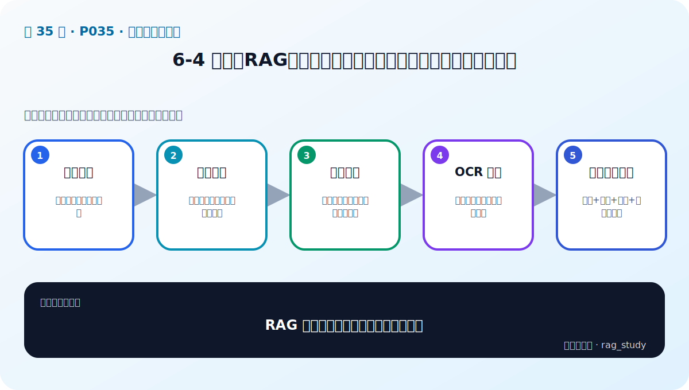

# P35：6-4 挑战：RAG如何读取多样性文档（文本、表格和布局分析）

> 笔记编号 35/89 · 对应原视频 P35 · 时长 09:11 · [打开这一节](https://www.bilibili.com/video/BV1fLoKBREGv?p=35)

[← P34: 6-3 原则：垃圾进垃圾出，注重文档质量](../06-document-processing/p034-原则-垃圾进垃圾出-注重文档质量.md) · [返回第 6 章专题](./README.md) · [P36: 6-5 文档分块：递归文本分块和语义智能分块 →](../06-document-processing/p036-文档分块-递归文本分块和语义智能分块.md)

## 这节到底讲什么

**核心问题：RAG 怎样读取文本、表格和复杂布局？**

这节直接回答“RAG 怎样读取文本、表格和复杂布局？”。老师的结论可以整理成五点：第一，文本提取：保留段落、标题与页码；第二，表格解析：保持行列关系而非打平成乱码；第三，布局分析：识别阅读顺序、栏、图注与区域；第四，OCR 兜底：扫描件需识别并记录置信度；第五，统一文档对象：内容+类型+位置+来源元数据。下面逐项解释每一点的含义和作用。

## 辅助流程图

## 正文讲解（按视频顺序）

> 下面是依据音轨和画面整理的通顺版本，不是逐字稿。技术术语已经校正，
> 老师的原始讲法保留在后面的 ASR 页面。

### 1. 文本提取

普通文本不仅要提取字符，还要保留标题、段落、列表和页码。多栏 PDF 要按正确阅读顺序重排，页眉页脚则应标记并去除，避免每页重复进入索引。

### 2. 表格解析

表格要保留表名、表头、行列和合并单元格关系。可转成 Markdown、HTML 或结构化 JSON，但必须让“城市—住宿上限—币种”仍能正确对应。

### 3. 布局分析

布局模型识别标题、正文、表格、图片、图注和区域坐标，解决仅按字符流无法判断结构的问题。版面结果还可用于按区域切块和回原 PDF 高亮来源。

### 4. OCR 兜底

扫描件需要 OCR。应保存识别置信度和原始图片位置，对数字、金额、日期和专名进行更严格抽检；低置信内容可以进入人工复核队列。

### 5. 统一文档对象

所有解析器最终输出统一对象，包括内容、类型、标题、位置、来源、版本和权限。下游分块器和索引器只依赖该对象，解析器因此可以按文件类型替换。

## 用一个例子串起来

一份制度 PDF 可能同时有标题、正文、跨页表格和页眉。直接抽成一长串文本会破坏结构；正确做法是分别解析、清洗、分块，并保留页码和标题等元数据。

## 完整原声逐段记录

已用本地语音识别核查；技术词与口误以专题笔记的校正版为准。

[查看本节按时间戳保留的本地 ASR 转写](./transcripts/p035-挑战-RAG如何读取多样性文档-文本-表格和布局分析-ASR.md)。原始转写会保留
同音字和断句误差，正文用校正后的术语，方便同时核对“老师说了什么”和“概念是什么”。

## 读完记住这五句话

- **文本提取：** 保留段落、标题与页码
- **表格解析：** 保持行列关系而非打平成乱码
- **布局分析：** 识别阅读顺序、栏、图注与区域
- **OCR 兜底：** 扫描件需识别并记录置信度
- **统一文档对象：** 内容+类型+位置+来源元数据

## 最小可运行代码

[打开本节最相关的纯 Python 练习](../../rag_from_scratch/chunking.py)。练习包不依赖 LangChain，
目的是先看清输入、输出和算法边界，再替换成课程中的框架/API。

## 最容易踩的坑

不要只检查程序有没有报错。解析结果即使能输出，也可能丢表格、打乱阅读顺序或切断关键条件。

## 自测

1. 不看图回答：RAG 怎样读取文本、表格和复杂布局？
2. 用上面的例子，指出本节五个知识点分别出现在哪里。
3. 如果没有“OCR 兜底”，会出现什么具体问题？

## 学完检查

- [ ] 我能不看视频解释本节核心概念
- [ ] 我能指出它在 RAG 数据流中的位置
- [ ] 我知道它最适合与最不适合的场景
- [ ] 我读过完整 ASR 并核对了技术术语
- [ ] 我完成了专题 README 中对应的自测或实验
