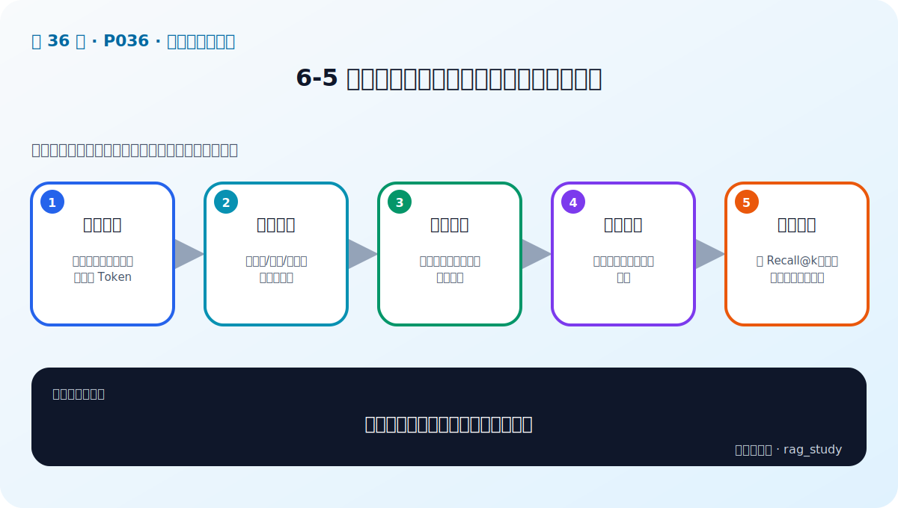

# P36：6-5 文档分块：递归文本分块和语义智能分块

> 笔记编号 36/89 · 对应原视频 P36 · 时长 12:19 · [打开这一节](https://www.bilibili.com/video/BV1fLoKBREGv?p=36)

[← P35: 6-4 挑战：RAG如何读取多样性文档（文本、表格和布局分析）](../06-document-processing/p035-挑战-RAG如何读取多样性文档-文本-表格和布局分析.md) · [返回第 6 章专题](./README.md) · [P37: 6-6 实战：实现制度问答模块数据读取和切割 →](../06-document-processing/p037-实战-实现制度问答模块数据读取和切割.md)

## 这节到底讲什么

**核心问题：递归分块和语义分块分别解决什么？**

这节直接回答“递归分块和语义分块分别解决什么？”。老师的结论可以整理成五点：第一，分块目标：兼顾语义完整、召回粒度和 Token；第二，递归分块：按段落/句子/字符逐级寻找边界；第三，重叠窗口：缓解跨块信息断裂但增加冗余；第四，语义分块：按相邻语义突变决定边界；第五，实验选择：用 Recall@k、上下文质量和成本比较。下面逐项解释每一点的含义和作用。

## 辅助流程图

## 正文讲解（按视频顺序）

> 下面是依据音轨和画面整理的通顺版本，不是逐字稿。技术术语已经校正，
> 老师的原始讲法保留在后面的 ASR 页面。

### 1. 分块目标

分块不是越小越好。块太大时，一个向量会混入多个主题，检索不够精确；块太小时，定义、条件和例外可能被拆散。合适的块要同时兼顾语义完整、召回粒度和送入 LLM 的 Token 成本。

### 2. 递归分块

递归分块会按照一组分隔符逐级尝试，例如先按段落切，块仍然过大时再按句子切，最后才按字符切。它的优点是规则简单、速度快，而且会尽量保留人类原本写下的段落和句子边界。

### 3. 重叠窗口

相邻块保留一小段重复内容，可以避免一个关键句正好被边界切成两半。但 overlap 越大，重复向量、存储量和上下文冗余也越多，所以不能盲目设置很大。

### 4. 语义分块

语义分块会比较相邻句子的向量变化；当主题出现明显跳变时才建立边界。它比固定长度更贴近内容结构，但需要额外计算 Embedding，阈值也必须用真实文档和检索问题调试。

### 5. 实验选择

最终选择不能只看切出来的文本是否整齐。应在同一批问题上比较 Recall@k、上下文是否包含完整条件、平均块长度、重复率和推理成本，再决定 chunk size、overlap 或语义阈值。

## 用一个例子串起来

假设制度原文有三段：第一段定义差旅，第二段规定住宿上限，第三段列出特殊城市的例外。递归分块会优先按这三个自然段切；若第二段过长，再按句子继续切，并用少量 overlap 保留边界信息。语义分块则会发现“普通上限”与“特殊城市例外”的主题变化，在变化处建立边界。两种方案最后都要用真实问题验证能否召回完整条件。

## 完整原声逐段记录

已用本地语音识别核查；技术词与口误以专题笔记的校正版为准。

[查看本节按时间戳保留的本地 ASR 转写](./transcripts/p036-文档分块-递归文本分块和语义智能分块-ASR.md)。原始转写会保留
同音字和断句误差，正文用校正后的术语，方便同时核对“老师说了什么”和“概念是什么”。

## 读完记住这五句话

- **分块目标：** 兼顾语义完整、召回粒度和 Token
- **递归分块：** 按段落/句子/字符逐级寻找边界
- **重叠窗口：** 缓解跨块信息断裂但增加冗余
- **语义分块：** 按相邻语义突变决定边界
- **实验选择：** 用 Recall@k、上下文质量和成本比较

## 最小可运行代码

[打开本节最相关的纯 Python 练习](../../rag_from_scratch/chunking.py)。练习包不依赖 LangChain，
目的是先看清输入、输出和算法边界，再替换成课程中的框架/API。

## 最容易踩的坑

不要只检查程序有没有报错。解析结果即使能输出，也可能丢表格、打乱阅读顺序或切断关键条件。

## 自测

1. 不看图回答：递归分块和语义分块分别解决什么？
2. 用上面的例子，指出本节五个知识点分别出现在哪里。
3. 如果没有“语义分块”，会出现什么具体问题？

## 学完检查

- [ ] 我能不看视频解释本节核心概念
- [ ] 我能指出它在 RAG 数据流中的位置
- [ ] 我知道它最适合与最不适合的场景
- [ ] 我读过完整 ASR 并核对了技术术语
- [ ] 我完成了专题 README 中对应的自测或实验
