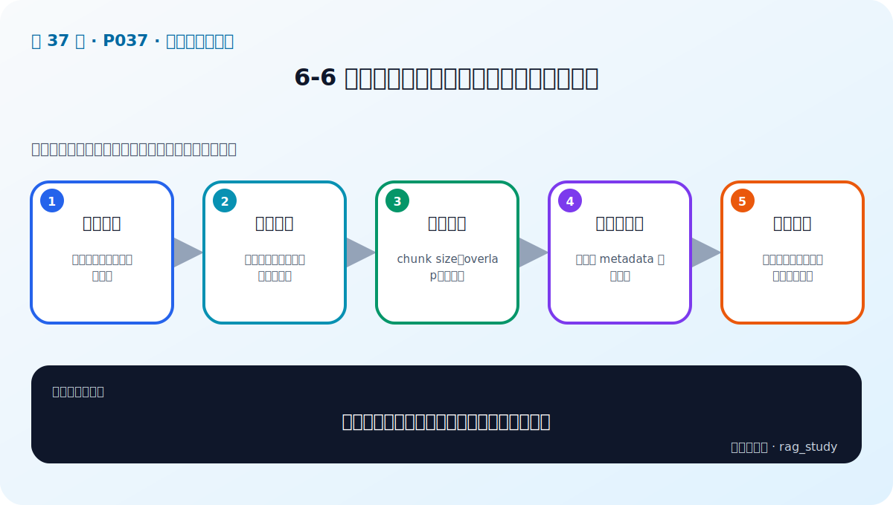

# P37：6-6 实战：实现制度问答模块数据读取和切割

> 笔记编号 37/89 · 对应原视频 P37 · 时长 35:38 · [打开这一节](https://www.bilibili.com/video/BV1fLoKBREGv?p=37)

[← P36: 6-5 文档分块：递归文本分块和语义智能分块](../06-document-processing/p036-文档分块-递归文本分块和语义智能分块.md) · [返回第 6 章专题](./README.md) · [P38: 6-7 本章总结 →](../06-document-processing/p038-文档解析与分块-本章总结.md)

## 这节到底讲什么

**核心问题：制度文档读取与切割实战的完整链路是什么？**

这节直接回答“制度文档读取与切割实战的完整链路是什么？”。老师的结论可以整理成五点：第一，加载文件：按格式解析并保留来源信息；第二，清洗文本：处理空白、页眉页脚和异常字符；第三，配置切块：chunk size、overlap、分隔符；第四，生成文档块：正文与 metadata 同步保存；第五，抽样验证：打印边界、长度、来源后再向量化。下面逐项解释每一点的含义和作用。

## 辅助流程图

## 正文讲解（按视频顺序）

> 下面是依据音轨和画面整理的通顺版本，不是逐字稿。技术术语已经校正，
> 老师的原始讲法保留在后面的 ASR 页面。

### 1. 加载文件

制度问答实战先按文件类型加载 PDF、Excel 等资料，并为每个文档生成稳定来源 ID。加载阶段就保存文件名、页码或工作表、版本和权限，后续不能只剩一段失去出处的文本。

### 2. 清洗文本

解析后检查乱码、空白、重复页眉页脚、异常换行和表格结构。清洗函数要保守并可测试，原始内容与清洗结果最好都能追踪，避免误删金额和例外条件。

### 3. 配置切块

根据模型上下文和文档结构设置 chunk size、overlap 与分隔符。先用段落、换行和句号等自然边界，块仍过大时再细切；参数放入配置而不是散落在代码。

### 4. 生成文档块

每个块包含稳定 chunk ID、正文和从父文档继承的 metadata。标题可以前置到正文帮助检索，parent_id 用于命中小块后取回更完整的父级上下文。

### 5. 抽样验证

在向量化前打印块长度、开头结尾、来源和相邻边界，专门检查列表、表格和跨页条件。随后用已知答案的问题做召回测试，确认切块不是只在视觉上整齐。

## 用一个例子串起来

一份制度 PDF 可能同时有标题、正文、跨页表格和页眉。直接抽成一长串文本会破坏结构；正确做法是分别解析、清洗、分块，并保留页码和标题等元数据。

## 完整原声逐段记录

已用本地语音识别核查；技术词与口误以专题笔记的校正版为准。

[查看本节按时间戳保留的本地 ASR 转写](./transcripts/p037-实战-实现制度问答模块数据读取和切割-ASR.md)。原始转写会保留
同音字和断句误差，正文用校正后的术语，方便同时核对“老师说了什么”和“概念是什么”。

## 读完记住这五句话

- **加载文件：** 按格式解析并保留来源信息
- **清洗文本：** 处理空白、页眉页脚和异常字符
- **配置切块：** chunk size、overlap、分隔符
- **生成文档块：** 正文与 metadata 同步保存
- **抽样验证：** 打印边界、长度、来源后再向量化

## 最小可运行代码

[打开本节最相关的纯 Python 练习](../../rag_from_scratch/chunking.py)。练习包不依赖 LangChain，
目的是先看清输入、输出和算法边界，再替换成课程中的框架/API。

## 最容易踩的坑

不要只检查程序有没有报错。解析结果即使能输出，也可能丢表格、打乱阅读顺序或切断关键条件。

## 自测

1. 不看图回答：制度文档读取与切割实战的完整链路是什么？
2. 用上面的例子，指出本节五个知识点分别出现在哪里。
3. 如果没有“生成文档块”，会出现什么具体问题？

## 学完检查

- [ ] 我能不看视频解释本节核心概念
- [ ] 我能指出它在 RAG 数据流中的位置
- [ ] 我知道它最适合与最不适合的场景
- [ ] 我读过完整 ASR 并核对了技术术语
- [ ] 我完成了专题 README 中对应的自测或实验
