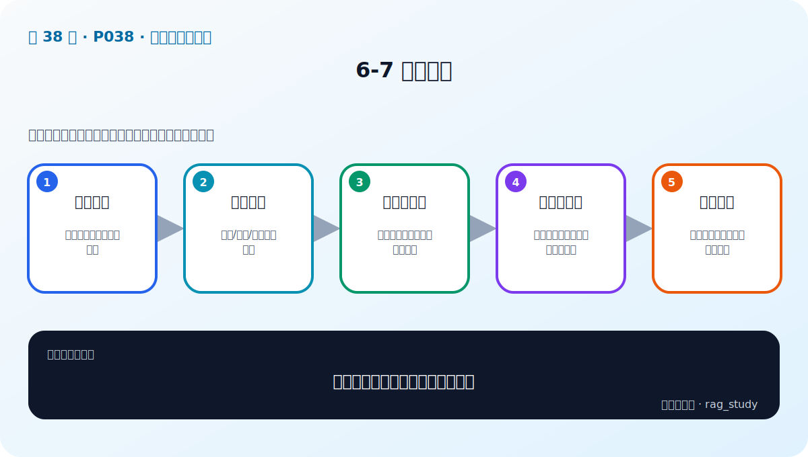

# P38：6-7 本章总结

> 笔记编号 38/89 · 对应原视频 P38 · 时长 01:14 · [打开这一节](https://www.bilibili.com/video/BV1fLoKBREGv?p=38)

[← P37: 6-6 实战：实现制度问答模块数据读取和切割](../06-document-processing/p037-实战-实现制度问答模块数据读取和切割.md) · [返回第 6 章专题](./README.md) · [P39: 7-1 本章介绍 →](../07-baseline-rag/p039-企业制度问答-Baseline-本章导学.md)

## 这节到底讲什么

**核心问题：文档处理章应形成哪些质量门槛？**

这节直接回答“文档处理章应形成哪些质量门槛？”。老师的结论可以整理成五点：第一，输入可控：来源、版本、权限有记录；第二，解析正确：文本/表格/版面不丢信息；第三，切块可检索：粒度、重叠、语义边界可解释；第四，元数据完整：来源、页码、标题支持过滤引用；第五，持续评测：坏案例回流到解析和分块策略。下面逐项解释每一点的含义和作用。

## 辅助流程图

## 正文讲解（按视频顺序）

> 下面是依据音轨和画面整理的通顺版本，不是逐字稿。技术术语已经校正，
> 老师的原始讲法保留在后面的 ASR 页面。

### 1. 输入可控

建立文档清单，记录来源、版本、更新时间、权限和处理状态。没有可控输入，索引中会混入旧版或无权资料，也无法进行增量更新。

### 2. 解析正确

文本、表格、布局和 OCR 应有各自质量检查。解析正确意味着内容、顺序和结构可用于回答，不只是没有抛出异常。

### 3. 切块可检索

块要有合适粒度、完整语义和可解释边界。递归、重叠、语义和父子分块不是互斥选项，应根据失败问题组合并通过 Recall@k 验证。

### 4. 元数据完整

至少保留 source、page/section、version、parent_id 和 permission。元数据支持过滤、引用、更新、去重和问题排查，是企业 RAG 的必要数据。

### 5. 持续评测

新文件格式、解析器版本或分块参数都会改变索引。把解析坏例和检索失败加入回归集，每次重建后自动检查质量，防止数据管道悄悄退化。

## 课后迁移示例（非视频原例）

> 来源说明：这是为了帮助理解而补充的迁移示例，不是老师在本节视频中逐字讲述的原例。

一份制度 PDF 可能同时有标题、正文、跨页表格和页眉。直接抽成一长串文本会破坏结构；正确做法是分别解析、清洗、分块，并保留页码和标题等元数据。

## 完整原声逐段记录

已用本地语音识别核查；技术词与口误以专题笔记的校正版为准。

[查看本节按时间戳保留的本地 ASR 转写](./transcripts/p038-文档解析与分块-本章总结-ASR.md)。原始转写会保留
同音字和断句误差，正文用校正后的术语，方便同时核对“老师说了什么”和“概念是什么”。

## 读完记住这五句话

- **输入可控：** 来源、版本、权限有记录
- **解析正确：** 文本/表格/版面不丢信息
- **切块可检索：** 粒度、重叠、语义边界可解释
- **元数据完整：** 来源、页码、标题支持过滤引用
- **持续评测：** 坏案例回流到解析和分块策略

## 最小可运行代码

[打开本节最相关的纯 Python 练习](../../rag_from_scratch/chunking.py)。练习包不依赖 LangChain，
目的是先看清输入、输出和算法边界，再替换成课程中的框架/API。

## 最容易踩的坑

不要只检查程序有没有报错。解析结果即使能输出，也可能丢表格、打乱阅读顺序或切断关键条件。

## 自测

1. 不看图回答：文档处理章应形成哪些质量门槛？
2. 用上面的例子，指出本节五个知识点分别出现在哪里。
3. 如果没有“元数据完整”，会出现什么具体问题？

## 学完检查

- [ ] 我能不看视频解释本节核心概念
- [ ] 我能指出它在 RAG 数据流中的位置
- [ ] 我知道它最适合与最不适合的场景
- [ ] 我读过完整 ASR 并核对了技术术语
- [ ] 我完成了专题 README 中对应的自测或实验
