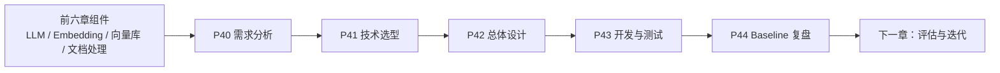

# P39：7-1 本章介绍

> 笔记编号 39/89 · 对应原视频 P39 · 时长 01:24 · [打开这一节](https://www.bilibili.com/video/BV1fLoKBREGv?p=39)

[← P38: 6-7 本章总结](../06-document-processing/p038-文档解析与分块-本章总结.md) · [返回第 7 章专题](./README.md) · [P40: 7-2 【企业员工制度问答助手】需求分析 →](../07-baseline-rag/p040-企业员工制度问答助手-需求分析.md)

## 这节到底讲什么

**核心问题：Baseline 章怎样把前置组件接成系统？**

这一节不是重复介绍 RAG，而是给出第 7 章的项目开发顺序。前六章已经准备好
大语言模型、Embedding、向量数据库、LangChain 和复杂文档处理；本章把这些
部件第一次接成企业制度问答系统。路线严格按照需求分析、技术选型、总体设计、
开发测试和复盘展开，最终得到一个可以继续评估和优化的 Baseline。

## 辅助流程图

## 正文讲解（按视频顺序）

> 下面是依据音轨和画面整理的通顺版本，不是逐字稿。技术术语已经校正，
> 老师的原始讲法保留在后面的 ASR 页面。

### 1. 业务需求

先分析员工为什么需要制度助手、系统要解决哪些查询，以及要接入哪些企业资料。
课程把功能需求和依赖数据放在技术选型之前，避免拿着框架寻找问题。

### 2. 技术选型

根据资料类型和项目规模选择生成模型、Embedding、向量数据库、文档解析器、
流程框架与前端。选型是当前约束下的初始假设，后续仍要通过测试结果调整。

### 3. 架构设计

总体设计把系统分成内部知识库构建与外部问答 Pipeline。前者离线处理资料并
建立索引，后者在线检索证据并生成答案，两条链路通过向量库连接。

### 4. Baseline 实现

实战按总体设计实现文档解析、分块、Embedding、Chroma 入库、相似度检索、
提示词组装和 LLM 生成，并用加班、差旅问题验证完整流程。

### 5. 迭代入口

本章完成的是可运行、可测试的第一版，不代表已经满足上线质量。下一章建立
评测方法，再根据失败类型进入高级检索、Graph RAG 和 Agent。

## 校正版讲解时间线

- **00:00–00:23：前置模块汇合。** 前几章分别学习了 LLM、Embedding、向量库、
  LangChain 和企业复杂数据处理，本章开始把它们连接成制度问答系统。
- **00:23–00:34：两项最终产物。** 一项是内部知识库，另一项是包含查询、检索、
  增强和生成的完整 RAG Pipeline。
- **00:34–01:07：按软件工程顺序推进。** 需求与数据分析 → 技术选型 → 总体架构
  → 开发与测试。
- **01:07–01:23：最后做思维复盘。** 传统开发者需要理解 AI 应用为什么不能只靠
  确定性的功能测试。

## 用一个例子串起来

把本章看成一次完整交付：P40 先确认员工查制度和差旅标准的痛点；P41 决定
使用 BGE-M3、Chroma、Qwen2-72B、DeepDoc、LangChain；P42 画出离线建库与
在线问答；P43 按图实现并测试；P44 再说明为什么它仍只是待评估的 Baseline。

## 完整原声逐段记录

已用本地语音识别核查；技术词与口误以专题笔记的校正版为准。

[查看本节按时间戳保留的本地 ASR 转写](./transcripts/p039-企业制度问答-Baseline-本章导学-ASR.md)。原始转写会保留
同音字和断句误差，正文用校正后的术语，方便同时核对“老师说了什么”和“概念是什么”。

## 读完记住这五句话

- **业务需求：** 企业员工制度问答
- **技术选型：** LLM、Embedding、向量库、框架
- **架构设计：** 离线建库与在线问答解耦
- **Baseline 实现：** 召回证据后约束模型生成
- **迭代入口：** 先能评测，再谈高级增强

## 最小可运行代码

[打开本节最相关的纯 Python 练习](../../rag_from_scratch/pipeline.py)。练习包不依赖 LangChain，
目的是先看清输入、输出和算法边界，再替换成课程中的框架/API。

## 最容易踩的坑

不要把“已经学过所有组件”误认为“自然能组成系统”。接口、数据格式、错误处理
和离线/在线边界必须在总体设计中明确。

## 自测

1. 第 7 章为什么按需求、选型、设计、实战、复盘的顺序展开？
2. 知识库构建与在线问答分别包含哪些步骤？
3. 为什么 P43 跑通后还不能称为可上线系统？

## 学完检查

- [ ] 我能不看视频解释本节核心概念
- [ ] 我能指出它在 RAG 数据流中的位置
- [ ] 我知道它最适合与最不适合的场景
- [ ] 我读过完整 ASR 并核对了技术术语
- [ ] 我完成了专题 README 中对应的自测或实验
