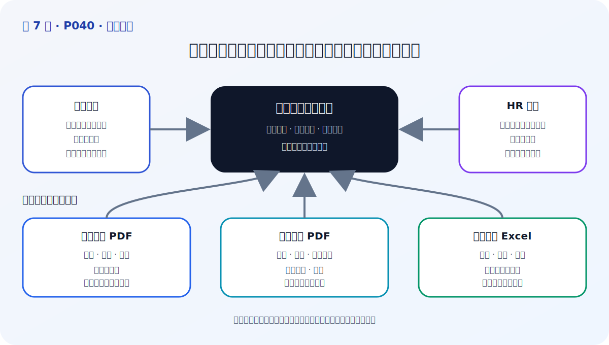
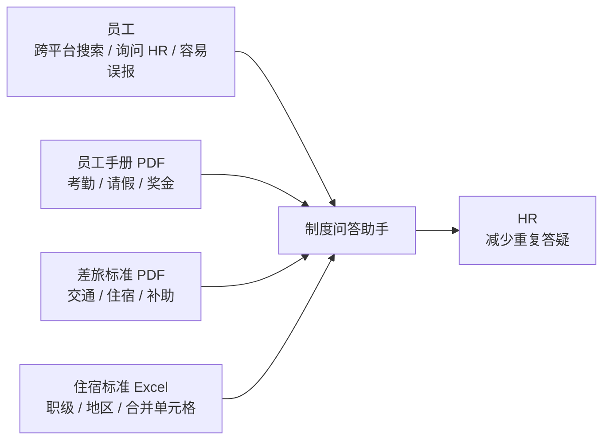

# P40：7-2 【企业员工制度问答助手】需求分析

> 笔记编号 40/89 · 对应原视频 P40 · 时长 02:25 · [打开这一节](https://www.bilibili.com/video/BV1fLoKBREGv?p=40)

[← P39: 7-1 本章介绍](../07-baseline-rag/p039-企业制度问答-Baseline-本章导学.md) · [返回第 7 章专题](./README.md) · [P41: 7-3 项目技术选型 →](../07-baseline-rag/p041-项目技术选型.md)

## 这节到底讲什么

**核心问题：企业制度问答助手的需求怎样拆？**

这一节从业务痛点出发定义项目，而不是先挑模型。企业制度分散在不同平台、
服务器和文件里，员工查找效率低，HR 又要重复回答；差旅报销还会因职级、
地区和时间不同产生不同标准。项目目标是把这些资料统一接入一个问答入口，
但答案仍必须能够回到原制度核查。

## 辅助流程图

## 正文讲解（按视频顺序）

> 下面是依据音轨和画面整理的通顺版本，不是逐字稿。技术术语已经校正，
> 老师的原始讲法保留在后面的 ASR 页面。

### 1. 用户与场景

企业制度通常复杂且分散在不同平台、服务器或文档中。员工需要来回切换系统
搜索，找不到时只能询问 HR，既降低信息获取效率，也增加重复沟通。差旅报销
还会因为职级、地区等条件不同而容易误报或多报。

### 2. 知识范围

演示数据包括员工手册/规章制度、差旅费用标准和更细的住宿费标准。员工手册
覆盖考勤、请假和奖金等规定；差旅资料覆盖交通、住宿、伙食补助和市内交通等
标准。

### 3. 答案要求

助手要帮助员工快速定位制度和报销标准，回答必须来自接入资料并同时展示参考
信息。资料没有覆盖时应明确说明，而不是用社会常识猜测公司规则。

### 4. 非功能需求

课程这一节主要讲业务和数据，没有展开并发与鉴权；但从企业落地角度还要补充
权限、隐私、版本、延迟和审计要求。要区分“视频明确提出的需求”和“上线前
必须补充的工程需求”。

### 5. 验收数据

需求分析应同步沉淀问题集：考勤、请假、加班、不同地区/职级的差旅标准，以及
资料外问题。它们既是开发样例，也是判断 Baseline 是否可用的起点。

## 校正版讲解时间线

- **00:00–00:45：制度查询痛点。** 企业制度复杂、数量多、存放位置分散；员工
  需要跨平台查找，或者直接询问 HR，产生搜索和沟通成本。
- **00:45–01:11：差旅报销痛点。** 不同职级、地区对应不同报销标准，员工难以
  准确掌握，容易误报或多报。
- **01:11–01:32：项目目标。** 聚合多个平台的规章制度和差旅资料，用统一问答
  帮员工定位信息并减轻 HR 工作量。
- **01:32–02:25：依赖数据。** 员工手册 PDF、差旅标准 PDF、住宿标准 Excel；
  PDF 含表格，Excel 含合并单元格，后续解析必须特殊处理。

## 用一个例子串起来

员工问“高级职级在上海旺季出差，住宿上限是多少”。答案同时依赖职级、地区
和旺季三个条件，信息可能来自 Excel 合并单元格。需求分析若只写“支持差旅
问答”，后续解析、检索和评测都会漏掉这些关键组合条件。

## 完整原声逐段记录

已用本地语音识别核查；技术词与口误以专题笔记的校正版为准。

[查看本节按时间戳保留的本地 ASR 转写](./transcripts/p040-企业员工制度问答助手-需求分析-ASR.md)。原始转写会保留
同音字和断句误差，正文用校正后的术语，方便同时核对“老师说了什么”和“概念是什么”。

## 读完记住这五句话

- **用户与场景：** 员工查制度、流程与标准
- **知识范围：** 明确资料来源、版本与更新周期
- **答案要求：** 准确、引用、无证据时拒答
- **非功能需求：** 延迟、并发、权限、隐私
- **验收数据：** 把典型问题和边界问题做成评测集

## 最小可运行代码

[打开本节最相关的纯 Python 练习](../../rag_from_scratch/pipeline.py)。练习包不依赖 LangChain，
目的是先看清输入、输出和算法边界，再替换成课程中的框架/API。

## 最容易踩的坑

不要把需求写成一句“做企业知识库”。必须列出用户、具体问题、权威数据、
组合条件、拒答边界和可验收样本。

## 自测

1. 企业制度问答解决了员工和 HR 的哪些具体痛点？
2. 演示项目接入了哪三类文件，它们各自有什么解析难点？
3. 为差旅住宿问题设计三个必须覆盖的组合条件。

## 学完检查

- [ ] 我能不看视频解释本节核心概念
- [ ] 我能指出它在 RAG 数据流中的位置
- [ ] 我知道它最适合与最不适合的场景
- [ ] 我读过完整 ASR 并核对了技术术语
- [ ] 我完成了专题 README 中对应的自测或实验
