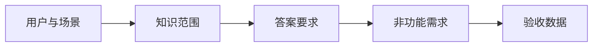

# P40：7-2 【企业员工制度问答助手】需求分析

> 笔记编号 40/89 · 对应原视频 P40 · 时长 02:25 · [打开这一节](https://www.bilibili.com/video/BV1fLoKBREGv?p=40)

[← P39: 7-1 本章介绍](../07-baseline-rag/p039-企业制度问答-Baseline-本章导学.md) · [返回第 7 章专题](./README.md) · [P41: 7-3 项目技术选型 →](../07-baseline-rag/p041-项目技术选型.md)

## 这节到底讲什么

**核心问题：企业制度问答助手的需求怎样拆？**

这节直接回答“企业制度问答助手的需求怎样拆？”。老师的结论可以整理成五点：第一，用户与场景：员工查制度、流程与标准；第二，知识范围：明确资料来源、版本与更新周期；第三，答案要求：准确、引用、无证据时拒答；第四，非功能需求：延迟、并发、权限、隐私；第五，验收数据：把典型问题和边界问题做成评测集。下面逐项解释每一点的含义和作用。

## 辅助流程图

## 正文讲解（按视频顺序）

> 下面是依据音轨和画面整理的通顺版本，不是逐字稿。技术术语已经校正，
> 老师的原始讲法保留在后面的 ASR 页面。

### 1. 用户与场景

员工查制度、流程与标准。

### 2. 知识范围

明确资料来源、版本与更新周期。

### 3. 答案要求

准确、引用、无证据时拒答。

### 4. 非功能需求

延迟、并发、权限、隐私。

### 5. 验收数据

把典型问题和边界问题做成评测集。

## 用一个例子串起来

用户提出问题后，系统先检索制度片段，再把片段、来源和问题放进提示词；如果证据不足，模型应明确拒答，而不是凭常识补齐公司规则。

## 完整原声逐段记录

已用本地语音识别核查；技术词与口误以专题笔记的校正版为准。

[查看本节按时间戳保留的本地 ASR 转写](./transcripts/p040-企业员工制度问答助手-需求分析-ASR.md)。原始转写会保留
同音字和断句误差，正文用校正后的术语，方便同时核对“老师说了什么”和“概念是什么”。

## 读完记住这五句话

- **用户与场景：** 员工查制度、流程与标准
- **知识范围：** 明确资料来源、版本与更新周期
- **答案要求：** 准确、引用、无证据时拒答
- **非功能需求：** 延迟、并发、权限、隐私
- **验收数据：** 把典型问题和边界问题做成评测集

## 最小可运行代码

[打开本节最相关的纯 Python 练习](../../rag_from_scratch/pipeline.py)。练习包不依赖 LangChain，
目的是先看清输入、输出和算法边界，再替换成课程中的框架/API。

## 最容易踩的坑

不要让模型在没有证据时自由补充答案。提示词应包含引用和拒答规则，并把检索结果保存在日志里。

## 自测

1. 不看图回答：企业制度问答助手的需求怎样拆？
2. 用上面的例子，指出本节五个知识点分别出现在哪里。
3. 如果没有“非功能需求”，会出现什么具体问题？

## 学完检查

- [ ] 我能不看视频解释本节核心概念
- [ ] 我能指出它在 RAG 数据流中的位置
- [ ] 我知道它最适合与最不适合的场景
- [ ] 我读过完整 ASR 并核对了技术术语
- [ ] 我完成了专题 README 中对应的自测或实验
