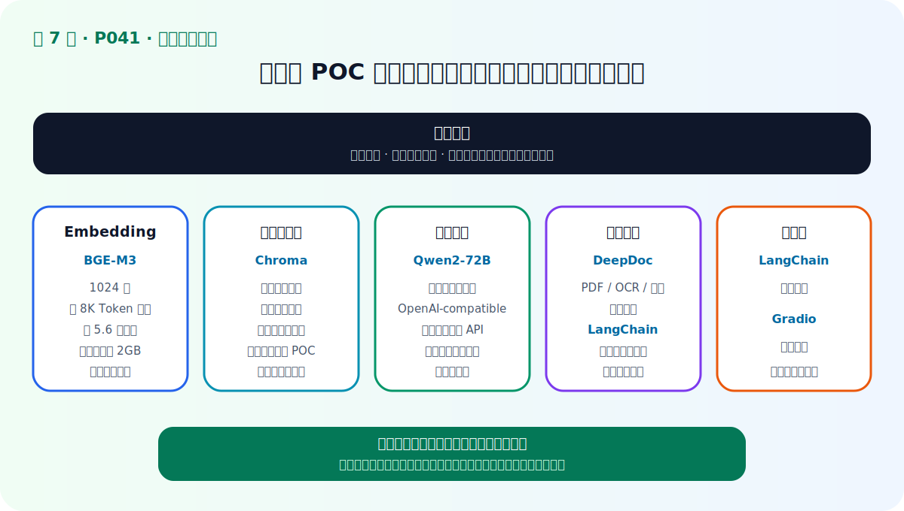
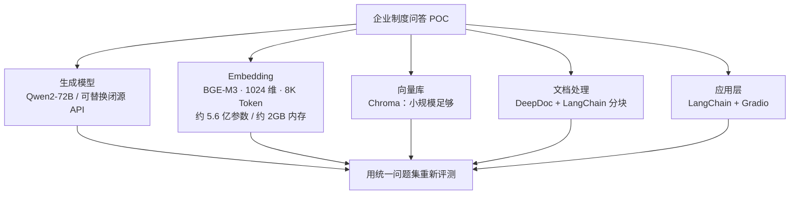

# P41：7-3 项目技术选型

> 笔记编号 41/89 · 对应原视频 P41 · 时长 01:36 · [打开这一节](https://www.bilibili.com/video/BV1fLoKBREGv?p=41)

[← P40: 7-2 【企业员工制度问答助手】需求分析](../07-baseline-rag/p040-企业员工制度问答助手-需求分析.md) · [返回第 7 章专题](./README.md) · [P42: 7-4 项目架构设计 →](../07-baseline-rag/p042-项目架构设计.md)

## 这节到底讲什么

**核心问题：项目技术选型为何必须从约束出发？**

这一节给出课程演示项目的实际组件，而不是通用选型清单：检索模型用 BGE-M3，
向量库用 Chroma，生成模型优先用 Qwen2-72B，PDF 解析用 RAGFlow DeepDoc，
长文本再用 LangChain 分块，流程编排使用 LangChain，演示界面使用 Gradio。
每个选择都对应当前小规模演示的约束，并非永久结论。

## 辅助流程图

## 正文讲解（按视频顺序）

> 下面是依据音轨和画面整理的通顺版本，不是逐字稿。技术术语已经校正，
> 老师的原始讲法保留在后面的 ASR 页面。

### 1. 需求约束

当前是小规模课程演示，文档数量少、没有强扩展性要求，所以优先保证能够快速
跑通和验证效果。这里的组件组合不等于大规模生产环境的最终采购方案。

### 2. LLM 选型

生成模型优先选能力较强的 Qwen2-72B，用强模型先验证整个方案是否有效；也可以
替换成闭源 API。验证质量上限之后，才适合继续讨论小模型和成本。

### 3. Embedding

课程选择 BGE-M3：输出向量 1024 维，支持约 8K Token 输入，约 5.6 亿参数，
演示中内存占用约 2GB。模型参数和榜单只是初筛信息，真实制度问题上的召回
效果才是最终依据。

### 4. 向量库/框架

小数据量使用 Chroma；PDF 和表格解析使用 RAGFlow DeepDoc，长文本再结合
LangChain 分块；整体流程用 LangChain 编排，Gradio 留作前端界面。

### 5. 小规模 POC

先用这套组合完成可测试原型，再用同一批问题检查召回、答案与延迟。若数据量、
并发、权限或部署条件变化，应重新评估组件，而不是被初始选型锁死。

## 校正版讲解时间线

- **00:03–00:32：Embedding。** 使用 BGE-M3；1024 维、支持约 8K Token 输入、
  约 5.6 亿参数，课程环境约占 2GB 内存。
- **00:33–00:44：向量数据库。** 因为演示文档少且没有强扩展要求，选择 Chroma。
- **00:44–01:01：生成模型。** 优先使用能力强的 Qwen2-72B 验证方案有效性，也
  可以改用闭源模型 API。
- **01:01–01:18：文档处理。** 使用 RAGFlow DeepDoc 解析带表格的资料，并结合
  LangChain 分块。
- **01:19–01:36：应用框架。** LangChain 负责流程，Gradio 负责前端；初始选型
  可以在项目执行中继续调整。

## 用一个例子串起来

课程先用 Qwen2-72B 验证质量上限，用 BGE-M3 生成 1024 维向量，用 Chroma
保存小规模索引。若以后扩展到千万级文档和高并发，向量库可能换成 Milvus，
但问题、文档对象、检索结果和评测接口应保持稳定。

## 完整原声逐段记录

已用本地语音识别核查；技术词与口误以专题笔记的校正版为准。

[查看本节按时间戳保留的本地 ASR 转写](./transcripts/p041-项目技术选型-ASR.md)。原始转写会保留
同音字和断句误差，正文用校正后的术语，方便同时核对“老师说了什么”和“概念是什么”。

## 读完记住这五句话

- **需求约束：** 质量、成本、延迟、数据安全
- **LLM 选型：** 能力、上下文、调用与部署方式
- **Embedding：** 领域召回、维度与推理成本
- **向量库/框架：** 规模、过滤、运维与团队经验
- **小规模 POC：** 统一评测后再锁定组件

## 最小可运行代码

[打开本节最相关的纯 Python 练习](../../rag_from_scratch/pipeline.py)。练习包不依赖 LangChain，
目的是先看清输入、输出和算法边界，再替换成课程中的框架/API。

## 最容易踩的坑

课程选型是小规模演示的初始方案。BGE-M3、Chroma 或 Qwen2-72B 的版本和参数
会变化，生产选型必须重新实测。

## 自测

1. 课程为什么选择 BGE-M3、Chroma 和 Qwen2-72B？
2. BGE-M3 在视频中给出了哪些规模参数？
3. 哪些业务变化会迫使你重新做技术选型？

## 学完检查

- [ ] 我能不看视频解释本节核心概念
- [ ] 我能指出它在 RAG 数据流中的位置
- [ ] 我知道它最适合与最不适合的场景
- [ ] 我读过完整 ASR 并核对了技术术语
- [ ] 我完成了专题 README 中对应的自测或实验
