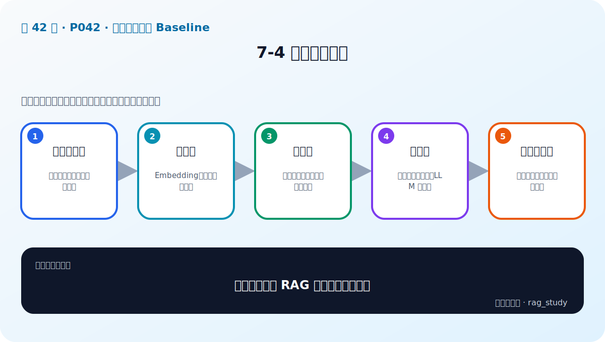
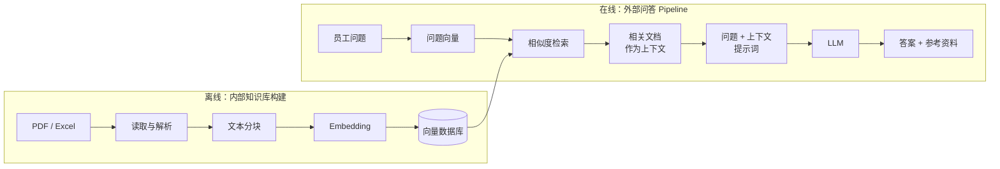

# P42：7-4 项目架构设计

> 笔记编号 42/89 · 对应原视频 P42 · 时长 01:40 · [打开这一节](https://www.bilibili.com/video/BV1fLoKBREGv?p=42)

[← P41: 7-3 项目技术选型](../07-baseline-rag/p041-项目技术选型.md) · [返回第 7 章专题](./README.md) · [P43: 7-5 实战：实现制度问答模块RAG baseline →](../07-baseline-rag/p043-实战-实现制度问答模块RAG-baseline.md)

## 这节到底讲什么

**核心问题：一个可迭代的 RAG 架构应怎样分层？**

这一节把系统明确拆成两条流水线。离线知识库流水线负责读取、解析、分块、
Embedding 和入库；在线问答流水线负责接收问题、相似度检索、组装上下文、
调用 LLM，并把答案与参考资料一起返回前端。理解这两条线，是读懂下一节
代码的前提。

## 辅助流程图

## 正文讲解（按视频顺序）

> 下面是依据音轨和画面整理的通顺版本，不是逐字稿。技术术语已经校正，
> 老师的原始讲法保留在后面的 ASR 页面。

### 1. 数据接入层

内部知识库构建从 PDF、Excel 等项目文档开始，依次完成读取解析与文本分块。
表格和合并单元格需要保留结构，不能在进入 Embedding 前丢失条件。

### 2. 索引层

每个文档块由 Embedding 模型转换成向量，再与正文和来源一起存入向量库。
这是离线链路的终点，也是在线问题能够搜索企业知识的连接点。

### 3. 检索层

员工在前端输入问题后，系统对问题做向量化并在已经构建的知识库中执行相似度
检索，返回若干相关文档。Top-k 决定送给模型的候选数量。

### 4. 生成层

检索结果作为上下文，与员工问题共同填入提示词，再交给大语言模型生成答案。
前端同时展示答案和相关上下文，让用户能够核对依据。

### 5. 评估观测层

课程原图重点是离线与在线两条主线；为了让系统可迭代，还应保存问题、命中
文档、相似度、最终提示词、模型输出和耗时，供下一章评估使用。

## 校正版讲解时间线

- **00:00–00:23：系统一分为二。** 第一部分是内部知识库构建，第二部分是面向
  外部问题的检索生成 Pipeline。
- **00:23–00:40：离线知识库。** 读取解析 → 文本分块 → Embedding 向量化 →
  写入向量数据库。
- **00:40–01:14：在线问答。** 接收问题 → 在知识库执行相似度检索 → 获得相关
  文档 → 与问题合并成提示词 → LLM 生成答案。
- **01:14–01:39：可解释展示。** 相关上下文也作为参考信息展示给员工；良好的
  总体设计可以让各模块独立迭代。

## 用一个例子串起来

离线阶段把“差旅制度.pdf”解析成文档块并写入 Chroma；在线阶段员工问
“住宿费怎么报”，系统只查询现成索引，不重新解析 PDF。命中的条款与问题
组成提示词，答案和条款原文一起显示。

## 完整原声逐段记录

已用本地语音识别核查；技术词与口误以专题笔记的校正版为准。

[查看本节按时间戳保留的本地 ASR 转写](./transcripts/p042-项目架构设计-ASR.md)。原始转写会保留
同音字和断句误差，正文用校正后的术语，方便同时核对“老师说了什么”和“概念是什么”。

## 读完记住这五句话

- **数据接入层：** 解析、清洗、分块、元数据
- **索引层：** Embedding、向量库与版本
- **检索层：** 查询处理、召回、融合、重排
- **生成层：** 提示词、上下文、LLM 与引用
- **评估观测层：** 数据集、指标、日志与反馈

## 最小可运行代码

[打开本节最相关的纯 Python 练习](../../rag_from_scratch/pipeline.py)。练习包不依赖 LangChain，
目的是先看清输入、输出和算法边界，再替换成课程中的框架/API。

## 最容易踩的坑

不要在每次提问时重新解析、分块和建库。离线知识处理与在线问答要解耦，
索引更新应有独立流程和版本。

## 自测

1. 画出离线建库和在线问答两条流水线，并标出它们的连接点。
2. 为什么答案之外还要返回参考上下文？
3. 为了后续评测，在线链路至少要记录哪些中间结果？

## 学完检查

- [ ] 我能不看视频解释本节核心概念
- [ ] 我能指出它在 RAG 数据流中的位置
- [ ] 我知道它最适合与最不适合的场景
- [ ] 我读过完整 ASR 并核对了技术术语
- [ ] 我完成了专题 README 中对应的自测或实验
