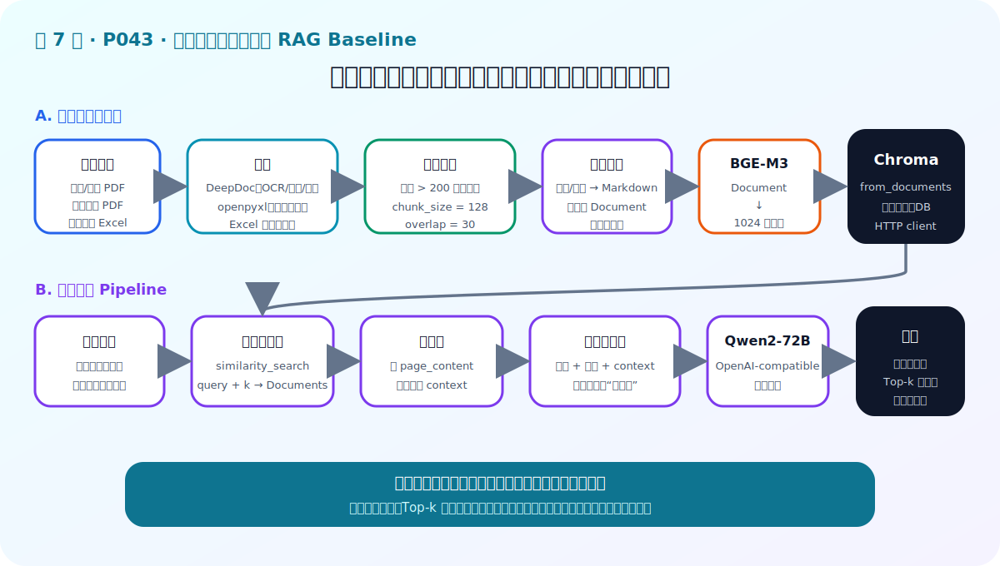
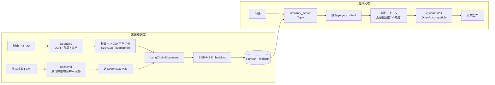

# P43：7-5 实战：实现制度问答模块RAG baseline

> 笔记编号 43/89 · 对应原视频 P43 · 时长 16:22 · [打开这一节](https://www.bilibili.com/video/BV1fLoKBREGv?p=43)

[← P42: 7-4 项目架构设计](../07-baseline-rag/p042-项目架构设计.md) · [返回第 7 章专题](./README.md) · [P44: 7-6 总结和展望：转变思想，AI应用开发和传统软件开发的区别 →](../07-baseline-rag/p044-总结和展望-转变思想-AI应用开发和传统软件开发的区别.md)

## 这节到底讲什么

**核心问题：制度问答 RAG Baseline 如何从零跑通？**

这一节真正把制度问答 Baseline 跑通。课程先复用模型与文档解析模块，处理
两个 PDF 和一个含合并单元格的 Excel；再用 BGE-M3 与 Chroma 建知识库，
验证相似度检索；最后把 Top-k 文档拼成上下文，套入拒答提示词并调用
Qwen2-72B 流式生成。学习重点是每一步的数据形态和连接关系。



## 辅助流程图



## 正文讲解（按视频顺序）

> 下面是依据音轨和画面整理的通顺版本，不是逐字稿。技术术语已经校正，
> 老师的原始讲法保留在后面的 ASR 页面。

### 1. 离线读取

项目读取考勤/休假制度、差旅费用标准两个 PDF，以及住宿标准 Excel。PDF 由
RAGFlow DeepDoc 处理 OCR、布局和表格；Excel 用 openpyxl 读取，先拆开合并
单元格，并把左上角值填充到原合并区域，避免条件丢失。

### 2. 建立索引

DeepDoc 已拆出的长文本若超过 200 字，再用递归字符分块器处理；课程设置
`chunk_size=128`、`chunk_overlap=30`，并加入适合中文的分隔符。所有文本
封装为 `Document` 后，由 BGE-M3 编码并通过 `Chroma.from_documents` 入库，
集合名称为“制度DB”。

### 3. 在线查询

知识库建好后先调用 `similarity_search(query, k)` 做检索自测，检查返回内容
是否真的涉及问题。例如迟到问题应命中考勤条款。在线 Pipeline 对问题列表
逐一检索，并把每个 `Document` 的 `page_content` 取出。

### 4. 组装提示词

把 Top-k 文档正文拼成统一上下文，再替换到“任务说明 + 问题 + 上下文”模板中。
任务说明明确要求只根据上下文回答；上下文没有相关信息时直接回答“不知道”。

### 5. 生成与核查

增强后的提示词交给通过 OpenAI-compatible 接口调用的 Qwen2-72B，课程示例
使用流式输出。最后分别测试加班与差旅问题，并把答案逐项对照检索上下文；
这只证明链路跑通，还不能代替系统化评测。

## 校正版讲解时间线

- **00:00–02:01：数据与总体流程。** 系统分为知识库构建和在线 RAG 问答；
  数据包括考勤/休假制度、差旅费用 PDF 和住宿标准 Excel。
- **02:01–05:38：复用基础模块。** `Model` 封装 OpenAI-compatible LLM 与
  BGE-M3；文档模块使用 DeepDoc 解析 PDF、用 openpyxl 处理 Excel 合并单元格。
- **05:39–09:47：解析与分块。** DeepDoc 输出文本和表格；超过 200 字的文本
  用 `chunk_size=128`、`overlap=30` 二次切分；Excel 展开合并单元格、删除空列、
  转成 Markdown，再统一封装为 `Document`。
- **09:47–11:38：Embedding 与入库。** 连接 Chroma HTTP 服务，通过
  `Chroma.from_documents` 同时完成 BGE-M3 编码与入库，集合名为“制度DB”。
- **11:39–12:32：检索自测。** 调用 `similarity_search`，用迟到问题检查是否
  返回包含迟到规定的文档。
- **12:32–14:54：问答 Pipeline。** Top-k 文档正文拼成上下文，填入带拒答规则
  的模板，再发送给 LLM 并流式打印答案。
- **14:55–16:21：结果核对。** 使用加班与差旅问题测试，确认答案能在上下文中
  找到依据；老师同时指出还需要更多问题评估这个初始版本。

## 用一个例子串起来

住宿标准 Excel 中一个“上海”单元格可能跨多行合并。程序先把合并区域展开
并向每行填充“上海”，再转成 Markdown 文本；否则某些职级行会失去城市条件。
入库后用“迟到如何处理”和“出差住宿标准”分别检查制度与差旅资料是否命中。

## 完整原声逐段记录

已用本地语音识别核查；技术词与口误以专题笔记的校正版为准。

[查看本节按时间戳保留的本地 ASR 转写](./transcripts/p043-实战-实现制度问答模块RAG-baseline-ASR.md)。原始转写会保留
同音字和断句误差，正文用校正后的术语，方便同时核对“老师说了什么”和“概念是什么”。

## 读完记住这五句话

- **离线读取：** 加载制度、切块并编码
- **建立索引：** 向量与文本/来源一一对应
- **在线查询：** 问题编码并取 Top-k
- **组装提示词：** 证据+问题+拒答/引用约束
- **生成与核查：** 输出答案、来源并保存调试信息

## 最小可运行代码

[打开本节最相关的纯 Python 练习](../../rag_from_scratch/pipeline.py)。练习包不依赖 LangChain，
目的是先看清输入、输出和算法边界，再替换成课程中的框架/API。

视频代码可压缩为下面五步；类名会随 LangChain 版本变化，因此学习时先看
数据流，不要机械复制导入路径：

```python
# 1. PDF 用 DeepDoc 解析；Excel 用 openpyxl 展开合并单元格
texts = parse_pdfs(pdf_paths) + parse_excel_with_merged_cells(xlsx_path)

# 2. 超过 200 字的文本二次切分
splitter = RecursiveCharacterTextSplitter(
    chunk_size=128,
    chunk_overlap=30,
    separators=["\n\n", "\n", "。", "；", "，", ""],
)
documents = to_documents(split_long_texts(texts, splitter, threshold=200))

# 3. BGE-M3 编码并写入 Chroma
vector_store = Chroma.from_documents(
    documents=documents,
    embedding=bge_m3,
    collection_name="制度DB",
    client=chroma_http_client,
)

# 4. 检索 Top-k 并拼接上下文
hits = vector_store.similarity_search(question, k=3)
context = "\n\n".join(doc.page_content for doc in hits)

# 5. 明确拒答规则，再调用 OpenAI-compatible LLM
prompt = PROMPT.format(question=question, context=context)
for token in llm.stream(prompt):
    print(token, end="")
```

仓库里的 [`BaselineRAG`](../../rag_from_scratch/pipeline.py) 提供了不依赖外部服务的
同构练习：`retrieve()` 对应第 4 步，`build_prompt()` 对应第 5 步。


## 最容易踩的坑

不要只看最终回答。必须同时打印命中文档和上下文；如果证据错误，换提示词或
更强 LLM 也无法修复检索问题。

## 自测

1. 为什么 Excel 合并单元格要展开并回填？
2. 视频中的二次分块阈值、`chunk_size` 和 `overlap` 分别是多少？
3. 从用户问题到流式答案，按顺序列出 Pipeline 的数据变化。

## 学完检查

- [ ] 我能不看视频解释本节核心概念
- [ ] 我能指出它在 RAG 数据流中的位置
- [ ] 我知道它最适合与最不适合的场景
- [ ] 我读过完整 ASR 并核对了技术术语
- [ ] 我完成了专题 README 中对应的自测或实验
