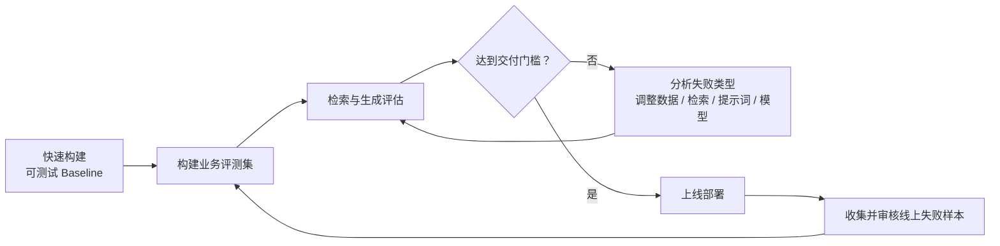

# P44：7-6 总结和展望：转变思想，AI应用开发和传统软件开发的区别

> 笔记编号 44/89 · 对应原视频 P44 · 时长 04:27 · [打开这一节](https://www.bilibili.com/video/BV1fLoKBREGv?p=44)

[← P43: 7-5 实战：实现制度问答模块RAG baseline](../07-baseline-rag/p043-实战-实现制度问答模块RAG-baseline.md) · [返回第 7 章专题](./README.md) · [P45: 8-1 本章介绍 →](../08-evaluation/p045-RAG-评估-本章导学.md)

## 这节到底讲什么

**核心问题：AI 应用开发与传统软件开发最大的差异是什么？**

这一节解释为什么上一集只能叫 Baseline：它能运行，但尚未经过覆盖业务场景
的完整评测，不能据此判断是否达到上线要求。传统软件更多依赖确定性规则，
AI 应用同时受用户表达、检索和模型生成随机性影响，因此必须先做可测试版本，
再以评测集和线上失败样本持续迭代。

## 辅助流程图

## 正文讲解（按视频顺序）

> 下面是依据音轨和画面整理的通顺版本，不是逐字稿。技术术语已经校正，
> 老师的原始讲法保留在后面的 ASR 页面。

### 1. 输出概率性

传统规则程序在输入和状态固定时，预期输出通常确定；AI 应用会受到用户表达
多样性、检索误差和生成随机性的共同影响，即使总体设计确定，也无法在开发前
保证所有回答符合预期。

### 2. 数据即逻辑

制度文件、切块结果、评测问题和线上样本都会改变系统行为。开发不能只看代码
功能是否通过，还必须把数据版本和失败样本视作产品逻辑的一部分。

### 3. 评测驱动

上一集只能称为 Baseline，因为尚未建立覆盖业务场景的测试数据，也没有证明
结果达到上线门槛。下一步要针对检索与生成分别评估，才能知道如何改。

### 4. 快速实验

先快速构建可测试基线，再根据评测结果做多轮受控迭代。每次只改变一个主要
变量并复跑同一评测集，避免同时换模型、分块和提示词后无法归因。

### 5. 持续运营

即使离线评测通过并上线，初始测试集也不可能覆盖全部真实表达。系统还要持续
收集线上失败样本，经过脱敏和审核后加入回归集，再推动后续版本。

## 校正版讲解时间线

- **00:00–00:30：本章交付物。** 已完成需求、数据、选型、总体设计和 RAG
  实现。
- **00:30–00:53：为什么叫 Baseline。** 当前系统缺少完备测试，是否满足上线
  要求仍然存疑，必须在此基础上继续测试迭代。
- **00:53–01:43：共同的软件生命周期。** 传统软件和 AI 应用都经历需求、设计、
  开发、测试、部署和运维。
- **01:43–03:17：关键差异是不确定性。** 传统软件主要基于确定规则；AI 应用会
  受到用户输入多样性和模型生成随机性的影响，无法在开发开始时准确预知结果。
- **03:17–04:00：Baseline 思维。** 快速构建可测试版本，用业务测试数据评估，
  再依据结果多轮改进。
- **04:00–04:27：上线后仍要迭代。** 初始测试集无法覆盖全部真实场景，应收集
  线上数据继续提升；这一思维也适用于机器学习模型训练。

## 用一个例子串起来

Baseline 对老师演示的两道题回答正确，不代表能处理“上海/北京”“旺季/
非旺季”“高级/普通职级”等组合，也不代表资料外问题会拒答。把这些边界问题
加入评测集，才能决定下一步该改解析、检索、提示词还是模型。

## 完整原声逐段记录

已用本地语音识别核查；技术词与口误以专题笔记的校正版为准。

[查看本节按时间戳保留的本地 ASR 转写](./transcripts/p044-总结和展望-转变思想-AI应用开发和传统软件开发的区别-ASR.md)。原始转写会保留
同音字和断句误差，正文用校正后的术语，方便同时核对“老师说了什么”和“概念是什么”。

## 读完记住这五句话

- **输出概率性：** 同输入也可能有变化
- **数据即逻辑：** 文档和样本决定大量行为
- **评测驱动：** 不能只靠单元测试判断语义质量
- **快速实验：** 模型、提示、检索需受控对比
- **持续运营：** 监控失败样本并迭代数据与链路

## 最小可运行代码

[打开本节最相关的纯 Python 练习](../../rag_from_scratch/pipeline.py)。练习包不依赖 LangChain，
目的是先看清输入、输出和算法边界，再替换成课程中的框架/API。

## 最容易踩的坑

不要把两三个演示问题答对当成上线验收。没有覆盖业务分布、边界和资料外问题
的评测集，就无法判断 Baseline 的真实质量。

## 自测

1. 传统软件与 AI 应用的不确定性分别来自哪里？
2. 为什么快速建立 Baseline 比一开始追求完美方案更合适？
3. 线上失败样本怎样安全地进入下一轮回归评测？

## 学完检查

- [ ] 我能不看视频解释本节核心概念
- [ ] 我能指出它在 RAG 数据流中的位置
- [ ] 我知道它最适合与最不适合的场景
- [ ] 我读过完整 ASR 并核对了技术术语
- [ ] 我完成了专题 README 中对应的自测或实验
