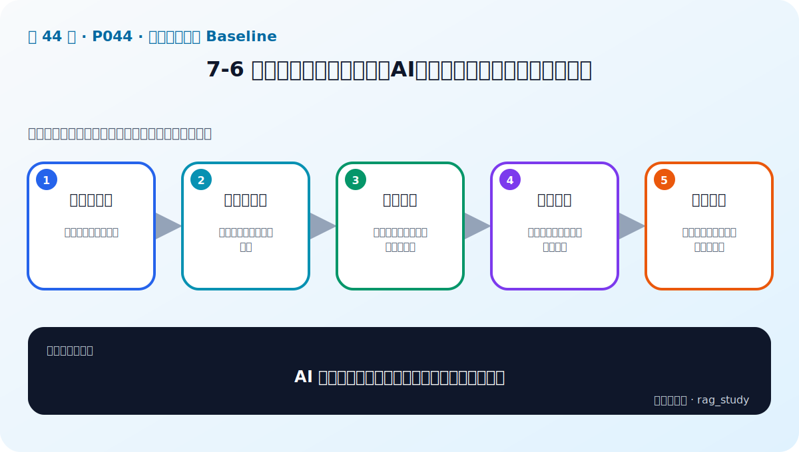
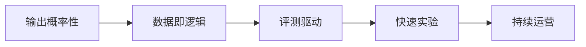

# P44：7-6 总结和展望：转变思想，AI应用开发和传统软件开发的区别

> 笔记编号 44/89 · 对应原视频 P44 · 时长 04:27 · [打开这一节](https://www.bilibili.com/video/BV1fLoKBREGv?p=44)

[← P43: 7-5 实战：实现制度问答模块RAG baseline](../07-baseline-rag/p043-实战-实现制度问答模块RAG-baseline.md) · [返回第 7 章专题](./README.md) · [P45: 8-1 本章介绍 →](../08-evaluation/p045-RAG-评估-本章导学.md)

## 这节到底讲什么

**核心问题：AI 应用开发与传统软件开发最大的差异是什么？**

这节直接回答“AI 应用开发与传统软件开发最大的差异是什么？”。老师的结论可以整理成五点：第一，输出概率性：同输入也可能有变化；第二，数据即逻辑：文档和样本决定大量行为；第三，评测驱动：不能只靠单元测试判断语义质量；第四，快速实验：模型、提示、检索需受控对比；第五，持续运营：监控失败样本并迭代数据与链路。下面逐项解释每一点的含义和作用。

## 辅助流程图

## 正文讲解（按视频顺序）

> 下面是依据音轨和画面整理的通顺版本，不是逐字稿。技术术语已经校正，
> 老师的原始讲法保留在后面的 ASR 页面。

### 1. 输出概率性

同输入也可能有变化。

### 2. 数据即逻辑

文档和样本决定大量行为。

### 3. 评测驱动

不能只靠单元测试判断语义质量。

### 4. 快速实验

模型、提示、检索需受控对比。

### 5. 持续运营

监控失败样本并迭代数据与链路。

## 用一个例子串起来

用户提出问题后，系统先检索制度片段，再把片段、来源和问题放进提示词；如果证据不足，模型应明确拒答，而不是凭常识补齐公司规则。

## 完整原声逐段记录

已用本地语音识别核查；技术词与口误以专题笔记的校正版为准。

[查看本节按时间戳保留的本地 ASR 转写](./transcripts/p044-总结和展望-转变思想-AI应用开发和传统软件开发的区别-ASR.md)。原始转写会保留
同音字和断句误差，正文用校正后的术语，方便同时核对“老师说了什么”和“概念是什么”。

## 读完记住这五句话

- **输出概率性：** 同输入也可能有变化
- **数据即逻辑：** 文档和样本决定大量行为
- **评测驱动：** 不能只靠单元测试判断语义质量
- **快速实验：** 模型、提示、检索需受控对比
- **持续运营：** 监控失败样本并迭代数据与链路

## 最小可运行代码

[打开本节最相关的纯 Python 练习](../../rag_from_scratch/pipeline.py)。练习包不依赖 LangChain，
目的是先看清输入、输出和算法边界，再替换成课程中的框架/API。

## 最容易踩的坑

不要让模型在没有证据时自由补充答案。提示词应包含引用和拒答规则，并把检索结果保存在日志里。

## 自测

1. 不看图回答：AI 应用开发与传统软件开发最大的差异是什么？
2. 用上面的例子，指出本节五个知识点分别出现在哪里。
3. 如果没有“快速实验”，会出现什么具体问题？

## 学完检查

- [ ] 我能不看视频解释本节核心概念
- [ ] 我能指出它在 RAG 数据流中的位置
- [ ] 我知道它最适合与最不适合的场景
- [ ] 我读过完整 ASR 并核对了技术术语
- [ ] 我完成了专题 README 中对应的自测或实验
