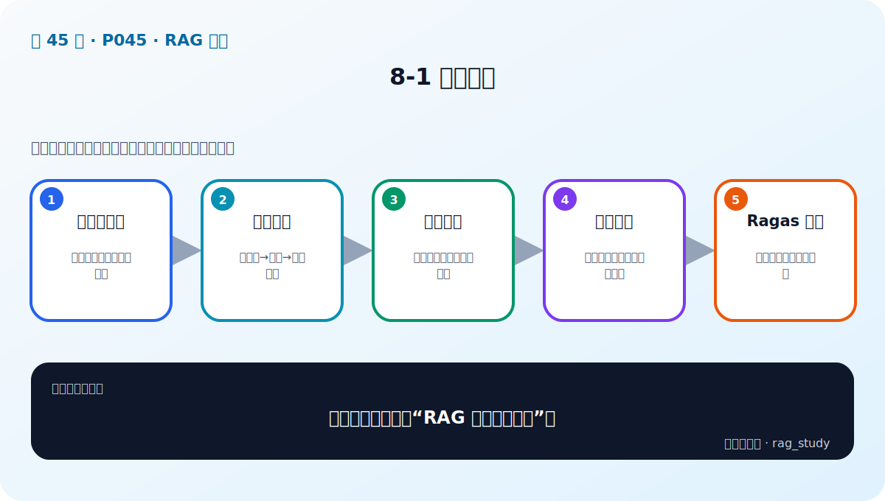
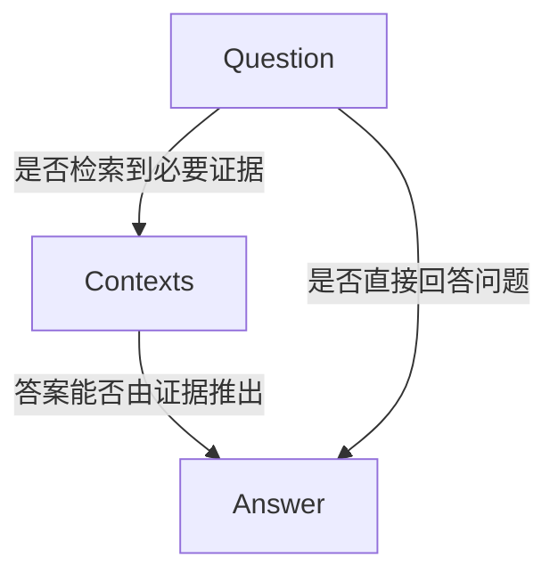

# 第 8 章：RAG 评估——让优化从感觉变成实验

> 对应视频 P45–P50：[打开本章第一节](https://www.bilibili.com/video/BV1fLoKBREGv?p=45)

## 问题、上下文、答案三角

- **上下文相关性/精确度**：召回内容是否围绕问题，噪声是否过多。
- **上下文召回**：回答所需的事实是否都在检索上下文中。
- **忠实度 Faithfulness**：答案中的事实陈述能否由上下文支持。
- **答案相关性**：答案是否真正回应问题，而不是只复述资料。

这四类问题分别指向不同模块。忠实度低优先检查生成和提示词；上下文召回低优先
检查解析、分块、查询和检索；不要用换模型掩盖所有问题。

## 三个评估步骤

1. **构建评测集**：问题、参考答案、相关文档或证据；覆盖常见、困难、歧义、
   无答案、跨文档、权限和时效性问题。
2. **选择指标与门槛**：检索可用 Recall@k、MRR、nDCG；生成可用忠实度、
   答案相关性、引用正确性、拒答准确率；另计延迟和成本。
3. **执行并切片分析**：保存每次运行的 query、contexts、answer、模型版本、
   参数和分数，按问题类型找失败模式。

平均分可能掩盖关键风险。制度问答中，“报销规则”平均很好但“离职补偿”全错，
系统仍不能上线。

## Ragas 的核心思路

Ragas 使用 LLM-as-a-Judge 和 Embedding 等能力自动比较问题、上下文和答案，
部分指标可无参考运行，提供参考答案通常更可靠。

- Faithfulness 会把答案拆成较原子的事实陈述，再逐条判断是否能由上下文推出。
- Answer Relevancy 可从答案反推潜在问题，再比较它与原问题的语义相似度。
- Context Precision 关注相关片段是否排在前面，惩罚 top-k 中的无关噪声。
- Context Recall 需要参考答案或参考证据，检查必要事实是否被上下文覆盖。

LLM Judge 本身也有偏差和随机性，因此自动分数需要用一小批人工标注做校准；
评估模型、提示词和版本也必须固定。

## 评测集怎样避免“看起来很专业但没用”

- 从真实日志和业务专家处采样，不只由开发者凭空编题。
- 训练/调参题与最终验收题分开，防止对测试集过拟合。
- 无答案题要同时衡量“正确拒答”和“错拒答”。
- 同一事实设计改写、简称、错别字和多轮上下文，测试鲁棒性。
- 每条问题保留标签，如 `simple`、`multi_hop`、`freshness`、`permission`。

## 可运行练习

[evaluation.py](../../rag_from_scratch/evaluation.py) 实现了 Recall@k 和 MRR。
先让 BM25 与向量检索跑同一评测集，再做 RRF；只有指标和失败样本都改善，才能
说明融合策略有效。

## 自测

答案完全正确，为什么 Faithfulness 仍可能很低？

答案可能来自模型参数记忆或偶然猜中，而不是检索上下文。RAG 的忠实度要求答案
能由当前证据推出；否则无法保证私有知识、时效性和可追溯性。

